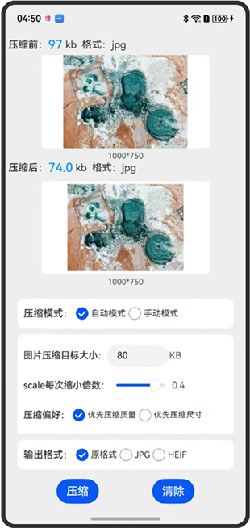

# 图片压缩方案

### 介绍

图片压缩在应用开发中是一个非常常见的需求，比如在处理用户上传图片时，需要上传指定大小以内的图片。目前图片压缩支持jpeg、heif格式。本例将介绍如何通过packing和scale实现图片压缩（如自动压缩到目标大小以内，手动调整图片质量和尺寸进行压缩等），以及把图片压缩成不同格式后保存到沙箱。

### 效果预览

|图片压缩方案|
|--------------------------------|
||

使用说明

1. <code>压缩模式</code>选择自动模式，输入图片压缩目标大小，可以自定义调整<code>scale每次缩小倍数</code>。<code>压缩偏好</code>选择<code>优先压缩质量</code>，可以自定义调整<code>packing最小二分单位</code>。可以选择图片压缩的输出格式。点击<code>压缩</code>按钮开始压缩，压缩完成后提示<code>压缩完成</code>，并在<code>压缩后</code>一栏显示压缩后预估的图片大小（<code>压缩后</code>所展示的图片大小，是该图片在内存中作为ArrayBuffer数据的压缩后大小，这一数值并不直接等同于该图片在最终保存到相册时的实际文件大小），以及压缩后的图片格式。

2. <code>压缩模式</code>选择自动模式，输入图片压缩目标大小，可以自定义调整<code>scale每次缩小倍数</code>。<code>压缩偏好</code>选择<code>优先压缩尺寸</code>，可以自定义调整<code>最低图片质量</code>。可以选择图片压缩的输出格式。点击<code>压缩</code>按钮开始压缩，压缩完成后提示<code>压缩完成</code>，并在<code>压缩后</code>一栏显示压缩后预估的图片大小，以及压缩后的图片格式。

3. <code>压缩模式</code>选择手动模式，可以自定义调整图片质量和图片尺寸。可以选择图片压缩的输出格式。点击压缩按钮开始压缩，压缩完成后提示<code>压缩完成</code>，并在<code>压缩后</code>一栏显示压缩后预估的图片大小，以及压缩后的图片格式。

4. 手动模式的压缩是指手动调整图片质量和尺寸进行图片压缩。自动模式的压缩是指通过设置图片压缩目标大小，根据设置的相关压缩参数（如scale每次缩小倍数，packing最小二分单位，最低图片质量），将图片自动压缩至最接近但不超过该压缩目标的大小。但是如果参数配置不合理（如scale每次缩小倍数设置较大，但压缩目标大小又设置很小），可能会出现最终压缩出来的图片达不到设定的压缩目标大小。

5. 自动模式的压缩分为优先压缩图片质量和优先压缩图片尺寸。优先压缩图片质量是指优先通过调整图片质量进行压缩。但是如果图片质量压缩到最低仍然超过目标大小，则会再采用scale进行二次压缩。对于通过调整图片质量就能满足目标大小要求的图片，如果想要找到尽可能接近目标大小的最佳压缩大小，可以调低<code>packing最小二分单位</code>，但相应的压缩性能也会更差一些。优先压缩图片尺寸是指优先通过调整图片尺寸进行压缩。如果对图片质量要求不高但是需要压缩后的图片尺寸尽可能大一些也可以调低<code>最低图片质量</code>。

### 工程目录

```
entry/src/main/ets/
|---entryability
|   |---EntryAbility.ets
|   |---Index.ets
```

### 具体实现

* 图片压缩，源码参考：[Index.ets](entry/src/main/ets/pages/Index.ets)

### 相关权限

无

### 依赖

无

### 约束与限制

1. 本示例仅支持标准系统上运行，支持设备：Phone;
2. 本示例为Stage模型，支持API20版本SDK，SDK版本号(API Version 20),镜像版本号(6.0.0.31)。
3. 本示例需要使用DevEco Studio 版本号(6.0.0.6)版本才可编译运行。

### 下载

如需单独下载本工程，执行如下命令：

```
git init
git config core.sparsecheckout true
echo code/ArkTS1.2/ImagecompressionSample/ > .git/info/sparse-checkout
git remote add origin https://gitcode.com/openharmony/applications_app_samples.git
git pull
```