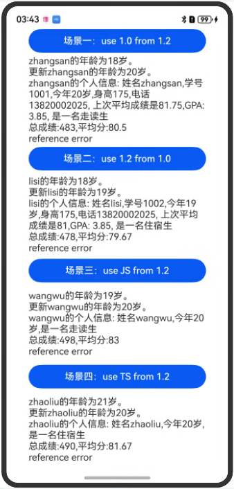

    # interop配套示例

### Interop介绍
Interop可以实现混合开发场景的模块相互通信场景，具体场景有ArkTS1.2中使用ArkTS1.0；ArkTS1.0中使用ArkTS1.2；ArkTS1.2中使用TS；ArkTS1.2中使用JS四种

### 实现思路
以场景一:ArkTS1.2中使用ArkTS1.0为例

新建Har包arkts1_0har用arkTs1.0语法编写代码
在arkts1_0har定义常量SUBJECT、类Student，类成员变量name、sex、studentID、age、height、phone、averageGrade、gradePoint、isBoarder和transcript等，定义错误类ReferenceError，类成员函数introduce和setSubjectScore，函数calTotalScore和calAverageScore

在entry目录下新建1.2.ets文件导入常量SUBJECT、类Student,定义函数test和errorHandle调用har包中方法，点击按钮可调用test和errorHandle函数，将这两个函数的返回值显示在页面上

①文件导入

在1.2.ets文件中导入常量SUBJECT、类Student 

②类实例化

在test函数内，实例化类Student，新增一个学生student1为A

③属性读写

读：访问A的年龄为20岁，写：更新A的年龄为20岁

④函数调用

调用calTotalScore计算总成绩

⑤对象方法调用

调用student1.introduce获取学生信息，比如姓名、学号、年龄、身高、电话、上次平均成绩、gradePoint和是否住校；调用student1.setSubjectScore，将A的成绩set到成绩表transcript中

⑥参数传递

调用calAverageScore计算平均成绩

⑦异常处理

在arkts1_0har中定义错误类ReferenceError，在1.2.ets中导入被捕获处理，正确返回错误信息reference error

ArkTS1.0中使用ArkTS1.2；ArkTS1.2中使用TS；ArkTS1.2中使用JS等三个场景可以参考ArkTS1.2中使用ArkTS1.0

### 效果预览

使用说明

在首页，依次点击蓝色按钮会在按钮下方空白位置打印出对应日志

效果如下所示：

)
### 工程目录

```
entry/src/main/ets/
|---pages
	|---Use1From2
		|---1.2.ets                        // 1.2代码
	|---Use2From1
		|---1.0.ets                        // 1.0代码
	|---UseJSFrom2
		|---1.2.ets                        // 1.2代码
	|---UseTSFrom2
		|---1.2.ets                        // 1.2代码
	|---index.ets                          // interop首页 
arkts1_0har/src/main/ets/
|---components
	|---ArkTSVersion_1.ets                 // 1.0代码
arkts1_2har/src/main/ets/
|---components
	|---ArkTSVersion_2.ets                 // 1.2代码
jshar/src/main/ets/
|---components
	|---JSTest.js                          // JS代码
tshar/src/main/ets/
|---components
	|---TSTest.ts                          // TS代码
```

### 相关权限
无
### 依赖
无
### 约束与限制
1. 本示例仅支持标准系统上运行，支持设备：Phone;
2. 本示例为Stage模型，支持API20版本SDK，SDK版本号(API Version 20),镜像版本号(6.0.0.31)。
3. 本示例需要使用DevEco Studio 版本号(6.0.0.21)版本才可编译运行。