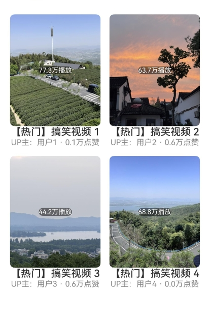
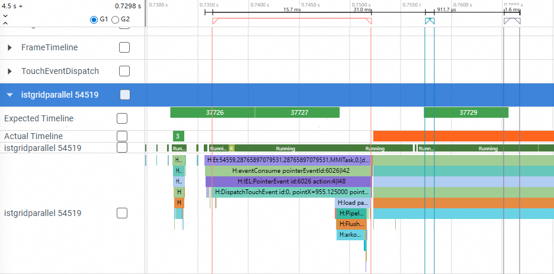

# List&Grid并行化创建子组件

### 介绍

本示例介绍了List和Grid如何并行化创建子组件，从而优化组件创建耗时和响应时延。

### 效果图预览


**使用说明**

1. 使用List&Grid模拟开发一个视频网站热门播放列表。
2. 提供两种组件创建方式，分别是非并行创建和并行创建。
3. 对比了List非并行创建和并行创建的性能差异。

### 实现思路

1. 初始界面：提供"非并行"和"并行"两个构建模式选项，点击后展示对应模式下创建的应用图标网格。源码参考[Index.ets](./entry/src/main/ets/pages/Index.ets)。
    ```ts
    // 是否并行创建参数
    export interface paramsObj{
      isEnable: boolean
    }

    @Entry
    @Component
    struct MyStateSample { //主界面
      build() {
        List() {
          Button("List并行创建")
            .onClick((e: ClickEvent)=>{
              this.getUIContext().getRouter().pushUrl({ url:"pages/Page1", params: { isEnable: true } as paramsObj }) // isEnable为true并行创建
            }).fontSize(12).margin(5).width('100%')
          Button("List串行创建")
            .onClick((e: ClickEvent)=>{
              this.getUIContext().getRouter().pushUrl({ url:"pages/Page1", params: { isEnable: false } as paramsObj }) // isEnable为false并行创建
            }).fontSize(12).margin(5).width('100%')
          Button("Grid并行创建")
            .onClick((e: ClickEvent)=>{
              this.getUIContext().getRouter().pushUrl({ url:"pages/Page2", params: { isEnable: true } as paramsObj }) // isEnable为true并行创建
            }).fontSize(12).margin(5).width('100%')
          Button("Grid串行创建")
            .onClick((e: ClickEvent)=>{
              this.getUIContext().getRouter().pushUrl({ url:"pages/Page2", params: { isEnable: false } as paramsObj }) // isEnable为false并行创建
            }).fontSize(12).margin(5).width('100%')
        }
        .padding(15)
        .width('100%')
      }
    }
    ```
2. 点击List并行创建，List滚动容器并行创建子组件。源码参考[Page1.ets](./entry/src/main/ets/pages/Page1.ets)。以下示例为List并行创建一个热门播放列表。

    ```ts
    @Entry
    @Component
    struct Index {
      isEnable: boolean = false; // 并行化开关
      @State arr: Array<Int> = [1] // 数据源
      @State stateVar: string = 'state var';

      aboutToAppear() {
        const params = this.getUIContext().getRouter().getParams() as paramsObj;
        this.isEnable = params.isEnable;
        for (let i = 2; i <= 50; i++) {
          this.arr.push(i)
        }
      }

      build() {
        Column() {
          List({ space: 10 }) {
            // 并行创建List子组件
            ParallelizeUI<Int, Info>({ enable: this.isEnable }, this.arr,
              (item: Int, index: Int) => {
                const coverIndex = ((item - 1) % 5) + 1   // cycle through 1..5
                const coverResId = `app.media.cover${coverIndex}`

                return new Info(
                  `【热门】搞笑视频 ${item}`,
                  `UP主：用户${item}`,
                  `${(Math.random() * 100).toFixed(1)}万播放`,
                  `${(Math.random() * 1).toFixed(1)}万点赞`,
                  coverResId
                )
              },
              (param: Info) => {
                ListItem() {
                  Column() {
                    // 封面
                    Stack() {
                      Image($r(param.coverRes))
                        .width('100%')
                        .height(200)
                        .borderRadius(8)
                        .objectFit(ImageFit.Cover)  // 保持封面裁剪
                        .alt('video cover')

                      // 播放量右下角浮层
                      Row() {
                        Text(param.views)
                          .fontSize(12)
                          .fontColor('#FFFFFF')
                          .backgroundColor('rgba(0,0,0,0.5)')
                          .borderRadius(10)
                      }
                      .align(Alignment.BottomEnd)
                    }

                    // 标题
                    Text(param.title)
                      .fontSize(18)
                      .fontWeight(FontWeight.Medium)
                      .maxLines(2)
                      .textOverflow({ overflow: TextOverflow.Ellipsis })

                    // 底部信息行（up主、点赞量）
                    Row() {
                      Text(param.up)
                        .fontSize(14)
                        .fontColor('#888')

                      Text(` · ${param.likes}`)
                        .fontSize(14)
                        .fontColor('#888')
                    }
                  }
                  .backgroundColor('#FFFFFF')
                  .borderRadius(12)
                  .padding(8)
                }
                .width('100%')
              })
          }
          .width('100%')
          .height('100%')
          .padding(10)
          .backgroundColor('#F8F8F8')
        }
      }
    }
    ```
    

3. 点击Grid并行创建，Grid滚动容器并行创建子组件。源码参考[Page2.ets](./entry/src/main/ets/pages/Page2.ets)。以下示例为Grid并行创建一个热门播放列表。

    ```ts
    @Entry
    @Component
    struct Index {
      isEnable: boolean = false; // 并行化开关
      @State stateVar: string = 'state var';
      @State arr:Array<Int>= [1] // 数据源
      aboutToAppear() {
        const params = this.getUIContext().getRouter().getParams() as paramsObj;
        this.isEnable = params.isEnable;
        for (let i = 2; i <= 50; i++) {
          this.arr.push(i)
        }
      }

      build() {
        Column() {
          Grid() {
            // 并行创建Grid子组件
            ParallelizeUI<Int, Info>({ enable: this.isEnable }, this.arr,
              (item: Int, index: Int) => {
                const coverIndex = ((item - 1) % 5) + 1   // cycle through 1..5
                const coverResId = `app.media.cover${coverIndex}`
                return new Info(
                  `【热门】搞笑视频 ${item}`,
                  `UP主：用户${item}`,
                  `${(Math.random() * 100).toFixed(1)}万播放`,
                  `${(Math.random() * 1).toFixed(1)}万点赞`,
                  coverResId
                )
              },
              (param: Info) => {
                GridItem() {
                  Column() {
                    // 封面
                    Stack() {
                      Image($r(param.coverRes))
                        .width('100%')
                        .height(200)
                        .borderRadius(8)
                        .objectFit(ImageFit.Cover)
                        .alt('video cover')

                      // 播放量右下角浮层
                      Row() {
                        Text(param.views)
                          .fontSize(12)
                          .fontColor('#FFFFFF')
                          .backgroundColor('rgba(0,0,0,0.5)')
                          .borderRadius(10)
                      }
                      .align(Alignment.BottomEnd)
                    }

                    // 标题
                    Text(param.title)
                      .fontSize(18)
                      .fontWeight(FontWeight.Medium)
                      .maxLines(2)
                      .textOverflow({ overflow: TextOverflow.Ellipsis })

                    // 底部信息行（up主、点赞量）
                    Row() {
                      Text(param.up)
                        .fontSize(14)
                        .fontColor('#888')

                      Text(` · ${param.likes}`)
                        .fontSize(14)
                        .fontColor('#888')
                    }
                  }
                  .backgroundColor('#FFFFFF')
                  .borderRadius(12)
                  .padding(8)
                }
                .width('100%')
              })
          }
          .columnsTemplate('1fr 1fr') // 两列网格
          .height('70%')
          .width('100%')
          .padding(10)
        }
      }
    }
    ```
    
### 性能对比

本示例使用了List和Grid如何并行化创建子组件，减少了页面跳转响应时延和完成时延。

参考[使用SmartPerf-Host分析应用性能](https://docs.openharmony.cn/pages/v5.1/zh-cn/application-dev/performance/performance-optimization-using-smartperf-host.md)文档，抓取trace对比分别使用并行创建和串行创建建组件时的性能。

响应时延通常以多模输入事件为起点，在本案例中对应于页面点击事件中的抬手时刻，结束点则为UI线程提交首帧绘制命令并完成上屏的时刻。如下所示：

- 使用并行创建子组件响应时延


- 使用串行创建子组件响应时延



完成时延通常以多模输入事件为起点，在本案例中对应于页面点击事件中的抬手时刻，结束点则为页面完成创建的时刻，在trace中对应ABILITY_OR_PAGE_SWITCH该区间结束位置。如下所示：

- 使用并行创建子组件完成时延


- 使用串行创建子组件完成时延


|  | 并行创建 | 串行创建 | 优化比例 |
| -------- | -------- | -------- | -------- |
| 响应时延 | 26.2ms | 31.0ms | 18.3% |
| 完成时延 | 517.8ms | 825.7ms | 59.5% |

### 工程结构&模块类型  

    ```
    |entry/src/main/ets                  
    |   |---entryablity
    |   |   |---EntryAbility.ts                         // 程序入口类             
    |   |---pages                                 
    |   |   |---Index.ets                               // 首页
    |   |   |---Page1.ets                               // List创建子组件
    |   |   |---Page2.ets                               // Grid创建子组件
    ```

### 参考资料

[接入ArkTS页面](https://docs.openharmony.cn/pages/v5.0/zh-cn/application-dev/ui/ndk-access-the-arkts-page.md)

### 相关权限

不涉及。

### 依赖

不涉及。

### 约束与限制

1.本示例仅支持标准系统上运行。

2.本示例为Stage模型，支持API20版本SDK，SDK版本号（API Version 20 Release）。

3.本示例需要使用DevEco Studio版本号（DevEco Studio 5.0.0 Release）及以上版本才可编译运行。

### 下载

如需单独下载本工程，执行如下命令：

```shell
git init
git config core.sparsecheckout true
echo code/ArkTS1.2/ListAndGridParallelSample/ > .git/info/sparse-checkout
git remote add origin https://gitcode.com/openharmony/applications_app_samples.git
git pull origin master