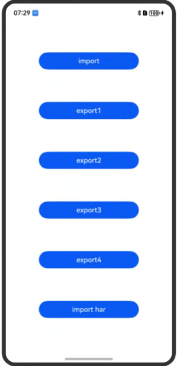

# 模块化引用示例

## 介绍

本示例为模块化引用示例。

## 效果图预览

  

  **场景说明**
    1. 懒加载机制默认实现：引入但未使用的类不会被加载。
    2. export出来的类，其余未export的情况不会加载。
    3. har包引入后，未使用的情况下不加载。

## 工程结构&模块类型

```
   ModuleSample
   |---entry
   |   |---src/main/ets/pages
   |   |   |---mod                          // 模块 
   |   |   |   |---mod1.ets
   |   |   |   |---mod2.ets
   |   |   |   |---mod3.ets 
   |   |   |   |---mod4.ets
   |   |   |   |---mod5.ets
   |   |   |---exportTestPage1.ets 
   |   |   |---exportTestPage2.ets
   |   |   |---Index.ets                    // 主页 
   |---ImportHar                            // har包
   |   |---src/main/ets/pages/components
   |   |   |---MainPage.ets
```

## 实现思路
### 场景1：懒加载机制默认实现：引入但未使用的类不会被加载。

- 在mod1.ets文件内写入类Mod1以及一条打印日志的顶层语句，Mod1类内包含一个静态代码块，静态代码块内为打印日志语句。
- 在Index.ets文件内导入Mod1.ets文件，不点击按钮"import"时，Mod1为引入但未使用的类，此时不会打印"executeModule mod1"以及"executeModule import 顶层语句"日志。
- 点击按钮时，使用Mod1类，此时才会打印"executeModule mod1"日志。"executeModule import 顶层语句"日志为顶层语句不会被打印。

```typescript
// mod1.ets
export class Mod1 {
  static name: string = 'mod';
  static {
    hilog.info(0x0000, 'testTag', "executeModule mod1");
  }
}
hilog.info(0x0000, 'testTag', "executeModule import 顶层语句");
```
```typescript
// Index.ets
import { Mod1 } from './mod/mod1';
@Component
struct MyStateSample {
  build() {
    ...
    Button("import")
      .width('60%')
      .onClick((e: ClickEvent) => {
        let mod1 = new Mod1();
      })
    ...
  }
}
```
### 场景2：export出来的类，其余未export的情况不会加载。
#### 2.1 顶层语句不会被加载

- 在mod2.ets文件内包含一个导出类Mod2以及一条打印日志的顶层语句，Mod2类内包含一个静态代码块，静态代码块内为打印日志语句。
- 在Index.ets文件内导入Mod2.ets文件，点击"export1"按钮时，Mod2.ets文件内未导出的顶层语句不会被加载，不会打印日志"executeModule export 顶层语句"。

```typescript
// mod2.ets
export class Mod2 {
  static name: string = '';
  static {
    hilog.info(0x0000, 'testTag', "executeModule mod2");
  }
}
hilog.info(0x0000, 'testTag', "executeModule export 顶层语句");
```
```typescript
// Index.ets
import { Mod2 } from './mod/mod2';
@Component
struct MyStateSample {
  build() {
    ...
    Button("export1")
      .width('60%')
      .onClick((e: ClickEvent) => {
        let mod2 = new Mod2();
      })
    ...
  }
}
```
#### 2.2 其余未导出的类不会被加载

- mod3文件内导出内容有：五个类，类名分别为A,B,C,D,E，A类内有一个静态成员变量count，值为1，A类的静态代码块只有hilog语句，顶层代码将A.count设置为100。 B,C,D,E内的静态成员变量count默认值为0，B,C,D,E内的静态代码块将每个类的count的值设置为++A.count。
- 在Index文件内导入两个类A和E，arkts1.0 export时所有类都会export，因此A.count经过四次增加，以及一次顶层语句的赋值，E.count的值为105。其余export的类不加载，E.count的值应该为2，仅导入两个类A和E。

```typescript
// mod3.ets
import hilog from '@ohos.hilog'
export class A {
  static count = 1;
  static {
    hilog.info(0x0000, 'testTag', "executeModule execute A");
  }
}
A.count = 101;
export class B {
  static count = 0;
  static {
    B.count = ++A.count;
    hilog.info(0x0000, 'testTag', "executeModule execute B");
  }
}

export class C {
  static count = 0;
  static {
    C.count = ++A.count;
    hilog.info(0x0000, 'testTag', "executeModule execute C");
  }
}
export class D {
  static count = 0;
  static {
    D.count = ++A.count;
    hilog.info(0x0000, 'testTag', "executeModule execute D");
  }
}
export class E {
  static count = 0;
  static {
    E.count = ++A.count;
    hilog.info(0x0000, 'testTag', "executeModule execute E");
  }
}
```
```typescript
// Index.ets
import { A, E } from './mod/mod3';
@Component
struct MyStateSample {
  build() {
    ...
    Button("export2")
      .width('60%')
      .onClick((e: ClickEvent) => {
        let modA = new A();
        let modE = new E();
        let promptAction: PromptAction = this.uiContext!.getPromptAction();
        promptAction.showToast({
          message: '共加载了 E.count: ' + E.count + '个类',
          duration: 20000
        });
      })
    ...
  }
}
```
#### 2.3 通过耗时验证其余未导出的类没有被加载
- mod4.ets文件包含一个导出类ExportSmallClassTest，如果这个类被加载会运行静态模块，在静态模块内将此时的时间记录到静态成员变量exportTime中。
- 在exportTestPage1.ets文件内，将mod4.ets中导出的类ExportSmallClassTest导入，导入后用现在的时间减去ExportSmallClassTest类中的exportTime就是导入耗时，将耗时写到Text组件，显示到界面上。
- mod5.ets文件里面包括两个类，ExportSmallClass和ExportBigClass，ExportSmallClass和在mod4中的ExportSmallClassTest类的内容完全一致，静态成员变量isExportOtherClass默认值为false，ExportBigClass是一个有15000多个成员变量的超大类，在这个类的静态代码块中将ExportSmallClass.isExportOtherClass置为true。如果加载了这个超大类，ExportSmallClass的静态成员变量isExportOtherClass的值将置为true。
- 在exportTestPage2.ets页面导入mod5中的ExportSmallClass类，将耗时记录下来，显示在界面上。并判断ExportSmallClass.isExportOtherClass是否为true，如果为true则代表超大类也导出了，此时显示文本“不需要的类也加载了”。
```typescript
// mod4.ets
import hilog from '@ohos.hilog'

export class ExportSmallClassTest {
  static exportTime: double = 0;
  static isExportOtherClass = false;
  static {
    ExportSmallClassTest.exportTime = Date.now();
    hilog.info(0x0000, 'testTag', "executeModule mod4 smallclass");
  }
  static na = 'zhangsan';
}
```
```typescript
// exportTestPage1.ets
import { ExportSmallClassTest } from './mod/mod4';
let exportTime: double = ExportSmallClassTest.exportTime;
let dur = Date.now() - exportTime;
@Entry
@Component
struct page1 {
  @State message: string = "预期结果";
  build() {
    Column() {
      Text('page1')
        .fontSize(30)
      Text('耗时' + dur + 'ms')
        .fontSize(20)
      Button("back")
        .onClick((e: ClickEvent) => {
          this.getUIContext().getRouter().back();
        })
    }
    .width('100%')
    .height('100%')
  }
}
```
```typescript
// mod5.ets
import hilog from '@ohos.hilog'
export class ExportSmallClass {
  static exportTime: double = 0;
  static isExportOtherClass = false;
  static {
    ExportSmallClass.exportTime = Date.now();
    hilog.info(0x0000, 'testTag', "executeModule mod5 smallclass");
  }
  static na = 'zhangsan';
}
  export class ExportBigClass {
  static exportTime: double = 0;
  static {
    ExportBigClass.exportTime = Date.now();
    ExportSmallClass.isExportOtherClass = true;
    hilog.info(0x0000, 'testTag', "executeModule mod5 bigclass");
  }
  static attribute_0 = 0;
  static attribute_1 = 1;
  static attribute_2 = 2;
  static attribute_3 = 3;
  ...
  static attribute_15000 = 15000;
}
```
```typescript
// exportTestPage2.ets
import { ExportSmallClass } from './mod/mod5';
let exportTime: double = ExportSmallClass.exportTime;
let dur = Date.now() - exportTime;
@Entry
@Component
struct page2 {
  build() {
    Column() {
      Text('page2')
        .fontSize(30)
      Text('耗时' + dur + 'ms')
        .fontSize(20)
      if(ExportSmallClass.isExportOtherClass) {
        Text('不需要的类也加载了')
      }
      Button("back")
        .onClick((e: ClickEvent) => {
          this.getUIContext().getRouter().back();
        })
    }
    .width('100%')
      .height('100%')
  }
}
```
### 场景3：har包引入后，未使用的情况下不加载。

- 在项目中新建har包，命名为ImportHar。
- 在har包内MainPage.ets页面。
- 点击按钮时，使用Mod1类，此时才会打印"executeModule mod 导入har包"日志。

```typescript
// ImportHar/src/main/ets/components/MainPage.ets
import hilog from '@ohos.hilog'
export class Har {
  static {
    hilog.info(0x0000, 'testTag', "executeModule mod 导入har包");
  }
}
```
```typescript
// Index.ets
import { Har } from 'importhar';
@Component
struct MyStateSample {
  build() {
    ...
    Button("import har")
      .width('60%')
      .onClick((e: ClickEvent) => {
        let har = new Har();
      })
    ...
  }
}
```

## 相关权限

无

## 依赖

无

## 约束与限制

1. 本示例仅支持标准系统上运行，支持设备：Phone;
2. 本示例为Stage模型，支持API20版本SDK，SDK版本号(API Version 20),镜像版本号(6.0.0.31)。
3. 本示例需要使用DevEco Studio 版本号(6.0.0.21)版本才可编译运行。

## 下载

如需单独下载本工程，执行如下命令：

```
git init
git config core.sparsecheckout true
echo code/ArkTS1.2/ModuleSample/ > .git/info/sparse-checkout
git remote add origin https://gitcode.com/openharmony/applications_app_samples.git
git pull
```