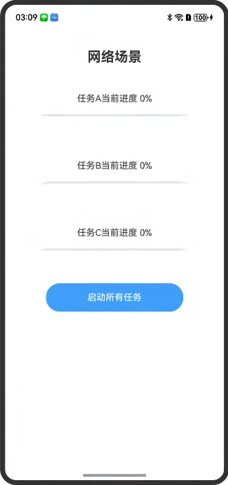

# 网络场景

### 介绍
网络访问多任务依赖，完成任务A和B后，触发任务C

### 效果图预览
| 开启任务前                                                    |  
|----------------------------------------------------------|
|  |

**使用说明**
1. 点击蓝色按钮"启动所有任务"
2. 任务A或者任务B先开始运行，按钮切换到不可用状态
3. 任务A和任务B执行完成之后，进度条进度为100%
4. 开始执行任务C，任务C执行完成之后，进度条进度为100%，按钮切换到可用状态


### 工程结构&模块类型

   ```
   entry/src/main/ets/
|---pages
|   |---index.ets                                     // 首页
   ```

### 具体实现

* 网络任务依赖
    *  点击蓝色按钮"启动所有任务"后执行函数startAllTasks()
	*  在startAllTasks()函数中执行任务A和任务B，执行完成后将this.taskACompleted和this.taskBCompleted赋值为true，将this.lock解锁，赋值为false
	*  每隔200ms判断this.lock的值，false为解锁状态可以执行任务C
	*  执行任务C，清除延时器


### 相关权限

网络权限: ohos.permission.INTERNET

### 依赖

无

### 约束与限制

1. 本示例仅支持标准系统上运行，支持设备：Phone;
2. 本示例为Stage模型，支持API20版本SDK，SDK版本号(API Version 20),镜像版本号(6.0.0.31)。
3. 本示例需要使用DevEco Studio 版本号(6.0.0.21)版本才可编译运行。

### 下载

如需单独下载本工程，执行如下命令：

```
git init
git config core.sparsecheckout true
echo code/ArkTS1.2/NetworkSample/ > .git/info/sparse-checkout
git remote add origin https://gitcode.com/openharmony/applications_app_samples.git
git pull
```