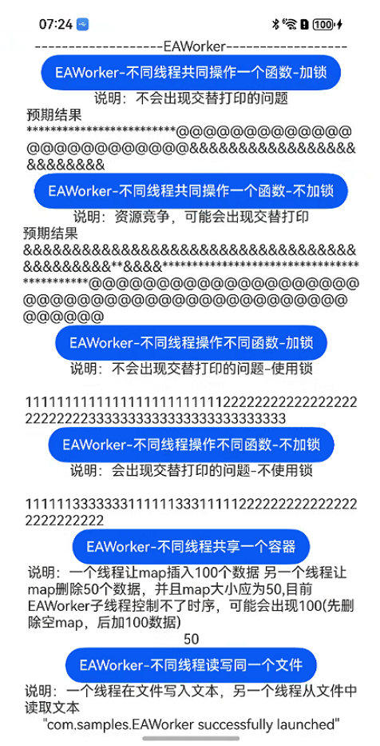

# 并行化处理

### 介绍

### EAWorker介绍
EACoroutine特性是为开发者提供一个能够独占线程的协程，用于执行特定的任务。
ArkTS演进的世界里只有协程的概念，用户创建的并发/异步任务实际通过不同的协程执行，当用户抛出重载任务会导致某个协程执行任务耗时过长影响系统调用，或用户期望有一个能够独立执行特定任务的协程，因此此处补充独占协程(Exclusive ArkTS Coroutine)。

### EAWorker工作机制
在创建 EAWorker 时，可选择是否启用 interop 功能。不过，创建 EAWorker 会产生一定的内存和性能开销，而且大量创建 EAWorker 会抢占系统线程资源，因此需要对 EAWorker 的创建数量进行限制。
若要创建 EAWorker，可调用 EAWorker 构造函数并传入一个布尔值参数，该参数用于控制是否启用 interop 功能，此功能仅在混合虚拟机环境下生效。

在混合虚拟机环境中，创建EAWorker，EAWorker对象可以调用run方法向EAWorker抛任务，利用EACoroutine设置并行化使用场景。
创建打开interop的EAWorker对象，创建多个任务，用EAWorker对象并行地执行这些任务。观察结果是否和预期一致。

### AsyncLock(异步锁)

为了解决多并发实例间的数据竞争问题，ArkTS语言基础库引入了异步锁能力。为了开发者的开发效率，AsyncLock对象支持跨并发实例引用传递。

使用异步锁的方法需要标记为async，调用方需要await修饰调用，才能保证时序正确。因此会导致外层调用函数全部标记成async。

### TaskPool介绍
任务池（TaskPool）作用是为应用程序提供一个多线程的运行环境，降低整体资源的消耗、提高系统的整体性能，且无需关心线程实例的生命周期。

### TaskPool工作机制
该接口设计简洁，易于使用，支持对任务进行执行、取消操作，同时具备指定任务优先级的能力。此外，通过系统统一的线程管理机制，结合动态调度和负载均衡算法，能够有效节省系统资源。
当长时间没有任务需要分发时，工作线程会自动缩容，从而减少工作线程的数量。

### 效果预览

效果如下所示：

|EAWorker|taskPool|
|--------------------------------|--------------------------------|
|||

使用说明

1. 在EAworker界面，依次点击蓝色按钮会在对应下方预期结果部分打印出对应日志；
2. 在taskPool界面，依次点击蓝色按钮会在对应下方预期结果部分打印出对应日志；


### 工程目录

```
entry/src/main/ets/
|---pages
|   |---index.ets                          // 并行化首页
```

### 具体实现

* EAWorker 源码参考: [Index.ets](entry/src/main/ets/pages/Index.ets)
    * 不同线程共同操作一个函数-加锁 在[Index.ets](entry/src/main/ets/pages/Index.ets)中创建EAWoker线程，调用foo()，并且foo()加锁;
    * 不同线程共同操作一个函数-不加锁 在[Index.ets](entry/src/main/ets/pages/Index.ets)中创建EAWoker线程，调用fooUnlock();
    * 不同线程操作不同函数-加锁 在[Index.ets](entry/src/main/ets/pages/Index.ets)中创建EAWoker线程，调用fooTest() fooTest2() fooTest3()，并且fooTest() fooTest2() fooTest3() 函数都加锁;
    * 不同线程操作不同函数-不加锁 在[Index.ets](entry/src/main/ets/pages/Index.ets)中创建EAWoker线程，调用fooTestUnlock() fooTestUnlock2() fooTestUnlock3();
    * 不同线程共享一个容器 在[Index.ets](entry/src/main/ets/pages/Index.ets)中创建EAWoker线程 map容器，调用fooMapTest() fooMapTest2();
    * 不同线程操作一个文件 在[Index.ets](entry/src/main/ets/pages/Index.ets)中创建EAWoker线程，主线程调用createFileTest() 子线程调用readFile();
* taskPool 源码参考: [Index.ets](entry/src/main/ets/pages/Index.ets)
    * 执行一组有关联的任务 在[Index.ets](entry/src/main/ets/pages/Index.ets)中调用taskTest()函数创建一组TaskPoll线程;
    * 任务优先级 在[Index.ets](entry/src/main/ets/pages/Index.ets)中 调用concurrentFunc()函数循环创建TaskPoll线程;
    * 并发函数计算两数之和 在[Index.ets](entry/src/main/ets/pages/Index.ets)中 调用concurrentFuncAdd()函数创建TaskPoll线程计算两数之和;

### 相关权限

无

### 依赖

无

### 约束与限制

1. 本示例仅支持标准系统上运行，支持设备：Phone;
2. 本示例为Stage模型，支持API20版本SDK，SDK版本号(API Version 20),镜像版本号(5.0.1.57)。
3. 本示例需要使用DevEco Studio 版本号(6.0.0.6)版本才可编译运行。

### 下载

如需单独下载本工程，执行如下命令：

```
git init
git config core.sparsecheckout true
echo code/ArkTS1.2/ParallelSample/ > .git/info/sparse-checkout
git remote add origin https://gitee.com/openharmony/applications_app_samples.git
git pull
```