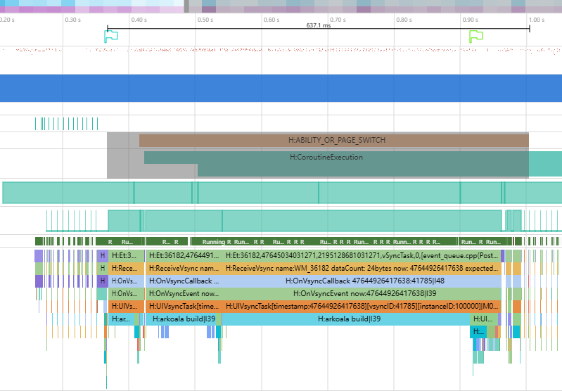

# 使用声明式的并行化方法创建UI组件

### 介绍

本示例介绍如何使用声明式的并行化创建方法ParallelizeUI创建UI组件，从而优化组件创建耗时和响应时延。

### 效果图预览


**使用说明**

1. 点击CreatePageUsingParallelizeUI按钮，开启并行创建UI页面；
2. 点击CreatePageWithoutUsingParallelizeUI按钮，不开启并行创建UI页面作为对比。

### 实现思路

点击CreatePageUsingParallelizeUI按钮，跳转到并行创建的UI页面，页面内的UI组件使用子线程并行创建。

1. 源码参考[Page.ets](./entry/src/main/ets/pages/Page.ets)，ParallelizeUI接收ParallelOption参数，ParallelOption.enable决定是否开启并行化创建，true为开启并行创建，false为不开启，默认为true。

2. 源码参考[Page.ets](./entry/src/main/ets/pages/Page.ets)，多线程可能会存在对象读写安全问题，ParallelizeUI方法内部不可以直接使用外部的状态变量，推荐使用memorizeUpdatedState函数来解决该问题。memorizeUpdatedState用于创建一个状态变量，该状态变量可用于更新UI。只有当入参匿名函数里面的状态变量更新时，该函数才会重新执行，返回新的value

```ts
import { ParallelOption, ParallelizeUI } from '@ohos.arkui.Parallelize';

@Entry
@Component
struct Page {
  isEnable: boolean = false;
  @State message: string = 'CreatePageUsingParallelizeUI';
  @State count: number = 0;
  @State page: PageInfo = new PageInfo('页面', 1);

  build() {
    // 使用memorizeUpdatedState拷贝外部外部状态变量page.
    let prop = memorizeUpdatedState<PageInfo>(() => {
      let value = this.page
      return value
    })

    Flex() {
      Column() {
        Button(`${this.message}`).fontSize('20')
          .width('100%')
          .backgroundColor('#007DFF')
          .align(Alignment.Top)
          .zIndex(10)
          .onClick((e: ClickEvent) => {
            this.page = new PageInfo('页面状态更新', 2);
          })
        Scroll() {
          // 并行创建, enable决定是否开启并行化创建.
          ParallelizeUI({enable: this.isEnable}) {
            ForEach(cardTypeInfos2, (cardInfo: CardInfo, index: number) => {
              Column() {
                Column() {
                  // ParallelizeUI内部使用拷贝状态变量prop.
                  Text(prop.value.name).fontSize('20')
                }
                if (cardInfo.type === "App" && cardInfo.appCardInfo) {
                  AppCard({ info: cardInfo.appCardInfo })
                } else if (cardInfo.type === "Service" && cardInfo.serviceCardInfo) {
                  ServiceCard({ info: cardInfo.serviceCardInfo })
                }
              }
              .margin({ left: 8, top: 0, right: 8, bottom: 0 } as Margin)
            })
          }
        }
        .scrollBar(BarState.Off)
        .width('100%')
        .height('100%')
      }
      .backgroundColor('#EEEEEE')
      .width('100%')
      .height('100%')
    }
    .width('100%')
    .height('100%')
  }
}
```

### 性能对比

本示例使用了ParallelizeUI方法在非UI线程创建UI组件，减少了页面跳转响应时延。

- 使用UI线程创建UI组件


- 使用多线程创建UI组件



|  | UI线程创建 | 多线程创建 | 优化比例 |
| -------- | -------- | -------- | -------- |
| 响应时延 | 878.4ms | 637.1ms | 37.8% |

### 工程结构&模块类型  

    ```
    |entry/src/main/ets                  
    |   |---entryablity
    |   |   |---EntryAbility.ts                         // 程序入口类             
    |   |---pages                                 
    |   |   |---Index.ets                               // 首页
    |   |   |---Page.ets                                // 组件页面
    |   |   |---MockData.ets                            // 页面使用的模拟数据
    ```

### 参考资料

[接入ArkTS页面](https://docs.openharmony.cn/pages/v5.0/zh-cn/application-dev/ui/ndk-access-the-arkts-page.md)

### 相关权限

不涉及。

### 依赖

不涉及。

### 约束与限制

1.本示例仅支持标准系统上运行。

2.本示例为Stage模型，支持API20版本SDK，SDK版本号（API Version 20 Release）。

3.本示例需要使用DevEco Studio版本号（DevEco Studio 5.0.0 Release）及以上版本才可编译运行。

### 下载

如需单独下载本工程，执行如下命令：

```shell
git init
git config core.sparsecheckout true
echo code/UI/ParallelizeUI/ > .git/info/sparse-checkout
git remote add origin https://gitcode.com/openharmony/applications_app_samples.git
git pull origin master