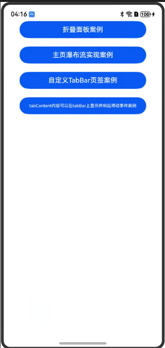
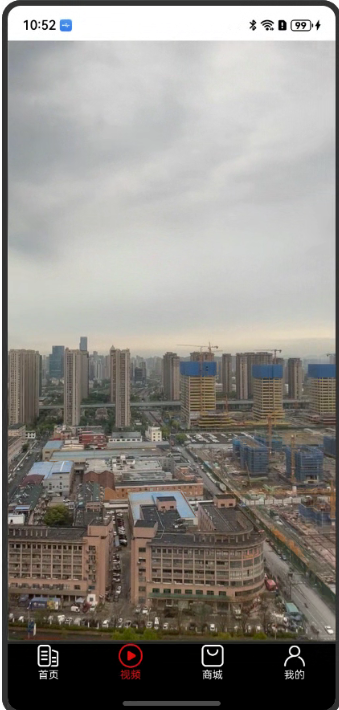

# 主页Tabs嵌套场景

### 介绍

1. 主页嵌套场景，使用tabContent嵌套；
2. 实现预加载；
3. 主页使用自定义tabbar；

### 效果预览

效果如下所示：

|主界面|主页瀑布流实现案例|折叠面板案例|自定义TabBar页签案例|TabContent内容可以在TabBar上显示并响应滑动事件案例|
|--------------------------------|--------------------------------|--------------------------------|--------------------------------|--------------------------------|
||||||

使用说明

1. 在主界面，点击蓝色按钮"主页瀑布流实现案例"。
    * 加载完成后显示整个列表，超过一屏时可以上下滑动。
2.  在主界面，点击蓝色按钮"折叠面板案例"。
    * 进入性能文章标签页面。
    * 点击多层级列表，展开子列表。
3.  在主界面，点击蓝色按钮"自定义TabBar页签案例"。
    * 依次点击TabBar页面，除了视频图标外，其余图标往上移动一小段距离。
4.  在主界面，点击蓝色按钮"TabContent内容可以在TabBar上显示并响应滑动事件案例"。
    * 点击播放按钮进行视频播放，按住进度条按钮和进度条下方区域可以拖动进度条，更改视频播放进度。

### 工程目录

```
entry/src/main/ets/
|---constants
|   |---constants.ets
|---model
|   |---collapsemenu
|   |   |---ArticleNode.ets
|   |   |---BasicDataSource.ets
|   |   |---MockData.ets
|   |   |---MockXrData.ets
|   |   |---TreeNode.ets
|   |---functionalScenes
|   |   |---SceneModuleDatas.ets
|   |   |---SceneModuleInfo.ets
|   |   |---TabsData.ets
|   |   |---WaterFlowDataSource.ets
|   |---constantsData.ets
|---pages
|   |---collapsemenu
|   |   |---CollapseMenuSection.ets
|   |   |---Concent.ets
|   |---functionalScenes
|   |   |---FunctionalScenes.ets
|   |---tabBar
|   |   |---TabBar.ets
|   |---tabContentOverFlow
|   |   |---TabContentOverFlow.ets
|   |---Index.ets
```

### 具体实现

* Example1(主页瀑布流案例)，源码参考：[Example1](entry/src/main/ets/pages/functionalScenes/FunctionalScenes.ets)
  * 构造懒加载数据源类型。
  * 通过LazyForEach循环构造列表数据。
* Example2(折叠面板案例)，源码参考：[Example2](entry/src/main/ets/pages/collapsemenu/CollapseMenuSection.ets)
  * 构造懒加载数据源类型。
  * 使用LazyForEach构造列表数据。
  * 通过点击事件更改expand的值，调用updateData方法通知监听器重新渲染页面，从而实现展开与折叠效果。
* Example3(自定义TabBar页签案例)，源码参考：[Example3](entry/src/main/ets/pages/tabBar/TabBar.ets)
  * 创建自定义组件做为TabBar的内容区。
* Example4(TabContent内容可以在TabBar上显示并响应滑动事件案例)，源码参考：[Example4](entry/src/main/ets/pages/tabContentOverFlow/TabContentOverFlow.ets)
  * TabContent加载Video组件。
  * 使用自定义进度条并添加PanGesture手势，实现在自定义TabBar上拖动进度条更改视频播放进度的功能。

### 相关权限

无

### 依赖

无

### 约束与限制

1. 本示例仅支持标准系统上运行，支持设备：Phone;
2. 本示例为Stage模型，支持API20版本SDK，SDK版本号(API Version 20),镜像版本号(6.0.0.31)。
3. 本示例需要使用DevEco Studio 版本号(6.0.0.6)版本才可编译运行。

### 下载

如需单独下载本工程，执行如下命令：

```
git init
git config core.sparsecheckout true
echo code/ArkTS1.2/TabsSample/ > .git/info/sparse-checkout
git remote add origin https://gitcode.com/openharmony/applications_app_samples.git
git pull
```