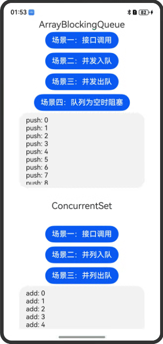
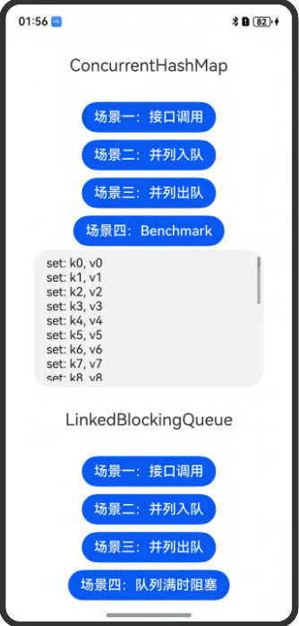
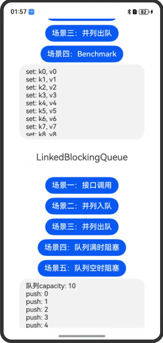

# 线程安全容器

### 介绍
验证线程安全容器（ArrayBlockingQueue、ConcurrentHashMap、ConcurrentSet、LinkedBlockingQueue）在多线程的下的安全性

### 效果图预览




**使用说明**
1. ArrayBlockingQueue
    * 点击场景一：接口调用，下方文本域显示接口调用结果
    * 点击场景二：并发入队，下方文本域显示push 200个数字过程和测试成功
    * 点击场景三：并发出队，下方文本域显示pop 200个数字过程和测试成功
    * 点击场景四：队列为空时阻塞，下方文本域显示pop数据log，但无成功log，等到输出push数据并成功之后，显示pop数据成功
2. ConcurrentHashMap
    * 点击场景一：接口调用，下方文本域显示接口调用结果
    * 点击场景二：并发入队，下方文本域显示set 100个数字过程和测试成功
    * 点击场景三：并发出队，下方文本域显示delete 100个数字过程和测试成功
    * 点击场景四：Benchmark
3. ConcurrentSet
    * 点击场景一：接口调用，下方文本域显示接口调用结果
    * 点击场景二：并发入队，下方文本域显示add 200个数字过程和测试成功
    * 点击场景三：并发出队，下方文本域显示delete 100个数字过程和测试成功
4. LinkedBlockingQueue
    * 点击场景一：接口调用，下方文本域显示接口调用结果
    * 点击场景二：并发入队，下方文本域显示push 200个数字过程和测试成功
    * 点击场景三：并发出队，下方文本域显示pop 200个数字过程和测试成功
    * 点击场景四：队列为满时阻塞，下方文本域显示push数据log，但无成功log，等到输出pop数据并成功之后，显示push数据成功
    * 点击场景五：队列为空时阻塞，下方文本域显示pop数据log，但无成功log，等到输出push数据并成功之后，显示pop数据成功

### 工程结构&模块类型

   ```
   entry/src/main/ets/
|---pages
|   |---containers
|   |   |---ArrayBlockingQueue.ets
|   |   |---ConcurrentHashMap.ets
|   |   |---ConcurrentSet.ets
|   |   |---LinkedBlockingQueue.ets
|   |---index.ets                                     // 首页
   ```

### 具体实现

1. ArrayBlockingQueue
    * 场景一：接口调用, ArrayBlockingQueue接口全调用，验证其正确性
    * 场景二：并发入队，开启两个线程，同时向ArrayBlockingQueue中push100个数字，确认数据是否正确push
    * 场景三：并发出队，开启两个线程，同时pop ArrayBlockingQueue中的200个数字，确认ArrayBlockingQueue是否为空
    * 场景四：队列为空时阻塞，开启两个线程，一个线程pop数据，一个线程push数据，ArrayBlockingQueue为空时不能pop数据，需要等push数据之后才能pop
2. ConcurrentHashMap
    * 场景一：接口调用，ConcurrentHashMap接口全调用，验证其正确性
    * 场景二：并发入队，开启两个线程，同时向ConcurrentHashMap中set50个数字，确认数据是否正确set
    * 场景三：并发出队，开启两个线程，同时delete ConcurrentHashMap中的100个数字，确认 ConcurrentHashMap是否为空
    * 场景四：Benchmark，开启六个线程，计算执行六个任务所需时间
3. ConcurrentSet
    * 场景一：接口调用，ConcurrentSet接口全调用，验证其正确性
    * 场景二：并发入队，开启两个线程，同时向ConcurrentSet中add 100个数字，确认数据是否正确add
    * 场景三：并发出队，开启两个线程，同时delete ConcurrentSet中的200个数字，确认ConcurrentSet是否为空
4. LinkedBlockingQueue
    * 场景一：接口调用，LinkedBlockingQueue接口全调用，验证其正确性
    * 场景二：并发入队，开启两个线程，同时向LinkedBlockingQueue中push 100个数字，确认数据是否正确push
    * 场景三：并发出队，开启两个线程，同时pop LinkedBlockingQueue中的200个数字，确认LinkedBlockingQueue是否为空
    * 场景四：队列为满时阻塞，开启两个线程，一个线程push数据，一个线程pop数据，LinkedBlockingQueue为满时不能push数据，需要等pop数据之后才能push
    * 场景五：队列为空时阻塞，开启两个线程，一个线程pop数据，一个线程push数据，LinkedBlockingQueue为空时不能pop数据，需要等push数据之后才能pop

### 相关权限

无

### 依赖

无

### 约束与限制

1. 本示例仅支持标准系统上运行，支持设备：Phone;
2. 本示例为Stage模型，支持API20版本SDK，SDK版本号(API Version 20),镜像版本号(6.0.0.31)。
3. 本示例需要使用DevEco Studio 版本号(6.0.0.21)版本才可编译运行。

### 下载

如需单独下载本工程，执行如下命令：

```
git init
git config core.sparsecheckout true
echo code/ArkTS1.2/ThreadSafeContainersSample/ > .git/info/sparse-checkout
git remote add origin https://gitcode.com/openharmony/applications_app_samples.git
git pull
```