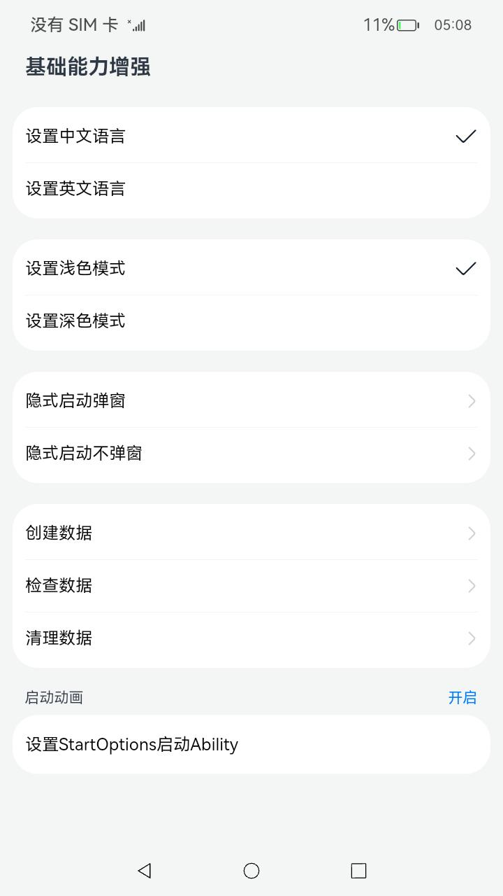
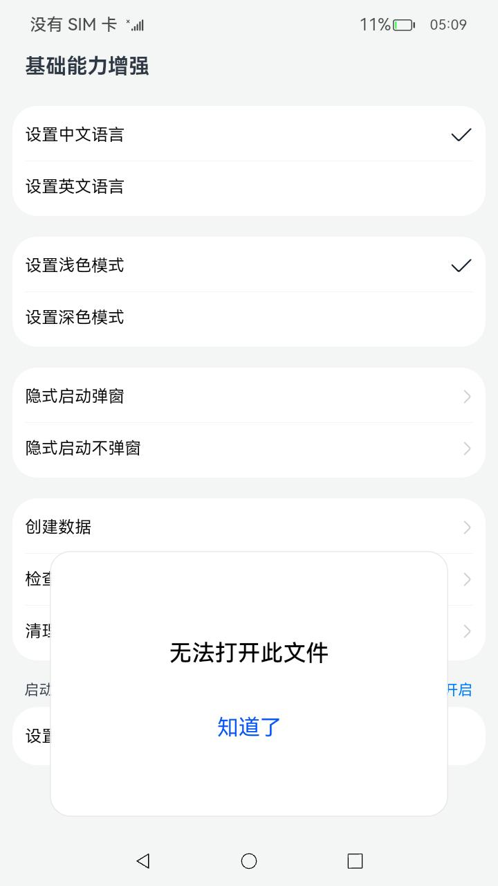
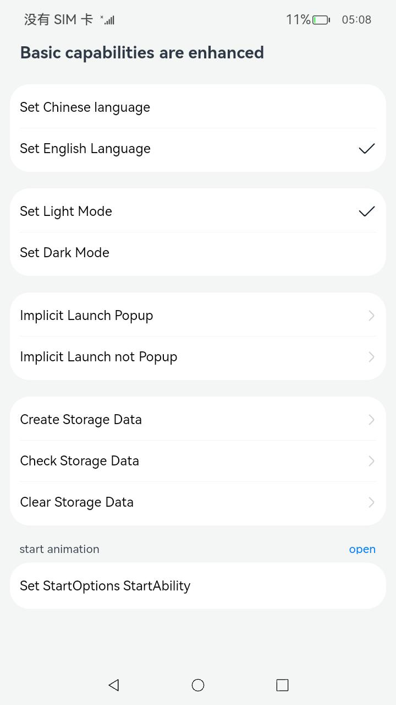
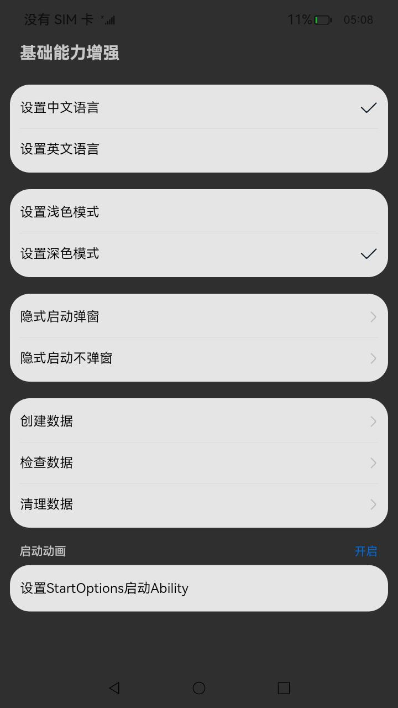

# 基础能力增强

### 介绍

本示例使用   [ApplicationContext](https://gitee.com/openharmony/docs/blob/master/zh-cn/application-dev/reference/apis-ability-kit/js-apis-inner-application-applicationContext.md) ,[ohos.ability.wantConstant](https://gitee.com/openharmony/docs/blob/master/zh-cn/application-dev/reference/apis-ability-kit/js-apis-ability-wantConstant.md) ,[ohos.app.ability.StartOptions](https://gitee.com/openharmony/docs/blob/master/zh-cn/application-dev/reference/apis-ability-kit/js-apis-app-ability-startOptions.md)等接口实现了以下功能：

1. 支持应用定制系统环境参数;

5. 支持隐式启动个数为0时才触发提示弹框--增加了一个flag;

6. 支持应用清理自己的数据;

7. Ability启动参数支持传递初始位置/初始大小/是否携带动效;

### 效果预览

|                            主页面                            |                         隐式启动弹窗                         |                      英文切换页                      |                    深色模式切换页                    |
| :----------------------------------------------------------: | :----------------------------------------------------------: | :--------------------------------------------------: | :--------------------------------------------------: |
|  |  |  |  |

使用说明

1.应用切换语言的能力

点击'切换英文语言'的ListItem，当前页面切换为英文，标题'基础能力增强'切换成'Basic capabilities are enhanced'
,点击'切换中文语言'的ListItem，当前页面切换为中文，标题'Basic capabilities are enhanced'切换成'基础能力增强'

2.应用切换颜色模式的能力

点击'切换深色模式'的ListItem，当前页面颜色切换为深色,弹出Toast提示'切换成功',点击'切换浅色模式'
的ListItem，当前页面颜色切换为浅色,弹出Toast提示'切换成功'

3.应用隐式启动个数为0时,才触发提示弹框的特性

点击'隐式启动弹窗'的ListItem，弹出弹窗，弹窗标题为'未找到文件'  ,点击'隐式启动不弹窗'
的ListItem，弹出Toast提示'隐式启动不弹窗'，且无弹窗（仅支持rk）

4.应用清理自己的数据的能力

点击'创建数据'的ListItem，弹出Toast提示创建'缓存文件成功',点击'检查数据'的ListItem，弹出Toast提示创建'查询到缓存文件'
,点击'清除数据'的ListItem，应用清理缓存文件后自动退出。手动重新启动应用后，点击'检查数据'的ListItem，弹出Toast提示创建'未找到缓存文件'

5.应用可以设置启动参数启动Ability能力
mm
点击''StartOptions配置'的ListItem,应用启动NewAbility。返回主界面后，点击''启动动画'的Toggle,再点击''
StartOptions配置'的ListItem，应用启动NewAbility

### 工程目录

```
entry/src/main/ets/
|---characteroperation
|   |---CharacterOperation.ets          // 调用applicationContext方法的工具类
|---entryability
|   |---EntryAbility.ets				// 首页的Ability
|---pages
|   |---Index.ets						// 首页
|   |---New.ets							// 被启动UIAbility的展示页
|---newability
|   |---NewAbility.ets					// 被启动的UIAbility(验证新接口启动使用)
|---utils								// 工具
|   |---Logger.ets						// 日志工具
```

### 具体实现

- 应用切换语言的功能接口封装在CharacterOperation，使用[ApplicationContext](https://gitee.com/openharmony/docs/blob/master/zh-cn/application-dev/reference/apis-ability-kit/js-apis-inner-application-applicationContext.md) 调用setLanguage(language: string): void方法实现，源码参考：[CharacterOperation.ets](entry/src/main/ets/characteroperation/CharacterOperation.ets)
- 应用切换颜色模式的功能接口封装在CharacterOperation，使用[ApplicationContext](https://gitee.com/openharmony/docs/blob/master/zh-cn/application-dev/reference/apis-ability-kit/js-apis-inner-application-applicationContext.md) 调用setColorMode(colorMode: ConfigurationConstant.ColorMode): void方法实现，源码参考：[CharacterOperation.ets](entry/src/main/ets/characteroperation/CharacterOperation.ets)
- 应用清理自己的数据的功能接口封装在CharacterOperation，使用[ApplicationContext](https://gitee.com/openharmony/docs/blob/master/zh-cn/application-dev/reference/apis-ability-kit/js-apis-inner-application-applicationContext.md) 调用clearUpApplicationData(callback: AsyncCallback<void>): void方法实现，源码参考：[CharacterOperation.ets](entry/src/main/ets/characteroperation/CharacterOperation.ets)
- 应用隐式启动个数为0时不触发提示弹框的特性，通过给Want的flags设置为FLAG_START_WITHOUT_TIPS,源码参考：[Index.ets](entry/src/main/ets/pages/Index.ets)
- 应用可以设置启动参数启动Ability能力，通过给startAbility(want: Want, options: StartOptions, callback: AsyncCallback<void>): void;方法传递新增参数StartOptions来设置启动位置，大小以及是否包含动画，源码参考：[Index.ets](entry/src/main/ets/pages/Index.ets)

### 相关权限

无

### 依赖

无

### 约束与限制

1.本示例仅支持标准系统上运行，支持设备：RK3568;

2.本示例为Stage模型，支持API11版本SDK，版本号：4.1.5.1；

3.本示例需要使用DevEco Studio 3.1.1 Release (Build Version: 3.1.0.501, built on June 20, 2023)才可编译运行；

### 下载

```shell
git init
git config core.sparsecheckout true
echo code/BasicFeature/Ability/AbilityFeature/ > .git/info/sparse-checkout
git remote add origin https://gitee.com/openharmony/applications_app_samples.git
git pull origin master
```

