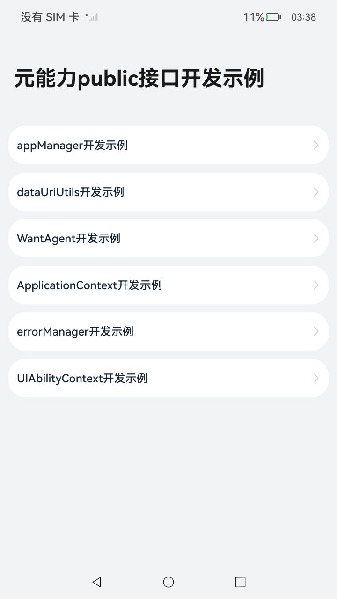
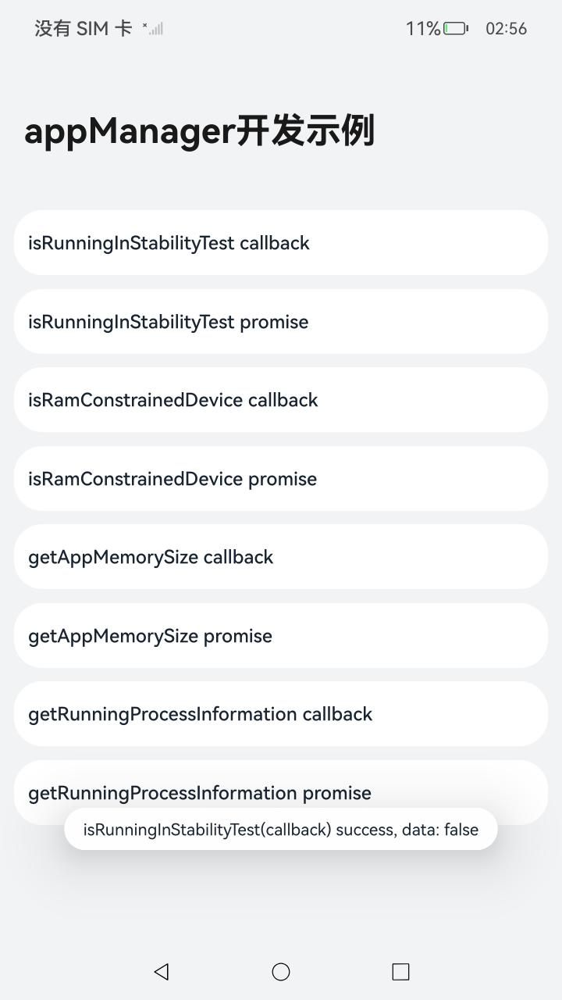
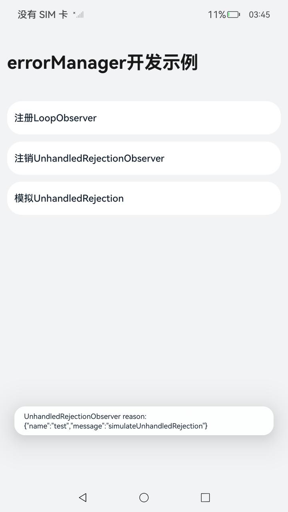
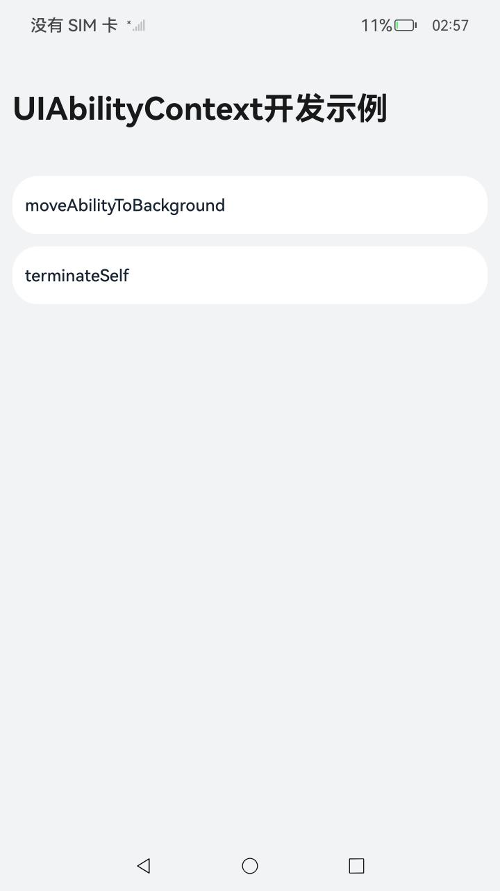

# 基础能力增强

### 介绍

本示例使用 [AppManager](https://gitee.com/openharmony/docs/blob/master/zh-cn/application-dev/reference/apis-ability-kit/js-apis-app-ability-appManager.md) ，[dataUriUtils](https://gitee.com/openharmony/docs/blob/master/zh-cn/application-dev/reference/apis-ability-kit/js-apis-ability-dataUriUtils.md)，[WantAgent](https://gitee.com/openharmony/docs/blob/master/zh-cn/application-dev/reference/apis-ability-kit/js-apis-wantAgent.md)，[ApplicationContext](https://gitee.com/openharmony/docs/blob/master/zh-cn/application-dev/reference/apis-ability-kit/js-apis-inner-application-applicationContext.md)，[errorManager](https://gitee.com/openharmony/docs/blob/master/zh-cn/application-dev/reference/apis-ability-kit/js-apis-app-ability-errorManager.md)，[UIAbilityContext](https://gitee.com/openharmony/docs/blob/master/zh-cn/application-dev/reference/apis-ability-kit/js-apis-inner-application-uiAbilityContext.md)中的接口进行实现。

### 效果预览

|                      主页面                      |                  appManager开发示例                   |                  errorManager开发示例                   |                  UIAbilityContext开发示例                   |
| :----------------------------------------------: | :---------------------------------------------------: | :-----------------------------------------------------: | :---------------------------------------------------------: |
|  |  |  |  |

### 使用说明

AppManager对应接口

1.点击主页面**appManager开发示例**按钮，跳转到'appManager开发示例'界面；

2.点击**isRunningInStabilityTest callback**按钮，弹出'isRunningInStabilityTest(callback) success...'信息；

3.点击**isRunningInStabilityTest promise**按钮，弹出提示'isRunningInStabilityTest(promise) success...'信息；

4.点击**isRamConstrainedDevice callback**按钮，弹出提示'isRamConstrainedDevice(callback) success...'信息；

5.点击**isRamConstrainedDevice promise**按钮，弹出提示'isRamConstrainedDevice(promise) success...'信息；

6.点击**getAppMemorySize callback**按钮，弹出提示'getAppMemorySize(callback) success...'信息；

7.点击**getAppMemorySize promise**按钮，弹出提示'getAppMemorySize(promise) success...'信息；

8.点击**getRunningProcessInformation callback**按钮，弹出提示'getRunningProcessInformation(callback) success...'信息；

9.点击**getRunningProcessInformation promise**按钮，弹出提示'getRunningProcessInformation(promise) success...'信息;


dataUriUtils对应接口

1.点击主页面**dataUriUtils开发示例**按钮，跳转到'dataUriUtils开发示例'界面；

2.点击**getId**按钮，弹出提示'dataUriUtils.getId() called...'信息；

3.点击**attachId**按钮，弹出提示'dataUriUtils.attachd() called...'信息；

4.点击**deleteId**按钮，弹出提示'dataUriUtils.deleteId() called...'信息；

5.点击**updateId**按钮，弹出提示'dataUriUtils.updateId() called...'信息；


WantAgent对应接口

1.点击主页面**WantAgent开发示例**按钮，跳转到'WantAgent开发示例'界面；

2.点击**getBundleName callback**按钮，弹出提示'getBundleName(callback) success...'信息；

3.点击**getBundleName promise**按钮，弹出提示'getBundleName(promise) success...'信息；

4.点击**getUid callback**按钮，弹出提示'getUid(callback) success...'信息；

5.点击**getUid promise**按钮，弹出提示'getUid(promise) success...'信息；

6.点击**cancel callback**按钮，弹出提示'cancel(callback) success'信息；

7.点击**cancel promise**按钮，弹出提示'cancel(promise) success'信息；

8.点击**equal callback**按钮，弹出提示'equal(callback) success...'信息；

9.点击**equal promise**按钮，弹出提示'equal(promise) success...'信息；

10.点击**getOperationType callback**按钮，弹出提示'getOperationType(callback) success...'信息；

11.点击**getOperationType promise**按钮，弹出提示'getOperationType(promise) success...'信息；

12.点击**trigger**按钮，弹出提示'trigger success...'信息；


ApplicationContext对应接口

1.点击主页面**ApplicationContext开发示例**按钮，跳转到'ApplicationContext开发示例'界面；

2.点击**setFont**按钮，弹出提示'setFont successfully'信息；

3.点击**getRunningProcessInformation promise**按钮，弹出提示'getRunningProcessInformation promise successfully...'信息；

4.点击**getRunningProcessInformation callback**按钮，弹出提示'getRunningProcessInformation callback successfully...'信息；

5.点击**getCurrentAppCloneIndex**按钮，弹出提示'getCurrentAppCloneIndex  successfully...'信息；


errorManager对应接口

1.点击主页面**errorManager开发示例**按钮，跳转到'errorManager开发示例'界面；

2.点击**注册LoopObserver**按钮，弹出提示'loopObserver registered successfully...'信息；

3.点击**注册UnhandledRejectionObserver**按钮，弹出提示'unhandledRejection registered successfully'信息，列表中增加**模拟UnhandledRejection**按钮，并且原**注册UnhandledRejectionObserver**按钮变为**注销UnhandledRejectionObserver**按钮

4.点击**模拟UnhandledRejection**按钮，弹出提示'UnhandledRejectionObserver  reason...'信息；

5.点击**注销UnhandledRejection**按钮，弹出提示'unhandledRejection unregistered successfully'信息，**注销UnhandledRejectionObserver**按钮变回**注册UnhandledRejectionObserver**按钮，列表中**模拟UnhandledRejection**按钮消失；


UIAbilityContext对应接口

1.点击主页面**UIAbilityContext开发示例**按钮，启动新的Ability显示'UIAbilityContext开发示例'界面；

2.点击**moveAbilityToBackground**按钮，将启动的Ability移动到后台，页面显示为主页面，触发AbilityLifecycleCallback中的生命周期；

3.再次点击主页面**UIAbilityContext开发示例**按钮，启动新的Ability显示'UIAbilityContext开发示例'界面，点击**terminateSelf**按钮，回到主页面；

### 工程目录

```
entry/src/main/ets/
|---abilitylifecyclecallback
|   |---AbilityLifecycleCallback.ets        //AbilityLifecycleCallback生命周期
|---abilitypages
|   |---ApplicationContext.ets              //ApplicationContext中对应接口
|   |---AppManager.ets                      //AppManager中对应接口
|   |---DataUriUtils.ets                    //DataUriUtils中对应接口
|   |---ErrorManager.ets                    //ErrorManager中对应接口
|   |---UIAbilityContext.ets                //UIAbilityContext中对应接口
|   |---WantAgent.ets                       //WantAgent中对应接口
|---entryability
|   |---EntryAbility.ets					// 首页的Ability
|---pages
|   |---Index.ets							// 首页
```

### 具体实现

* AppManager对应接口实现，源码参考[AppManager.ets](entry/src/main/ets/abilitypages/appManager.ets)

  * isRunningInStabilityTest（callback）接口实现：通过调用appManager.isRunningInStabilityTest()接口，查询当前是否处于稳定性测试场景。使用callback异步回调，并将弹出Toast信息的功能；
  * isRunningInStabilityTest（promise）接口实现：通过调用appManager.isRunningInStabilityTest()接口，查询当前是否处于稳定性测试场景。使用Promise异步回调，并将弹出Toast信息的功能；
  * isRamConstrainedDevice（callback）接口实现：通过调用appManager.isRamConstrainedDevice()接口，查询是否为ram受限设备。使用callback异步回调，并将弹出Toast信息的功能；
  * isRamConstrainedDevice（promise）接口实现：通过调用appManager.isRamConstrainedDevice()接口，查询是否为ram受限设备。使用Promise异步回调，并将弹出Toast信息的功能；
  * getAppMemorySize（callback）接口实现：通过调用appManager.getAppMemorySize()接口，获取当前应用程序可以使用的内存的值。使用callback异步回调，并将弹出Toast信息的功能；
  * getAppMemorySize（promise）接口实现：通过调用appManager.getAppMemorySize()接口，获取当前应用程序可以使用的内存的值。使用Promise异步回调，并将弹出Toast信息的功能；
  * getRunningProcessInformation（callback）接口实现：通过调用appManager.getRunningProcessInformation()接口，获取当前运行进程的有关信息。使用callback异步回调，并将弹出Toast信息的功能；
  * getRunningProcessInformation（promise）接口实现：通过调用appManager.getRunningProcessInformation()接口，获取当前运行进程的有关信息。使用Promise异步回调，并将弹出Toast信息的功能；
* dataUriUtils对应接口实现，源码参考[DataUriUtils.ets](entry/src/main/ets/abilitypages/DataUriUtils.ets)

  * getId接口实现：通过调用dataUriUtils.getId()接口，获取指定uri路径末尾的ID的功能；
  * attachId接口实现：通过调用dataUriUtils.attachId()接口，将ID附加到uri的路径末尾的功能；
  * deleteId接口实现：通过调用dataUriUtils.deleteId()接口，删除指定uri路径末尾的ID的功能；
  * updateId接口实现：通过调用dataUriUtils.updateId()接口，更新指定uri中的ID的功能；
* WantAgent对应接口实现，源码参考[WantAgent.ets](entry/src/main/ets/abilitypages/WantAgent.ets)

  * getBundleName（callback）接口实现：通过调用this.getBundleNameCallback()接口，获取WantAgent实例的包名；
  * getBundleName（promise）接口实现：通过调用this.getBundleNamePromise()接口，获取WantAgent实例的包名；
  * getUid（callback）接口实现：通过调用this.getUidCallback()接口，获取WantAgent实例的用户ID；
  * getUid（promise）接口实现：通过调用this.getUidPromise接口，获取WantAgent实例的用户ID；
  * cancel（callback）接口实现：通过调用this.cancelCallback()接口，取消WantAgent实例；
  * cancel（promise）接口实现：通过调用this.cancelPromise()接口，取消WantAgent实例；
  * equal（callback）接口实现：通过调用this.equalCallback()接口，以此来判断是否是来自同一应用的相同操作，判断两个WantAgent实例是否相等的回调方法。返回true表示两个WantAgent实例相等，false表示两个WantAgent实例不相等；
  * equal（promise）接口实现：通过调用this.equalPromise()接口，以此来判断是否是来自同一应用的相同操作，判断两个WantAgent实例是否相等的结果。返回true表示两个WantAgent实例相等，false表示两个WantAgent实例不相等；
  * getOperationType（callback）接口实现：通过调用this.getOperationTypeCallback()接口，获取一个WantAgent的OperationType信息；
  * getOperationType（promise）接口实现：通过调用this.getOperationTypePromise()接口，获取一个WantAgent的OperationType信息；
  * trigger接口实现：通过调用this.trigger()接口，主动激发WantAgent实例；
* ApplicationContext对应接口实现，源码参考[ApplicationContext.ets](entry/src/main/ets/abilitypages/ApplicationContext.ets)

  * setFont接口实现：通过调用applicationContext.setFont接口，设置应用的字体类型。仅支持主线程调用，设置字体类型，字体可以通过font.registerFont方法进行注册使用；
  * getRunningProcessInformation（callback）接口实现：通过调用ApplicationContext.getRunningProcessInformation接口，获取有关运行进程的信息；
  * getRunningProcessInformation（promise）接口实现：通过调用ApplicationContext.getRunningProcessInformation接口，获取有关运行进程的信息；
  * getCurrentAppCloneIndex接口实现：通过调用ApplicationContext.getCurrentAppCloneIndex接口，获取当前应用的分身索引；
* errorManager对应接口实现，源码参考[ErrorManager.ets](entry/src/main/ets/abilitypages/ErrorManager.ets)
  * 注册on（loopObserver类型）接口实现：通过调用errorManager.on 接口，注册监听loopObserver，注册后可以捕获到应用主线程处理消息的具体执行时间，触发onLoopTimeOut，之后注销监听；
  * 注册on（unhandledRejection类型）接口实现：通过调用errorManager.on接口，注册监听unhandledRejection，注册后可以捕获到当前线程中未被捕获到的promise rejection，模拟unhandledRejection类型错误，触发监听，之后注销监听；
* UIAbilityContext对应接口实现：源码参考[UIAbilityContext.ets](entry/src/main/ets/abilitypages/UIAbilityContext.ets)
  * moveAbilityToBackground接口实现：通过调用context.moveAbilityToBackground()接口，将处于前台的Ability移动到后台，调用context.terminateSelf()，停止Ability自身，触发AbilityLifecycleCallback中的生命周期；

### 相关权限

不涉及。

### 依赖

不涉及。

### 约束与限制

1.本示例仅支持标准系统上运行，支持设备：RK3568；

2.本示例为Stage模型，支持API12版本SDK，版本号：5.0.0.31；

3.本示例需要使用DevEco Studio NEXT Developer Beta1 (Build Version: 5.0.3.502, built on July 28, 2024)才可编译运行；

### 下载

```shell
git init
git config core.sparsecheckout true
echo code/BasicFeature/Ability/AbilityRuntime > .git/info/sparse-checkout
git remote add origin https://gitee.com/openharmony/applications_app_samples.git
git pull origin master
```


