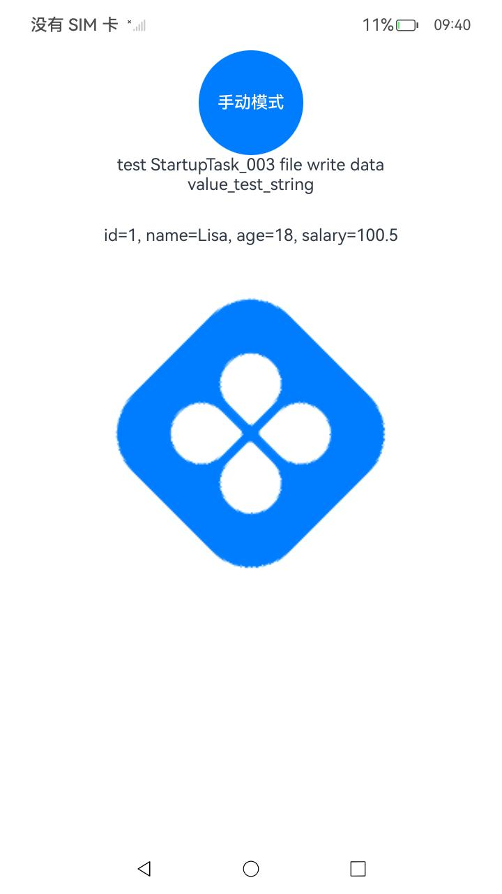

# 应用启动框架AppStartup

### 介绍

本示例使用了：
[@ohos.app.appstartup.StartupTask](https://gitee.com/openharmony/docs/blob/master/zh-cn/application-dev/reference/apis-ability-kit/js-apis-app-appstartup-startupTask.md)，
[@ohos.app.appstartup.StartupConfig](https://gitee.com/openharmony/docs/blob/master/zh-cn/application-dev/reference/apis-ability-kit/js-apis-app-appstartup-startupConfig.md)，
[@ohos.app.appstartup.StartupConfigEntry](https://gitee.com/openharmony/docs/blob/master/zh-cn/application-dev/reference/apis-ability-kit/js-apis-app-appstartup-startupConfigEntry.md)，
[@ohos.app.appstartup.StartupListener](https://gitee.com/openharmony/docs/blob/master/zh-cn/application-dev/reference/apis-ability-kit/js-apis-app-appstartup-startupListener.md)，
[@ohos.app.appstartup.startupManager](https://gitee.com/openharmony/docs/blob/master/zh-cn/application-dev/reference/apis-ability-kit/js-apis-app-appstartup-startupManager.md)
接口，展示了在eTS中如何使用应用启动框架AppStartup；

### 效果预览

|              主页面(自动模式)              |            手动模式            | 
|:-----------------------------------:|:-----------------------------------------:|
|  |  | 

使用说明： 
 在启动应用后：
 1. excludeFromAutoStart:false 是自动模式，index页面中显示的数据都是在应用启动框架AppStartup中初始化完成的；
 2. excludeFromAutoStart:true 是手动模式，点击按钮手动模式在代码中通过startupManager.run()函数来加载ImageKnifeTask后在页面显示出图片；

### 工程目录

```
entry/src/main/ets/
|---util
|   |---SingleKVStore.ts                   // 工具类
|---startup
|   |---FileTask.ets                       // 创建文件，且写入数据
|   |---ImageKnifeTask.ets                 // 初始化ImageKnifeTask
|   |---KvManagerUtilTask.ets              // 获取KvManager
|   |---KVStoreTask.ets                    // 创建KVStore，且存入数据
|   |---RdbStoreTask.ets                   // 创建RdbStore，且存入数据
|   |---ResourceManagerTask.ets            // 获取图片资源
|   |---StartupConfig.ets                  // StartupConfig配置
|---pages
|   |---Index.ets                          // 首页
|   |---ImageKnife.ets                     // 框架加载图片
```

### 具体实现

在resources->base->profile->startup_config.json 配置startup目录下的task，在module.json5中添加这些task，
启动应用首先会执行这些配置的task，然后在页面获取初始化的实例或者一些数据，具体情况根据业务所定；

### 相关权限

不涉及。

### 依赖

[ImageKnife](https://gitee.com/openharmony-tpc/ImageKnife) 示例中加载图片使用的是ImageKnife框架。

### 约束与限制

1. 本示例仅支持标准系统上运行，支持设备：RK3568；

2. 本示例已适配API version 12版本SDK，版本号：5.0.0.28；

3. 本示例需要使用DevEco Studio 3.1 Beta2 (Build Version: 4.1.3.500 构建 2024年7月5日)及以上版本才可编译运行；

### 下载

如需单独下载本工程，执行如下命令：

```
git init
git config core.sparsecheckout true
echo code/BasicFeature/Ability/AppStartup/ > .git/info/sparse-checkout
git remote add origin https://gitee.com/openharmony/applications_app_samples.git
git pull origin master
```