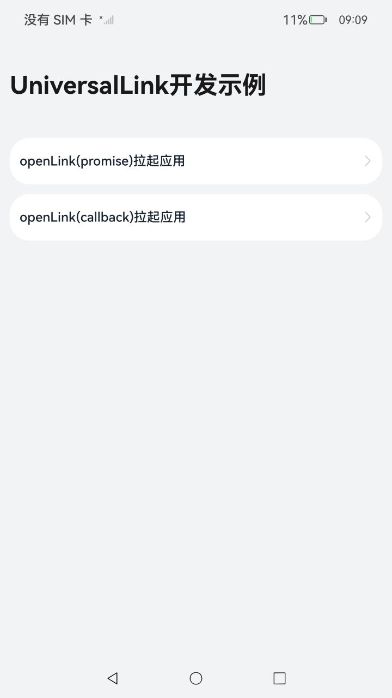
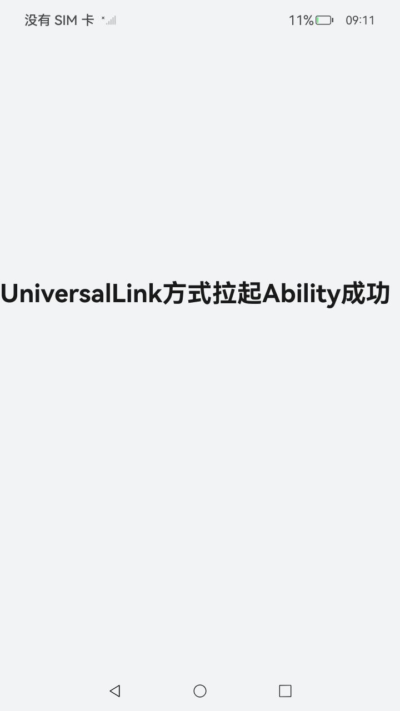

# 基础能力增强

### 介绍

本示例使用 [UIAbilityContext](https://gitee.com/openharmony/docs/blob/master/zh-cn/application-dev/reference/apis-ability-kit/js-apis-inner-application-uiAbilityContext.md) 接口实现了通过AppLinking启动UIAbility功能。

### 效果预览

|                      主页面                      |                  点击按钮拉起Ability                  |
| :----------------------------------------------: | :---------------------------------------------------: |
|  |  |

### 使用说明

UniversalLink基础能力展示

1.点击主页面**openLink(promise)拉起应用**按钮，拉起新的Ability，页面显示'UniversalLink方式拉起Ability成功'；

2.点击主页面**openLink(callback)拉起应用**按钮，拉起新的Ability，页面显示'UniversalLink方式拉起Ability成功'；

### 工程目录

```
entry/src/main/ets/
|---entryability
|   |---EntryAbility.ets					// 首页的Ability
|   |---OpenLinkAbility.ets				    // UIAbility(用于验证UniversalLink功能使用)
|---pages
|   |---Index.ets							// 首页(包含openLink接口的调用)
|   |---UniversalLinkIndex.ets				// 被启动的UIAbility的展示页
```

### 具体实现

* UniversalLink基础能力实现，源码参考[Index.ets](entry/src/main/ets/pages/Index.ets)

  * openLink（promise）接口实现：通过调用context.openLink接口，传入与要拉起的应用相同的配置，实现拉起应用的功能；
  * openLink（callback）接口实现：通过调用context.openLink接口，传入与要拉起的应用相同的配置，实现拉起应用的功能；


### 相关权限

不涉及。

### 依赖

不涉及。

### 约束与限制

1.本示例仅支持标准系统上运行，支持设备：RK3568；

2.本示例为Stage模型，支持API12版本SDK，版本号：5.0.0.31；

3.本示例需要使用DevEco Studio NEXT Developer Beta1 (Build Version: 5.0.3.403, built on June 20, 2024)才可编译运行；

### 下载

```shell
git init
git config core.sparsecheckout true
echo code/BasicFeature/Ability/UniversalLink/ > .git/info/sparse-checkout
git remote add origin https://gitee.com/openharmony/applications_app_samples.git
git pull origin master
```

