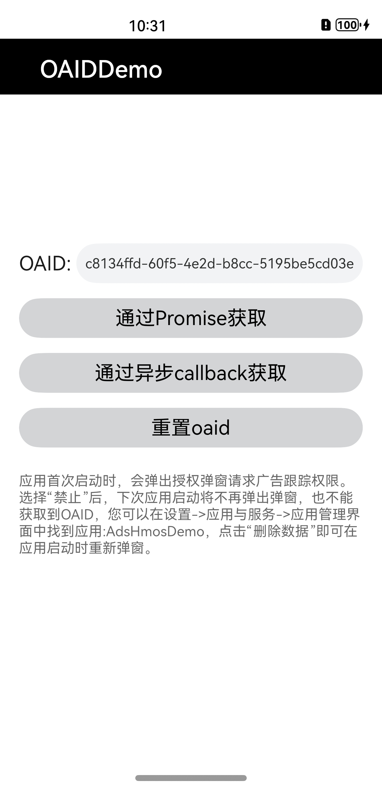
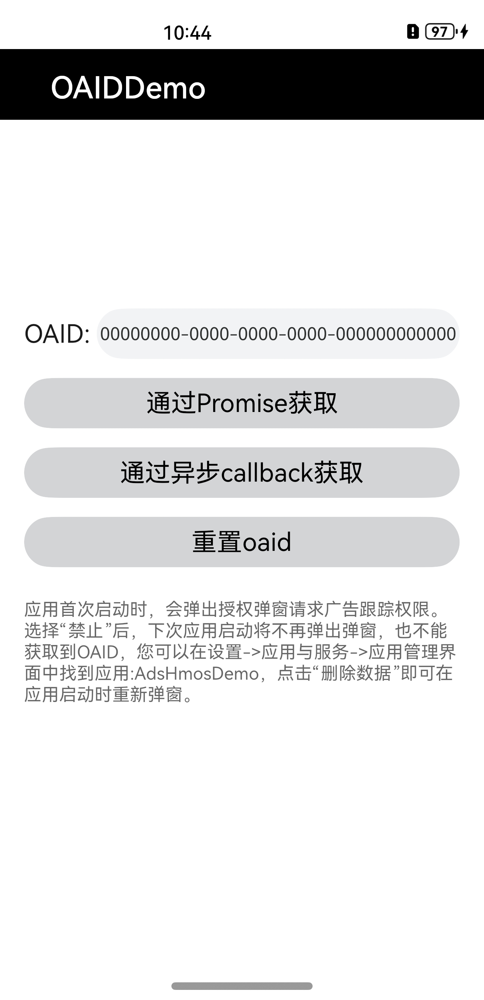

# 广告标识服务Sample

### 介绍

本示例展示了如何通过广告标识服务部件提供的接口获取开放匿名设备标识符以及重置开放匿名设备标识符

### 效果预览
| 打开主页弹出授权弹框页面      | 获取OAID成功页面                       |         获取OAID失败页面                    |   
|-----------------------------------|--------------------|------------------------------------|
|  |  |  | 


概念说明：

- 开放匿名设备标识符

  开放匿名设备标识符（Open Anonymous Device Identifier, OAID，以下简称OAID）：是一种非永久性设备标识符，基于开放匿名设备标识符，可在保护用户个人数据隐私安全的前提下，向用户提供个性化广告，同时三方监测平台也可以向广告主提供转化归因分析。

使用说明：

1.打开应用进入首页，首次进入应用会弹出授权弹窗，选择“允许”，则可以获取到OAID；选择“禁止”，则OAID获取不到，为全0的空串。

2.点击“通过Promise获取OAID”，上方文本框显示OAID。

3.点击“通过异步callback获取OAID”，上方文本框显示OAID。

4.重置功能需安装[ResetOAID](/code/BasicFeature/Ads/OAIDSample/lib/ResetOAID-1.0.0.hap)，点击“重置OAID”，上方文本框OAID重置。


### 工程目录
```
entry/src/main/ets/
|---entryability
|   |---EntryAbility.ts     
|---log
|   |---Logger.ts          // 日志
|---pages
|   |---Index.ets          // 主页面，获取OAID及重置OAID

```

### 具体实现

1.配置Module信息：

- 在module.json5文件中的“requestPermissions”标签中添加需要开的权限，例如应用读取开放匿名设备标识符权限
```
"requestPermissions": [
  {
    "name": "ohos.permission.APP_TRACKING_CONSENT",
    "reason": "$string:reason",
    "usedScene": {
      "abilities": [
        "EntryFormAbility"
      ],
      "when": "inuse"
    }
  }
]

```

2.获取OAID

- 在Index.ets页面中调用广告标识服务部件提供的identifer.getOAID接口

3.重置OAID

- 在Index.ets页面中调用广告标识服务部件提供的identifer.resetOAID接口

### 相关权限

获取OAID功能需要申请广告跟踪权限：
[ohos.permission.APP_TRACKING_CONSENT](https://docs.openharmony.cn/pages/v4.0/zh-cn/application-dev/security/permission-list.md/)。

### 依赖

不涉及

### 约束与限制

1.本示例仅支持标准系统上运行。

2.本示例为Stage模型，已适配API10版本SDK，SDK版本号(API Version 10 Release),镜像版本号(4.0 Release)。

3.本工程示例需要使用DevEco Studio 版本号(4.0Release)及以上版本才可编译运行。

### 下载

如需单独下载本工程，执行如下命令：

```shell
git init
git config core.sparsecheckout true
echo code/BasicFeature/Ads/OAIDSample/ > .git/info/sparse-checkout
git remote add origin https://gitee.com/openharmony/applications_app_samples.git
git pull origin master
```