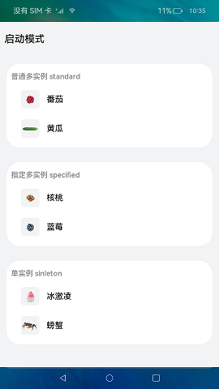
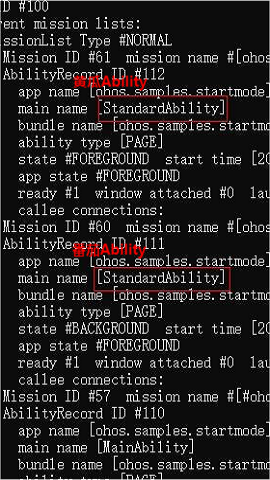
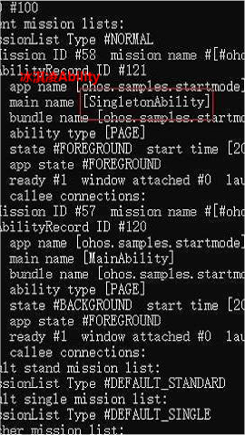
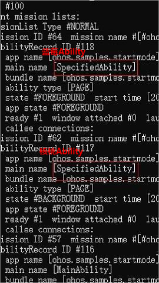

# Ability的启动模式

### 介绍

本示例展示了在一个Stage模型中，实现standard、singleton、specified多种模式场景。

本实例参考[开发指南](https://gitee.com/openharmony/docs/blob/master/zh-cn/application-dev/quick-start/stage-structure.md) 。
本实例需要使用[aa工具](https://gitee.com/openharmony/docs/blob/master/zh-cn/application-dev/tools/aa-tool.md) 查看应用Ability 模式信息。 

### 效果预览

|主页|普通多实例Ability信息|单实例Ability信息|指定多实例Ability信息|
|--------------------------------|--------------------------------|--------------------------------|--------------------------------|
|||||

使用说明

1、standard模式：

1）进入首页，点击番茄，会新建一个番茄的Ability，展示番茄的详情；

2）在番茄的详情界面，点击黄瓜，会新建一个黄瓜的Ability，展示黄瓜的详情；

3）使用aa工具查看Ability信息，此时存在以下Ability：1个番茄的Ability、1个黄瓜的Ability、1个首页的Ability；

2、singleton模式：

1）进入首页，点击冰淇凌，会新建一个冰淇凌的Ability，展示冰淇凌的详情；

2）在冰淇凌的详情界面，点击螃蟹，会复用冰淇凌的Ability，页面数据会刷新并展示螃蟹的详情；

3）使用aa工具查看Ability信息，此时存在以下Ability：1个冰淇凌的Ability、1个首页Ability；

3、specified模式：

1）进入首页，点击核桃，会新建一个核桃的Ability，展示核桃的详情；

2）在核桃的详情界面，点击蓝莓，会新建一个蓝莓的Ability，展示蓝莓的详情；

3）在蓝莓的详情界面，点击核桃，会复用已存在的核桃的Ability，实现specified模式下的单实例特性，页面数据会刷新并展示核桃的详情；

4）使用aa工具查看Ability信息，此时存在以下Ability：1个核桃的Ability、1个蓝莓的Ability、1个首页Ability；

### 工程目录
```
entry/src/main/ets/
|---Application
|---common
|   |---Logger.ts                     // 日志工具
|   |---Util.ts                       // 封装常用函数
|---MainAbility
|---model
|   |---DataModel.ts                  // 封装数据类型
|   |---DataUtil.ts                   // 封装数据处理函数
|   |---MokeData.ts                   // 模拟数据
|---pages
|   |---component
|   |   |---FoodListItem.ets          // 食物列表组件
|   |---FoodDetail.ets                // 食物详情页
|   |---Home.ets                      // 首页
```
### 具体实现

* 本示例启动standard、singleton、specificed三种模式的方法主要封装在Util当中，源码参考:[Util.ts](https://gitee.com/openharmony/applications_app_samples/blob/master/code/BasicFeature/ApplicationModels/AbilityStartMode/entry/src/main/ets/common/Util.ts) 。
    * 新建Ability：创建三个代表standard、singleton、specified模式的Ability，如工程目录中的SingletonAbility、SpecifiedAbility、StandardAbility，并在module.json文件中将launchType属性修改为对应的启动模式属性。
    * 启动指定Ability：通过Util中的startMode函数根据页面所传的abilityName，启动对应的ability并进入详情页面。
    * specified多实例功能实现：specified模式则是根据MyAbilityStage中的onAcceptWant函数给用户返回一个ability标识，如果之前启动过标识的ability，不创建新的实例并拉回栈顶，否则创建新的实例并启动。
   
### 相关权限

不涉及。

### 依赖

不涉及。

### 约束与限制

1.本示例仅支持标准系统上运行,支持设备:RK3568。

2.本示例已适配API version 10版本SDK，版本号：4.0.5.1。

3.本示例需要使用DevEco Studio 3.1 Canary1 (Build Version: 3.1.0.100)及以上版本才可编译运行。
