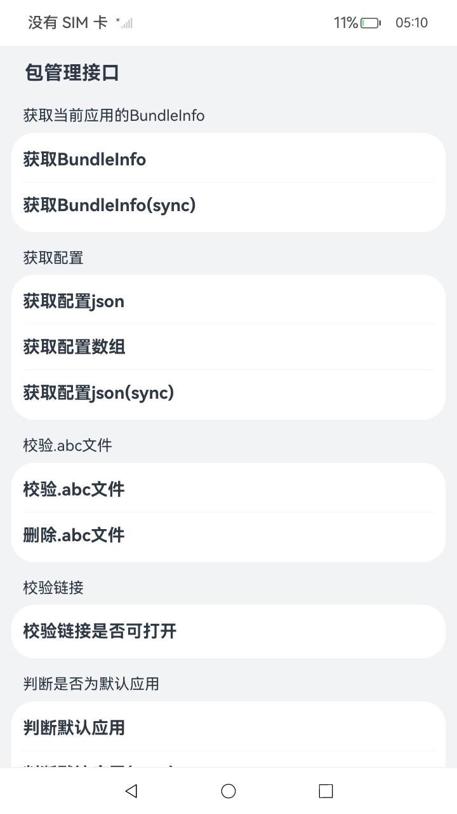
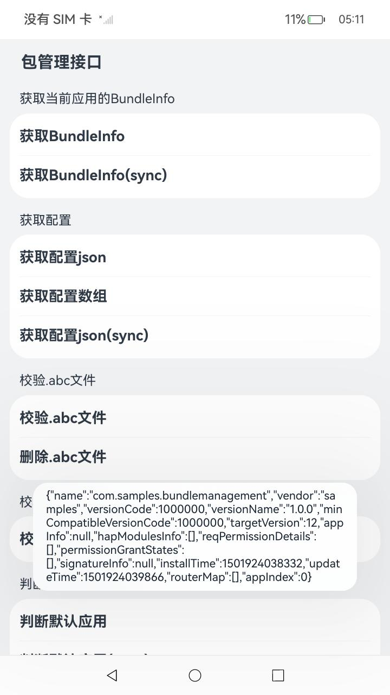

# 支持5.0特性能力sample

### 介绍

本示例使用[@ohos.bundle.bundleManager](https://gitee.com/openharmony/docs/blob/master/zh-cn/application-dev/reference/apis-ability-kit/js-apis-bundleManager.md)，[@ohos.bundle.defaultAppManager](https://gitee.com/openharmony/docs/blob/master/zh-cn/application-dev/reference/apis-ability-kit/js-apis-defaultAppManager.md)，[@ohos.bundle.overlay](https://gitee.com/openharmony/docs/blob/master/zh-cn/application-dev/reference/apis-ability-kit/js-apis-overlay.md)
等接口，展示了向开发者如何调用包管理提供的public接口，验证其功能。

### 效果预览

|主页|
|---|
||

### 使用说明

此界面为主页面，其中展示了包管理各类接口的调用以及特性Overlay场景功能其作用有：

1、点击每个示例按钮，可调用包管理接口并把数据通过弹窗形式显现。

例如下图所示，点击获取BundleInfo按钮对应的接口返回结果会通过弹窗形式显现，其他示例按钮对应的返回结果形式与其相同。

|资源API测试|
|---|
||

### 工程目录

```
entry/src/main/ets/
|---entryability
|---newuiextability                   // ExtensionAbilitiy实现类
|---pages
|   |---Index.ets                     // 场景首页
|   |---NewPage.ets                   // 静态快捷方式场景      
|---libraryOverlay                    // 动态共享包
|---libraryRuntimeOverlay      
```

动态共享包可参考：[HSP (openharmony.cn)](https://docs.openharmony.cn/pages/v4.1/zh-cn/application-dev/quick-start/in-app-hsp.md)

### 具体实现

#### 包管理API调用示例具体实现：

1、引入d.ts头文件import bundleManager from '@ohos.bundle.bundleManager';import defaultAppMgr from '@ohos.bundle.defaultAppManager';import overlay from '@ohos.bundle.overlay';然后调用内部的相关接口，例如：

* 获取当前应用的BundleInfo：bundleManager.getBundleInfoForSelf()
* 获取BundleInfo(sync)：bundleManager.getBundleInfoForSelfSync()
* 获取配置json：bundleManager.getProfileByAbility()
* 获取配置json(sync)：bundleManager.getProfileByAbilitySync()
* 获取配置数组：bundleManager.getProfileByExtensionAbility()
* 获取配置数组(sync)：bundleManager.getProfileByExtensionAbilitySync()
* 校验.abc文件：bundleManager.verifyAbc()
* 删除.abc文件：bundleManager.deleteAbc()
* 校验链接是否可打开：bundleManager.canOpenLink()
* 判断默认应用：defaultAppMgr.isDefaultApplication()
* 判断默认应用(sync)：defaultAppMgr.isDefaultApplicationSync()
* 设置overlay状态：overlay.setOverlayEnabled()
* 获取overlayModuleInfo信息：overlay.getOverlayModuleInfo()
* 获取多条overlayModuleInfo信息：overlay.getTargetOverlayModuleInfos()

源码参考：[资源API调用示例](entry/src/main/ets/pages/Index.ets)

#### 安装命令：

modules.abc（任意hap中的\ets\modules.abc文件）。

1.由于测试verifyAbc()接口，deleteAbc()接口（分别是校验.abc文件，删除.abc文件）时依赖.abc文件，因此需要推送到指定目录：

```
hdc_std file send 本地路径\modules.abc /data/app/el1/bundle/public/com.samples.bundlemanagement/
```

2.由于测试setOverlayEnabled()，getOverlayModuleInfo()，getTargetOverlayModuleInfos()（分别是设置overlay状态，获取overlayModuleInfo信息，获取多条overlayModuleInfo信息）时依赖动态共享包，因此需要共同安装：

```
hdc_std install 本地路径\entry-default-signed.hap 本地路径\libraryRuntimeOverlay-default-signed.hsp 本地路径\libraryOverlay-default-signed.hsp
```


### 相关权限

不涉及。

### 依赖

不涉及。

### 约束与限制

1.本示例仅支持标准系统上运行，支持设备：RK3568；

2.本示例为Stage模型，支持API12版本SDK，版本号：5.0.0.22；

3.本示例需要使用DevEco Studio 4.1.3 Release（Build Version: 4.1.3.500, built on January 20, 2024）才可编译运行；

4.本示例涉及权限至少为system_basic级别。

### 下载

如需单独下载本工程，执行如下命令：

```
git init
git config core.sparsecheckout true
echo code/BasicFeature/ApplicationModels/BundleManager/BundleManagement/ > .git/info/sparse-checkout
git remote add origin https://gitee.com/openharmony/applications_app_samples.git
git pull origin master
```

