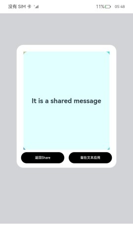
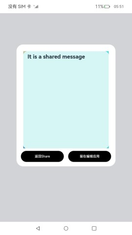

# 自定义分享

### 介绍

自定义分享主要是发送方将文本，链接，图片三种类型分享给三方应用,同时能够在三方应用中展示。本示例使用[数据请求](https://gitee.com/openharmony/docs/blob/master/zh-cn/application-dev/reference/apis/js-apis-http.md)
实现网络资源的获取，使用[屏幕截屏](https://gitee.com/openharmony/docs/blob/master/zh-cn/application-dev/reference/apis/js-apis-screenshot.md)
实现屏幕的截取，使用[文件管理](https://gitee.com/openharmony/docs/blob/master/zh-cn/application-dev/reference/apis/js-apis-fileio.md)
实现对文件，文件目录的管理，使用[媒体库管理](https://gitee.com/openharmony/docs/blob/master/zh-cn/application-dev/reference/apis/js-apis-medialibrary.md)
获取截取的图片，使用[弹窗](https://gitee.com/openharmony/docs/blob/master/zh-cn/application-dev/reference/apis/js-apis-promptAction.md)
进行信息的提示。

### 效果预览

| 主页                               | 点击分享                                      | 分享页面                                      |其它应用分享|
|----------------------------------|-------------------------------------------|-------------------------------------------|--------------|
|  |  |  ||

| 文本分享应用主页面 | 文本分享成功预览页 | 文本分享成功展开页 |
| ------------------------------------------------------------ | ------------------------------------------------------------ | :----------------------------------------------------------: |
|  |  |  |

| 文本编辑应用主页面 | 文本编辑成功预览页 | 文本编辑成功展开页 |
| ------------------------------------------------------------ | ------------------------------------------------------------ | :----------------------------------------------------------: |
|  |  |  |

使用说明：

1.启动Share应用，首页展示分享跳转页面，点击分享按钮出现自定义分享弹窗（三方APP的）。

2.点击分享文本+链接，选择"Chat"图标，会拉起三方应用[Chat](https://gitee.com/openharmony/applications_app_samples/tree/master/code/Solutions/IM/Chat)
，此时选择[聊天列表](entry/src/main/ets/pages/Index.ets)
中任意的朋友进行分享。

3.点击生成海报，此时第一层弹窗消失并出现新的弹窗，点击截图并分享，会出现小提示"截图成功，分享加载中..."
,稍后会拉起三方应用[Chat](https://gitee.com/openharmony/applications_app_samples/tree/master/code/Solutions/IM/Chat)
，此时选择[聊天列表](entry/src/main/ets/pages/Index.ets)
中任意的朋友进行分享。

4.点击分享文本+链接，选择"文本分享"图标，会拉起应用[文本分享](./textShare/)
,此时选择"留在文本分享"可以进入[文本页面](./textShare/src/main/ets/textreceiveability/TextReceiveAbility.ts)
,若选择"返回"，则会回到Share应用主页面。

5.点击分享文本+链接，选择"文本编辑"图标，会拉起应用[文本编辑](./textEdit/)
,此时选择"留在文本编辑"可以进入[文本编辑页面](./textEdit/src/main/ets/editability/EditTextAbility.ts)
,若选择"返回"，则会回到Share应用主页面。

### 工程目录
```
entry/src/main/ets/
|---Application
|   |---MyAbilityStage.ets                   
|---MainAbility
|   |---MainAbility.ts                   
|---model
|   |---Logger.ts                      // 日志工具
|---pages
|   |---Index.ets                      // 首页
textShare/src/main/ets/
├──model
|  └──Logger.ts
├──pages
|  ├──Index.ets                       // EntryAbility页面
|  ├──TemplateBuilder.ets             // 自定义组件页面
|  └──UIExtenIndex.ets                // UIExtension页面
├──textreceiveability
|  └──TextReceiveAbility.ts           // 文本分享主页面
├──uiextensionability
|  └──UIExtAbility.ts 
textEdit/src/main/ets/
├──editability
|  └──EditTextAbility.ts              // 文本编辑主页面
├──model
|  └──Logger.ts
├──pages
|  ├──Index.ets                       // EntryAbility页面
|  ├──TemplateBuilder.ets             // 自定义组件页面
|  └──UIExtenIndex.ets                // UIExtension页面
├──uiextensionability
|  └──UIExtAbility.ts 
```

### 具体实现

* 本示例分为链接分享，应用内文件分享，其它应用分享三个模块： 
  * 文本+链接分享模块
    * ButtonDialogBuilder方法展示自定义分享弹窗，@ohos.abilityAccessCtrl接口获取访问控制权限，@ohos.net.http接口获取网络资源。
    * 源码链接：[MainAbility.ts](entry/src/main/ets/MainAbility/MainAbility.ts)，[HttpRequest.ets](ShareComponent/src/main/ets/net/HttpRequest.ets)
    * 参考接口：[@ohos.prompt](https://gitee.com/openharmony/docs/blob/master/zh-cn/application-dev/reference/apis/js-apis-promptAction.md)，[@ohos.abilityAccessCtrl](https://gitee.com/openharmony/docs/blob/master/zh-cn/application-dev/reference/apis/js-apis-abilityAccessCtrl.md)，[@ohos.net.http](https://gitee.com/openharmony/docs/blob/master/zh-cn/application-dev/reference/apis/js-apis-http.md)
  
  * 应用内文件分享模块
    * 使用弹窗，屏幕截屏(截取屏幕)，文件管理(管理文件和文件目录)和媒体库管理(获取截取的图片)接口进行图片、链接，视频的分享
    * 源码链接：[ShareUtils.ts](ShareComponent/src/main/ets/feature/ShareUtils.ts)，[MediaUtils.ts](ShareComponent/src/main/ets/feature/MediaUtils.ts)，[ShareConst.ts](ShareComponent/src/main/ets/util/ShareConst.ts)
    * 参考接口：[@ohos.prompt](https://gitee.com/openharmony/docs/blob/master/zh-cn/application-dev/reference/apis/js-apis-promptAction.md)，[@ohos.screenshot](https://gitee.com/openharmony/docs/blob/master/zh-cn/application-dev/reference/apis/js-apis-screenshot.md)，[@ohos.fileio](https://gitee.com/openharmony/docs/blob/master/zh-cn/application-dev/reference/apis/js-apis-fileio.md)，[@ohos.multimedia.mediaLibrary](https://gitee.com/openharmony/docs/blob/master/zh-cn/application-dev/reference/apis/js-apis-medialibrary.md)

  * 其他应用分享模块：
    * 使用弹窗，屏幕截屏(截取屏幕)，文件管理(管理文件和文件目录)和媒体库管理(获取截取的图片)API，把图片，链接，文件在其他应用内分享
    * 源码链接：[ShareUtils.ts](ShareComponent/src/main/ets/feature/ShareUtils.ts)，[MediaUtils.ts](ShareComponent/src/main/ets/feature/MediaUtils.ts)，[ShareConst.ts](ShareComponent/src/main/ets/util/ShareConst.ts)
    * 参考接口：[@ohos.prompt](https://gitee.com/openharmony/docs/blob/master/zh-cn/application-dev/reference/apis/js-apis-promptAction.md)，[@ohos.screenshot](https://gitee.com/openharmony/docs/blob/master/zh-cn/application-dev/reference/apis/js-apis-screenshot.md)，[@ohos.fileio](https://gitee.com/openharmony/docs/blob/master/zh-cn/application-dev/reference/apis/js-apis-fileio.md)，[@ohos.multimedia.mediaLibrary](https://gitee.com/openharmony/docs/blob/master/zh-cn/application-dev/reference/apis/js-apis-medialibrary.md)

* 本示例还包含文本分享应用及文本编辑应用：
  * 在Index.ets中加载TemplateBuilder自定义组件并显示分享信息,  源码参考[textShare_Index.ets](./textShare/src/main/ets/pages/Index.ets)、[textEdit_Index.ets](./textEdit/src/main/ets/pages/Index.ets)。
    * 在加载Index页面中，如果是被分享方拉起，则加载TemplateBuilder自定义组件。若不是被分享拉起，则显示Ability设置内容。
  
  * TemplateBuilder组件内容封装在TemplateBuilder.ets中，源码参考：[textShare_TemplateBuilder.ets](./textShare/src/main/ets/pages/TemplateBuilder.ets)、
  [textEdit_TemplateBuilder.ets](./textEdit/src/main/ets/pages/TemplateBuilder.ets)。
    * 在TemplateBuilder组件中包含UIExtAbility组件、“返回Share”和“留在文本分享/留在文本编辑”按钮，可选择返回Share应用或留在当前（文本分享/文本编辑）应用。

### 相关权限

允许应用截取屏幕图像：[ohos.permission.CAPTURE_SCREEN](https://gitee.com/openharmony/docs/blob/master/zh-cn/application-dev/security/permission-list.md#ohospermissioncapture_screen)

允许使用Internet网络：[ohos.permission.INTERNET](https://gitee.com/openharmony/docs/blob/master/zh-cn/application-dev/security/permission-list.md#ohospermissioninternet)

允许应用访问用户媒体文件中的地理位置信息：[ohos.permission.MEDIA_LOCATION](https://gitee.com/openharmony/docs/blob/master/zh-cn/application-dev/security/permission-list.md#ohospermissionmedia_location)

允许应用读取用户外部存储中的媒体文件信息：[ohos.permission.READ_MEDIA](https://gitee.com/openharmony/docs/blob/master/zh-cn/application-dev/security/permission-list.md#ohospermissionread_media)

允许应用读写用户外部存储中的媒体文件信息：[ohos.permission.WRITE_MEDIA](https://gitee.com/openharmony/docs/blob/master/zh-cn/application-dev/security/permission-list.md#ohospermissionwrite_media)

### 依赖

依赖于[Chat](https://gitee.com/openharmony/applications_app_samples/tree/master/code/Solutions/IM/Chat)  应用，来作为接收方。

### 约束与限制

1.本示例仅支持标准系统上运行,支持设备:RK3568。

2.本示例为Stage模型，已适配API version 10版本SDK，版本号：4.0.8.5。

3.本示例需要使用DevEco Studio 3.1 Beta2 (Build Version: 3.1.0.400, built on April 7, 2023)及以上版本才可编译运行。

4.本示例使用的screenshot API属于SystemAPI，需要使用Full SDK 手动从镜像站点获取，并在DevEco
Studio中替换，具体操作可参考[替换指南](https://docs.openharmony.cn/pages/v3.2/zh-cn/application-dev/quick-start/full-sdk-switch-guide.md/)
。

5.本示例涉及相关权限为system_core级别（相关权限级别可通过[权限定义列表](https://gitee.com/openharmony/docs/blob/master/zh-cn/application-dev/security/permission-list.md)
查看）， 需要手动配置高级别的权限签名(
具体操作可查看[自动化签名方案](https://docs.openharmony.cn/pages/v3.2/zh-cn/application-dev/security/hapsigntool-overview.md/)) 。

5.当前4.0.8.5版本的Full SDK。因为不支持UIExtension类型编译，所以需要手动修改SDK中“10/toolchains/modulecheck/module.json"文件。在对应的extensionAbilities的type属性中，追加”ui“枚举值。

```json
"extensionAbilities": {
    "type": {
        "type": "string",
        "enum": [
            "ui"
        ]
    }
}
```

### 下载

如需单独下载本工程，执行如下命令：

```
git init
git config core.sparsecheckout true
echo code/BasicFeature/ApplicationModels/CustomShare/ > .git/info/sparse-checkout
git remote add origin https://gitee.com/openharmony/applications_app_samples.git
git pull origin master
```
