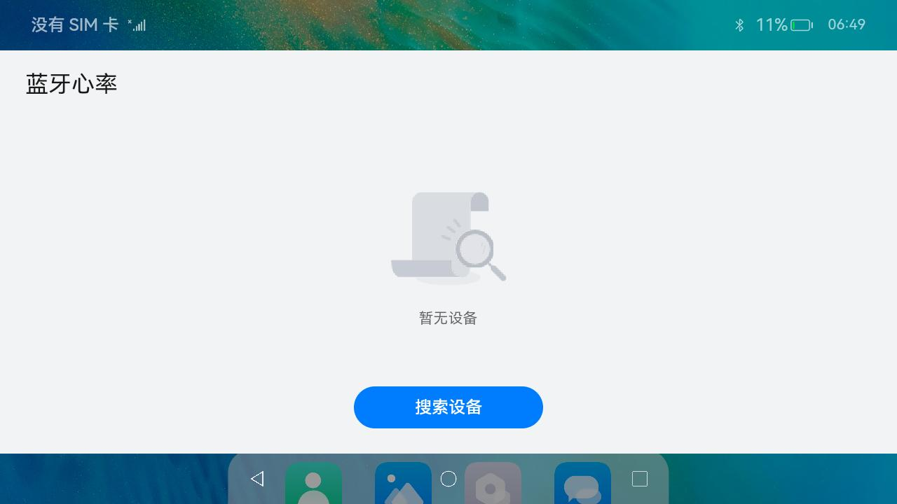
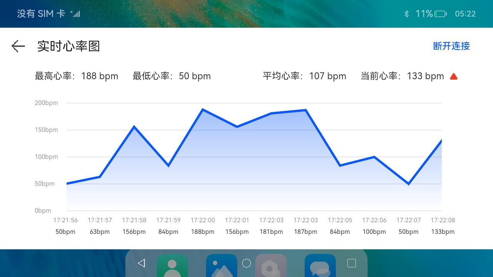

# 蓝牙

### 介绍

本示例通过使用蓝牙低功耗心率服务，展示蓝牙相关API用法。实现了以下几点功能：

1. 发现具有特定服务的设备。
2. 连接到设备。
3. 发现服务。
4. 发现服务的特征、如何读取给定特征的值、为特征设置通知等。

相关概念

1. BLE扫描：通过BLE扫描接口实现对BLE设备的搜索。
2. BLE连接：通过BLE的GattClientDevice实现对BLE设备的连接、断连等操作。
3. 接收数据：通过BLECharacteristicChange接收特征值的改变。

### 效果预览

| 搜索设备 | 搜索结果 |
| ---- | ---- |
|  |  |

| 连接成功 | 实时心率 |
| ---- | ---- |
|  |  |

使用说明

1. 启动应用后，弹出是否允许应用访问位置信息，点击允许后开始操作。
2. 点击界面中搜索设备，如未开启蓝牙会自动开启并搜索心率设备，如已开启直接搜索设备。
3. 点击连接按钮可以连接到对应的蓝牙心率设备。
4. 点击列表Item可以进入实时心率图查看页面。
5. 点击实时心率图页断开连接可以断开与当前心率设备的连接。

### 工程目录

```
entry/src/main/ets/
|---constants
|   |---BleConstants.ts                    // BLE常量
|   |---StyleConstants.ts                  // Style样式常量
|---entryability
|---model
|   |---BluetoothDevice.ets                // 蓝牙设备model
|---pages
|   |---Main.ets                           // 首页
|   |---HeartRate.ets                      // 实时心率图
|---uicomponents
|   |---HeartRateGraph.ets                 // 实时心率图表
|   |---NavigationBar.ets                  // 顶部导航栏
|---uitls
|   |---ArrayBufferUtils.ts                // ArrayBuffer工具
|   |---DateUtils.ts                       // 日期工具
|   |---Log.ts                             // 日志工具
|---viewmodel
|   |---BluetoothViewModel.ets             // 主要封装了蓝牙库相关的接口，实现相关功能，如：开启蓝牙、扫描BLE、连接、断连等功能
advertiser/src/main/ets/
|---constants
|   |---BleConstants.ts                    // BLE常量
|---entryability
|---pages
|   |---Main.ets                           // 首页
|---uitls
|   |---ArrayBufferUtils.ts                // ArrayBuffer工具
|   |---Log.ts                             // 日志工具
|   |---MathUtils.ts                       // Math工具，用于生成随机数
|---viewmodel
|   |---AdvertiserBluetoothViewModel.ets   // 主要封装了蓝牙库相关的接口，实现相关功能，如：开启蓝牙、开启蓝牙心率广播等功能
```

### 具体实现

1. 首页扫描蓝牙心率设备：使用[bluetooth](https://docs.openharmony.cn/pages/v3.2/zh-cn/application-dev/reference/apis/js-apis-bluetooth.md/) 来实现蓝牙的开启和BLE的扫描，然后再使用一个List显示扫描到BLE心率设备，点击连接按钮可以连接上对应的心率设备。
2. 实时心率图页：使用[bluetooth](https://docs.openharmony.cn/pages/v3.2/zh-cn/application-dev/reference/apis/js-apis-bluetooth.md/) 来接收心率设备发送的心率数据，并使用画布[Canvas](https://docs.openharmony.cn/pages/v3.2/zh-cn/application-dev/reference/arkui-ts/ts-components-canvas-canvas.md/) 来绘制实时心率图，点击断开连接可以断开与当前心率设备的连接。

### 相关权限

| 权限名                                 | 权限说明                                               | 级别         |
| -------------------------------------- | ------------------------------------------------------ | ------------ |
| ohos.permission.USE_BLUETOOTH          | 允许应用查看蓝牙的配置。                               | normal       |
| ohos.permission.DISCOVER_BLUETOOTH     | 允许应用配置本地蓝牙，查找远端设备且与之配对连接。     | normal       |
| ohos.permission.MANAGE_BLUETOOTH       | 允许应用配对蓝牙设备，并对设备的电话簿或消息进行访问。 | system_basic |
| ohos.permission.APPROXIMATELY_LOCATION | 允许应用获取设备模糊位置信息。                         | normal       |
| ohos.permission.LOCATION               | 允许应用获取设备位置信息。                             | normal       |

### 依赖

本示例需要使用设备来模拟BLE心率设备。这里使用OpenHarmony来模拟了BLE心率设备，相关代码在`module - advertiser`。使用另一台OpenHarmony设备运行`advertiser`编译出来的hap后，点击`开启BLE心率广播`。当BLE心率服务应用扫描并连接到模拟的BLE心率设备后，就可以在应用中查看当前模拟的实时心率。

### 约束与限制

1. 本示例仅支持标准系统上运行。
2. 本示例为Stage模型，从API version 9开始支持。SDK版本号：3.2.12.1 Release，镜像版本号：OpenHarmony 3.2.12.2。
3. 本示例需要使用DevEco Studio 3.1 Release (Build Version: 3.1.0.500, built on April 28, 2023)编译运行。
4. 本示例所配置的权限包含system_basic级别（相关权限级别可通过[权限定义列表]([OpenAtom OpenHarmony](https://docs.openharmony.cn/pages/v3.2/zh-cn/application-dev/security/permission-list.md/)查看），需要手动配置对应级别的权限签名或者使用ACL使能（具体操作可查看[自动化签名方案](https://docs.openharmony.cn/pages/v3.2/zh-cn/application-dev/security/hapsigntool-overview.md/)）。

### 下载

如需单独下载本工程，执行如下命令：

```
git init
git config core.sparsecheckout true
echo code/BasicFeature/Connectivity/Bluetooth/ > .git/info/sparse-checkout
git remote add origin https://gitee.com/openharmony/applications_app_samples.git
git pull origin master
```