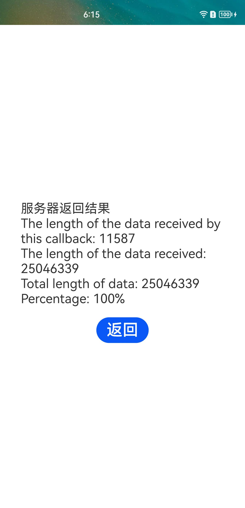

# Http

### 介绍

本示例通过[@ohos.net.http](https://gitee.com/openharmony/docs/blob/master/zh-cn/application-dev/reference/apis/js-apis-http.md)
等接口，实现了根据URL地址和相关配置项发起http请求的功能。

### 效果预览

|首页|结果页|
|--------------------------------|--------------------------------|
||

使用说明

1.启动应用可配置网络请求，设置网址、请求方式、请求参数；

2.点击确认按钮，跳转请求结果页面；

3.点击返回按钮，返回配置页面；

4.支持将本示例中的http模块编译成tgz包。

### 工程目录

```
entry/src/main/ets/
|---Application
|---MainAbility
|   |---MainAbility.ts            // 项目入口，请求相关权限
|---page
|   |---Index.ets                 // 首页
|---util                          // 日志文件
http/src/main/ets/
|---components
|   |---MainPage
|   |   |---MainPage.ets          // 首页主体内容
|   |---model
|   |   |---http.ts               // 封装了http参数和发起请求的接口
```

### 具体实现

* 本示例将发送http请求的接口封装在Http模块，源码参考：[http.ts](https://gitee.com/openharmony/applications_app_samples/blob/master/code/BasicFeature/Connectivity/Http/http/src/main/ets/components/model/http.ts)
  * 发起请求：在[MainPage.ets](https://gitee.com/openharmony/applications_app_samples/blob/master/code/BasicFeature/Connectivity/Http/http/src/main/ets/components/MainPage/MainPage.ets)
  通过TextInput组件获取参数，点击“确认”按钮后通过Http.request()方法调用http.createHttp().request()接口向指定的地址发送请求。

### 相关权限

[ohos.permission.INTERNET](https://gitee.com/openharmony/docs/blob/master/zh-cn/application-dev/security/permission-list.md)

### 依赖

不涉及。

### 约束与限制

1.本示例仅支持标准系统上运行，支持设备：RK3568。

2.本示例已适配API10版本SDK，版本号：4.0.5.1 及以上。

3.本示例需要使用DevEco Studio 3.1 Canary1 (Build Version: 3.1.0.100)及以上版本才可编译运行。

4.运行本示例需全程联网。

### 下载

如需单独下载本工程，执行如下命令：

```
git init
git config core.sparsecheckout true
echo code/BasicFeature/Connectivity/Http/ > .git/info/sparse-checkout
git remote add origin https://gitee.com/openharmony/applications_app_samples.git
git pull origin master
```