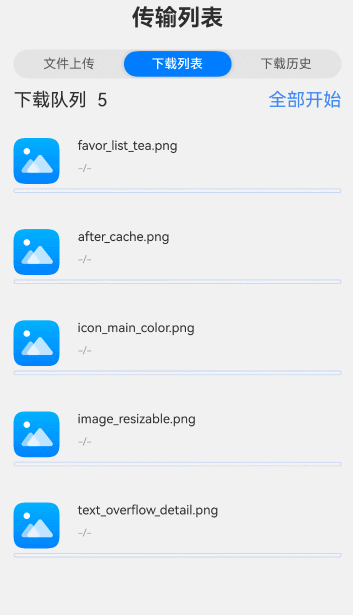

# 多文件下载监听案例

### 介绍

多文件下载监听在应用开发中是一个非常常见的需求。本示例将介绍如何使用request上传下载模块实现多文件下载监听，如监听每个文件下载任务的进度，任务暂停，下载完成等下载情况。下载历史页面展示的是下载完成的文件，可对页面中已删除的文件进行重新下载 。每个应用至多支持创建10个未完成的任务，相关规格说明请参考[request.agent.create](https://docs.openharmony.cn/pages/v5.0/zh-cn/application-dev/reference/apis-basic-services-kit/js-apis-request.md#requestagentcreate10)。

### 效果图预览

 

**使用说明**

1. 连接网络。进入页面，点击“全部开始”，启动所有文件的下载任务。点击“全部暂停”，暂停所有文件下载任务。再次点击“全部开始”,可重新启动未完成的下载任务。如出现下载失败，一般是网络不稳定，点击“全部开始”即可重新下载。
2. 下载完成的文件会保存在应用缓存路径下,出现在下载历史页面中。
3. 可点击删除按钮，在应用缓存路径下删除该文件存储的数据。
4. 点击文件，若文件中在应用缓存路径下存在，弹窗提示用户“文件已存在”；否则弹窗提示用户“文件不存在，是否重新下载？”，点击确认按钮，该条文件数据会出现在下载列表中，可点击“全部开始“按钮重新下载。

### 实现思路

1. 配置下载参数。一个下载任务需要配置对应一套下载参数request.agent.Config。本例中使用downloadConfig方法简单配置了下载文件的url，实际业务中请按实际情况按需配置。源码参考[MultipleFilesDownload.ets](./casesfeature/multiplefilesdownload/src/main/ets/view/MultipleFilesDownload.ets)。

   ```typescript
   let config: request.agent.Config = {
     action: request.agent.Action.DOWNLOAD, // 配置任务选项，这里配置为下载任务
     url: downloadUrl, // 配置下载任务url
     overwrite: true, // 下载过程中路径已存在时的解决方案选择。true表示覆盖已存在的文件
     method: 'GET', // HTTP标准方法。下载时，使用GET或POST。
     saveas: './', // 这里'./'表示下载至应用当前缓存路径下。
     mode: request.agent.Mode.BACKGROUND, // 任务模式设置后台任务。
     gauge: true // 后台任务的过程进度通知策略，仅应用于后台任务。true表示发出每个进度已完成或失败的通知。
   };
   ```

2. 创建多个文件下载监听实例。单个文件下载监听只需要配置下载参数，创建下载任务，注册下载任务相关监听，启动下载任务即可实现。而要实现多文件下载监听，需要每个下载任务注册独立的下载监听回调。本例通过封装自定义组件FileDownloadItem，在每个FileDownloadItem中创建各自的下载任务和监听回调，从而实现多文件下载监听。源码参考[MultipleFilesDownload.ets](./casesfeature/multiplefilesdownload/src/main/ets/view/MultipleFilesDownload.ets)。

   ```typescript
   ForEach(this.downloadConfigArray, (item: request.agent.Config) => {
     ListItem() {
       // 创建文件下载监听实例
       FileDownloadItem({
         downloadConfig: item, // 文件下载配置
         isStartAllDownload: this.isStartAllDownload, // 是否全部开始下载
         downloadCount: this.downloadCount // 待下载任务数量
         downloadFailCount: this.downloadFailCount // 下载失败任务数量
       })
     }
   }, (item: request.agent.Config) => JSON.stringify(item))
   ```

3. 创建下载任务，并注册下载任务相关监听。本例在每个FileDownloadItem中使用request.agent.create创建下载任务。然后在下载任务创建成功后，注册各自下载任务相关监听。本例中注册了下载任务完成回调，下载任务失败回调，下载进度更新回调，暂停任务回调，重新启动任务回调。源码参考[FileDownloadItem.ets](./casesfeature/multiplefilesdownload/src/main/ets/view/FileDownloadItem.ets)。

   ```typescript
   request.agent.create(context, this.downloadConfig).then((task: request.agent.Task) => {
     // 注册下载任务相关回调
     task.on('completed', this.completedCallback); // 下载任务完成回调
     task.on('failed', this.failedCallback); // 下载任务失败回调
     task.on('pause', this.pauseCallback); // 暂停任务回调
     task.on('resume', this.resumeCallback); // 重新启动任务回调
     task.on('progress', this.progressCallback); // 下载进度更新回调
   }).catch((err: BusinessError) => {
     logger.error(TAG, `Failed to task create with error message: ${err.message}, error code: ${err.code}`);
   });
   ```

4. 启动下载任务。本例在每个FileDownloadItem中使用task.start方法启动各自的下载任务。源码参考[FileDownloadItem.ets](./casesfeature/multiplefilesdownload/src/main/ets/view/FileDownloadItem.ets)。

   ```typescript
   task.start((err: BusinessError) => {
     if (err) {
       logger.error(TAG, `Failed to task start with error message: ${err.message}, error code: ${err.code}`);
       return;
     }
     this.downloadTask = task;
   })
   ```

5. 删除文件。使用fs.unlink删除该条数据应用文件路径

   ```typescript
   // TODO：知识点：删除该条数据应用文件路径
   fs.unlink(filePath).then(() => {
      // 文件状态变为已删除
      this.FileInfo.fileStatus = 3;
      promptAction.showToast({
         message: $r('app.string.multiple_files_download_history_toast_text_del'),
         duration: 2000,
         bottom: '50%',
      })
   }).catch((error: BusinessError) => {
      logger.error("remove file failed with error:" + error);
   });
   ```

6. 重新下载已删除的文件。使用fs.access判断文件是否已经存在，若不存在弹窗提示用户是否重新下载。

   ```typescript
   // 获取应用文件路径
   const cacheDir = context.cacheDir;
   const FilePath: string = `${cacheDir}/${this.fileName}`;
   
   // TODO：知识点：使用fs.access判断目录是否已经存在。
   fs.access(FilePath).then((res: boolean) => {
     if (!res) {
       // 文件已删除，弹窗提示是否重新下载
       AlertDialog.show({
         message: `${this.fileName}文件不存在,是否重新下载？`,
         alignment: DialogAlignment.Center, // 弹窗在竖直方向上的对齐方式。
         autoCancel: false, // 点击遮罩层时，是否关闭弹窗。默认值：true
         primaryButton: {
           value: $r('app.string.multiple_files_download_history_button_text_cancel'),
           fontColor: $r('app.color.multiple_files_download_text_color'),
           action: () => {
             logger.info('已取消');
           }
         },
         secondaryButton: {
           value: $r('app.string.multiple_files_download_history_button_text_confirm'),
           fontColor: $r('app.color.multiple_files_download_del_bgc'),
           action: () => {
             // 更改该条数据下载状态
             this.FileInfo.fileStatus = 0;
             // 该条数据加入下载列表数组中
             this.downloadFileArray.push(this.FileInfo);
             // 下载历史列表删除该条数据
             this.historyArray = this.historyArray.filter( ( item: downloadFilesData ) => {
               return item.id !== this.FileInfo.id;
             });
             // 更新待下载任务数量
             this.downloadCount = this.downloadFileArray.length;
           }
         },
         cornerRadius: $r('app.integer.multiple_files_download_borderRadius_twelve'), // 弹窗边框弧度
         width: $r('app.string.multiple_files_download_list_height'), // 弹窗宽度
         cancel: () => {
           logger.info('点击关闭按钮');
         }
       });
     } else {
       // 文件已下载到本地，弹窗提示文件已存在
       promptAction.showToast({
         message: $r('app.string.multiple_files_download_history_toast_text_exist'),
         duration: 1000,
         bottom: '50%',
       })
     }
   ```

### 高性能知识点

本示例中注册了progress下载进度更新监听，不建议在下载进度更新回调中加日志打印，以减少不必要的性能损耗。

### FAQ

1. 无网络时，点击”全部开始“，下载队列中的任务状态却显示”已暂停“。

   答：request.agent.Config有一个参数retry默认是true，如果没有网络或者网络不满足时，会自动暂停waiting，所以在没网络的时候下载底层逻辑会走暂停回调，应用侧在暂停回调里设置了显示当前下载状态，所以无网络时，点击”全部开始“，下载队列中的任务状态显示”已暂停“。目前本例中已经把retry设置为false，没网络时，开启下载任务会直接走入失败回调，直接显示”下载失败“。

### 工程结构&模块类型

   ```
   multiplefilesdownload                               // har类型
   |---view
   |   |---MultipleFilesDownload.ets                   // 视图层-文件下载页面
   |   |---FileDownloadItem.ets                        // 视图层-单个文件下载组件
   |   |---HistoryItem.ets                             // 视图层-单个文件历史组件
   ```

### 参考资料

[上传下载](https://docs.openharmony.cn/pages/v5.0/zh-cn/application-dev/reference/apis-basic-services-kit/js-apis-request.md)

### 相关权限

| 权限名                   | 权限说明             | 级别   |
| ------------------------ | -------------------- | ------ |
| ohos.permission.INTERNET | 允许使用Interent网络 | normal |

### 依赖

不涉及。
### 约束与限制

1.本示例仅支持标准系统上运行。

2.本示例为Stage模型，支持API12版本SDK，SDK版本号（API Version 12 Release）。

3.本示例需要使用DevEco Studio版本号（DevEco Studio 5.0.0 Release）及以上版本才可编译运行。

### 下载

如需单独下载本工程，执行如下命令：

```shell
git init
git config core.sparsecheckout true
echo code/BasicFeature/Connectivity/MultipleFilesDownload > .git/info/sparse-checkout
git remote add origin https://gitee.com/openharmony/applications_app_samples.git
git pull origin master
```