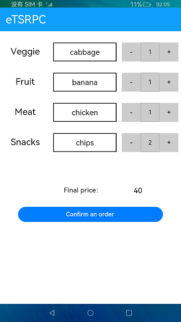

# RPC连接

### 介绍

本示例使用[@ohos.rpc](https://gitee.com/openharmony/docs/blob/master/zh-cn/application-dev/reference/apis/js-apis-rpc.md) 相关接口，实现了一个前台选择商品和数目，后台计算总价的功能，使用rpc进行前台和后台的通信。

### 效果预览

|主页|选择列表|
|-----------------|----------------------|
|||

使用说明：

1. 点击商品种类的空白方框，弹出商品选择列表，选择点击对应的商品，空白方框显示相应内容。

2. 点击商品选择框后的 **+** 或  **-** 按钮，选择商品所对应的数量。

3. 点击 **Confirm an order** 按钮，根据相应的菜品数量与单价，计算出总价并显示。

### 工程目录
```
entry/src/main/ets/
|---common
|   |---CustomDialogList.ets           // 选项弹窗
|   |---FlexList.ets                   // 首页视频种类列表
|   |---Logger.ets                     // 日志工具
|   |---TitleBar.ets                   // 头部
|---entryability
|   |---EntryAbility.ets               // 入口文件
|---model
|   |---OptionsData.ets                // 选项懒加载
|   |---ProcessData.ets                // 封装了获取总价的api
|   |---ReceivedData.ets               // 重写了请求方法
|---muck
|   |---MyData.ets                     // muck数据
|---pages
|   |---Index.ets                      // 首页
```

### 具体实现

* 发送数据：在首页的sortString()中通过rpc.MessageSequence.create()创建MessageSequence对象，然后通过MessageSequence.writeStringArray()将
  我们的处理过的购物数据写入MessageSequence对象中，通过rpc.RemoteObject.sendMessageRequest()将我们得出总价所需要的参数发送到进程中，
  源码参考：[Index.ets](https://gitee.com/openharmony/applications_app_samples/blob/master/code/BasicFeature/Connectivity/RPC/entry/src/main/ets/pages/Index.ets) ;

* 读取数据：处理MessageRequest请求的接口封装在ReceivedData里面，在这里接收传递的来数据，然后经过处理得出总价，
  并通过rpc.MessageParcel.writeInt()写入MessageParcel对象，源码参考：[ReceivedData.ets](https://gitee.com/openharmony/applications_app_samples/blob/master/code/BasicFeature/Connectivity/RPC/entry/src/main/ets/model/ReceivedData.ets) 。

### 相关权限

不涉及。

### 依赖

不涉及。

### 约束与限制

1.本示例仅支持在标准系统上运行。

2.本示例需要使用DevEco Studio 3.1 Canary1 (Build Version: 3.1.0.100)及以上版本才可编译运行。

3.本示例已适配API10版本SDK，版本号：4.0.5.1。
