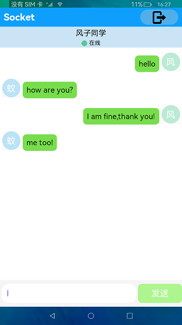

#  Network Management - Socket

### Introduction

This sample demonstrates the application of Socket in network communications, including connection authentication and chat communication between two devices.

### Concepts

UDP Socket is a connectionless protocol, which allows sending of datagrams to the peer without first establishing a connection. The protocol is applicable when a small amount of data is transmitted at a time and real-time performance takes precedence over reliability.

### Required Permissions

1. Internet access permission: "ohos.permission.INTERNET"

2. Wi-Fi access permission: "ohos.permission.GET_WIFI_INFO"

### Usage Guidelines

1. Start the application, tap **User** to select your user ID, enter the IP address of the peer device, and click **confirm**. (Perform this step on both devices.)
 
2. On one device, tap **create room** and enter a room number. On the other device, a dialog box containing the room number is displayed. Click **confirm**. The two devices enter the chat screen.

3. After entering a message on one device, tap **send message**. The message will be displayed on the chat page on the peer device.

4. Tap the **exit** icon on the right of the title bar to return to the login user page.

5. Tap the nickname bar on the chat screen, and select **offline** on the displayed menu. The icons of the two devices will change to the offline state, and the nickname bar turns gray. In this case, one device cannot receive messages from the peer device.

6. When you tap the nickname bar to switch to the online state, the icons of the two devices will change to the online state, and the nickname bar is displayed in blue. In this case, one device can receive messages from the peer device.

### Constraints

1. This sample can only be run on standard-system devices.

2. This sample requires DevEco Studio 3.0 Beta4 (Build Version: 3.0.0.992, built on July 14, 2022) to compile and run.
