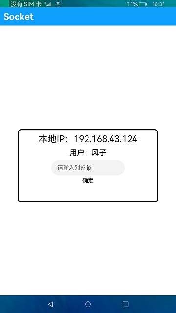
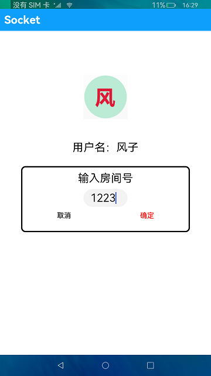
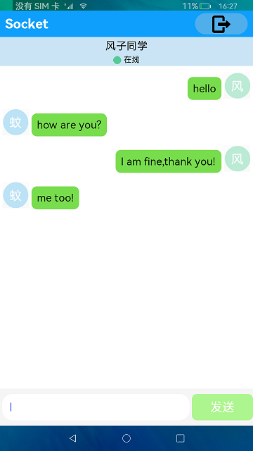

# 网络管理-Socket连接

### 介绍

本示例主要演示了Socket在网络通信方面的应用，展示了Socket在两端设备的连接验证、聊天通信方面的应用。

### 效果预览

|       输入IP                             |    创建房间                               | 聊天                             |
|----------------------------------------|---------------------------------------|--------------------------------|
|  |  |  |

使用说明

1.打开应用，点击**用户**文本框选择要登录的用户，并输入另一个设备的IP地址，点击**确定**按钮进入已登录的用户页面（两个设备都要依次执行此步骤）。

2.在其中一个设备上点击**创建房间**按钮，任意输入房间号，另一个设备会收到有房间号信息的弹框，点击**确定**按钮后，两个设备进入聊天页面。

3.在其中一个设备上输入聊天信息并点击**发送**按钮后，另一个设备的聊天页面会收到该聊天消息。

4.点击顶部标题栏右侧的**退出**图标按钮，则返回已登录的用户页面。

5.点击聊天页面中的昵称栏，会弹出一个菜单，选择离线选项后，两端设备的状态图标都会切换为离线图标，并且昵称栏都会变成灰色，此时任何一端发送消息另一端都接收不到消息。

6.当点击昵称栏再次切换为在线状态，则两端的己方账号状态会切换为在线图标，同时两端的昵称栏会显示蓝色，此时可正常收发消息。

### 工程目录
```
entry/src/main/ets/MainAbility
|---app.ets
|---model
|   |---chatBox.ts                     // 聊天页面
|   |---DataSource.ts                  // 数据获取
|   |---Logger.ts                      // 日志工具
|---pages
|   |---Index.ets                      // 监听消息页面
|   |---Login.ets                      // 首页登录页面
|---Utils
|   |---Utils.ets
```
### 具体实现

* 本示例分为三个模块
  * 输入对端IP模块 
    * 使用wifi.getIpInfo()方法获取IP地址，constructUDPSocketInstance方法创建一个UDPSocket对象
    * 源码链接：[Login.ets](entry/src/main/ets/MainAbility/pages/Login.ets)，[Util.ets](entry/src/main/ets/MainAbility/Utils/Util.ets)
    * 接口参考：[@ohos.wifi](https://gitee.com/openharmony/docs/blob/master/zh-cn/application-dev/reference/apis/js-apis-wifi.md)，[@ohos.net.socket](https://gitee.com/openharmony/docs/blob/master/zh-cn/application-dev/reference/apis/js-apis-socket.md)，[@ohos.router](https://gitee.com/openharmony/docs/blob/master/zh-cn/application-dev/reference/apis/js-apis-system-router.md)
  
  * 创建房间模块
    * 点击创建房间按钮，弹出创建房间框，输入房间号，点击确定，进入聊天页面
    * 源码链接：[Login.ets](entry/src/main/ets/MainAbility/pages/Login.ets)，[Util.ets](entry/src/main/ets/MainAbility/Utils/Util.ets)
    * 接口参考：[@ohos.wifi](https://gitee.com/openharmony/docs/blob/master/zh-cn/application-dev/reference/apis/js-apis-wifi.md)，[@ohos.net.socket](https://gitee.com/openharmony/docs/blob/master/zh-cn/application-dev/reference/apis/js-apis-socket.md)，[@ohos.router](https://gitee.com/openharmony/docs/blob/master/zh-cn/application-dev/reference/apis/js-apis-system-router.md)
    
  * 聊天模块
    * bindOption方法监听消息，设置在线与离线
    * 源码链接：[ChatBox.ets](entry/src/main/ets/MainAbility/model/ChatBox.ets)，[DataSource.ets](entry/src/main/ets/MainAbility/model/DataSource.ets)，[Index.ets](entry/src/main/ets/MainAbility/pages/Index.ets)
    * 接口参考：[@ohos.wifi](https://gitee.com/openharmony/docs/blob/master/zh-cn/application-dev/reference/apis/js-apis-wifi.md)，[@ohos.net.socket](https://gitee.com/openharmony/docs/blob/master/zh-cn/application-dev/reference/apis/js-apis-socket.md)，[@ohos.router](https://gitee.com/openharmony/docs/blob/master/zh-cn/application-dev/reference/apis/js-apis-system-router.md)

#### 相关概念

UDP Socket是面向非连接的协议，它不与对方建立连接，而是直接把我要发的数据报发给对方，适用于一次传输数据量很少、对可靠性要求不高的或对实时性要求高的应用场景。

### 相关权限

1.允许使用Internet网络权限：[ohos.permission.INTERNET](https://gitee.com/openharmony/docs/blob/master/zh-cn/application-dev/security/permission-list.md#ohospermissioninternet)

2.允许应用获取WLAN信息权限：[ohos.permission.GET_WIFI_INFO](https://gitee.com/openharmony/docs/blob/master/zh-cn/application-dev/security/permission-list.md#ohospermissionget_wifi_info)

### 依赖 

不涉及。

### 约束与限制

1.本示例仅支持标准系统上运行，支持设备：RK3568。

2.本示例仅支持API9版本SDK，版本号：3.2.11.9 及以上。

3.本示例需要使用DevEco Studio 3.1 Beta2 (Build Version: 3.1.0.400 构建 2023年4月7日)及以上才可编译运行。

### 下载

如需单独下载本工程，执行如下命令：
```
git init
git config core.sparsecheckout true
echo code\BasicFeature\Connectivity\Socket > .git/info/sparse-checkout
git remote add origin https://gitee.com/openharmony/applications_app_samples.git
git pull origin master
```