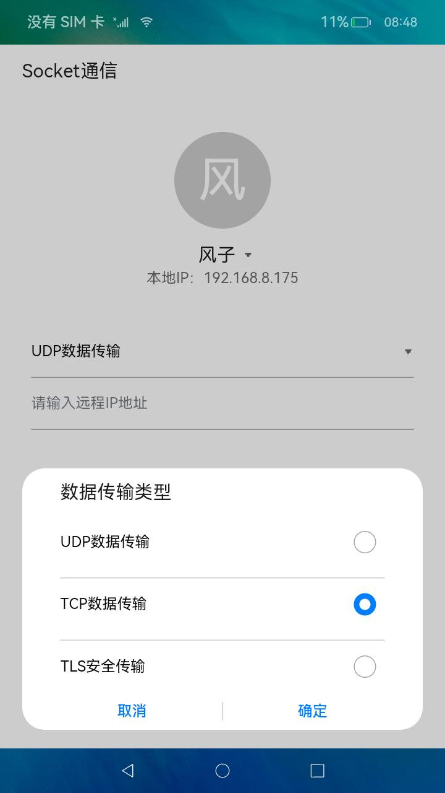
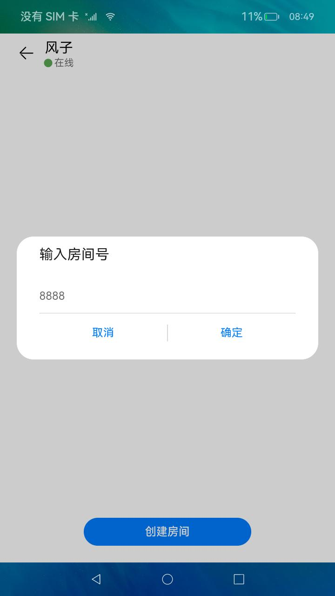
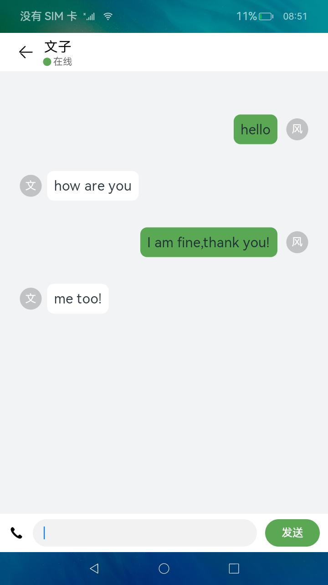
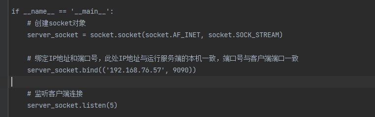
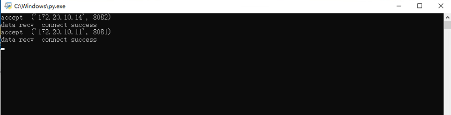

# 网络管理-Socket连接

### 介绍

本示例主要演示了Socket在网络通信方面的应用，展示了Socket在两端设备的连接验证、聊天通信方面的应用。

### 效果预览
| 输入IP | 创建房间 | 聊天  |
|------------------------------------|-----------------------------------------|-----------------------------------|
|  |  |  |

使用说明

1.搭建服务器环境：修改服务器脚本中的服务端IP地址，与本机IP地址保持一致，修改完成后双击运行脚本（端口号不必修改，与客户端工程中的端口保持一致即可）。  


2.运行成功后为阻塞状态，等待客户端连接成功后会有相应提示。  


3.打开应用，点击**用户**选择框选择要登录的用户（不同客户端保持用户选择不一致），点击协议选择框选择通信协议（与运行的服务器一致），并输入另一个设备的IP地址(如果是TCP和TLS，则输入服务端IP地址)，点击**登录**按钮进入创建房间用户页面（两个设备都要依次执行此步骤）。

4.在两台设备都成功连上服务器后，在其中一个设备上点击**创建房间**按钮，任意输入房间号，另一个设备会收到邀请进入房间的信息弹框，点击**确定**按钮后，两个设备进入聊天页面。

5.在其中一个设备上输入聊天信息并点击**发送**按钮后，另一个设备的聊天页面会收到该聊天消息。

6.点击顶部标题栏左侧的**返回**图标按钮，则返回创建房间页面。

7.以上运行完成后如需再次创建房间请重启客户端和服务端进行调试。

### 工程目录

```
/Socket
├── entry             # 主entry模块目录
│   └── src
│       ├── main
│           ├── ets                                # ets模块目录
│               ├── components                     # 组件目录
│                   ├── ChatComponent.ets          # 聊天组件
│                   ├── CreateRoomDialog.ets       # 创建房间弹窗
│                   ├── InvitationDialog.ets       # 邀请进入房间弹窗
│                   ├── SelectAgreementDialog.ets  # 选择协议弹窗
│                   ├── SelectUserDialog.ets       # 选择用户弹窗
│                   ├── ToolComponent.ets          # 工具面板组件
│               ├── controller                     # 
│                   ├── LoginController.ts         # 负责与服务器的连接和接发消息
│               ├── data                           # 
│                   ├── ChatBox.ts                 # 聊天组件对应实体
│                   ├── DataSource.ts              # 数据源实体
│                   ├── ToolData.ts                # 工具面板对应实体
│               ├── entryability                
│               ├── model                          #  
│                   ├── Socket.ts                  # 负责创建相应Socket实例
│                   ├── SocketFactory.ts           # Socket工厂
│               ├── pages                          # 
│                   ├── CreateRoom.ets             # 创建房间页面
│                   ├── NewIndex.ets               # 聊天首页
│                   ├── NewLogin.ets               # 连接服务器页面
│               ├── socket                         # tcp\tls\udp
│               ├── utils                          # 工具类目录
│               ├── Constants.ts                   # 定义UI事件常量
```

### 具体实现

- UDP Socket：使用UDP Socket实现文本传输，无需搭建服务器，对端直接交流。代码：[UdpSocket.ts](entry%2Fsrc%2Fmain%2Fets%2Fsocket%2FUdpSocket.ts)。  
- TCP Socket：使用TCP Socket实现文本传输和公共通知事件转发，需要Python脚本搭建TCP服务器，公共通知用于来起音频通话应用。代码：[TcpSocket.ts](entry%2Fsrc%2Fmain%2Fets%2Fsocket%2FTcpSocket.ts)，服务器代码：[TCP_Server.py](server_python%2FTCP_Server.py)。  
- TLS Socket：使用TLS Socket实现文本传输，需要Python脚本搭建TLS服务器，服务器和客户端需要同一套证书文件。代码：[TlsSocket.ts](entry%2Fsrc%2Fmain%2Fets%2Fsocket%2FTlsSocket.ts)，服务器代码：[TLS_Server.py](server_python%2FTLS_Server.py)。

### 相关权限

网络权限: ohos.permission.INTERNET  
获取WIFI信息的权限: ohos.permission.GET_WIFI_INFO

### 依赖

1. windows上启动socket服务端，模拟消息转发服务器[服务器目录](./server_python)
2. 需要使用[音频通话示例](https://gitee.com/openharmony/applications_app_samples/tree/master/code/BasicFeature/Media/VoiceCallDemo)启动语音通话功能

### 约束与限制

1. 本示例仅支持标准系统上运行，支持设备：RK3568。

2. 本示例为Stage模型，仅支持API9版本SDK，版本号：3.2.11.10，镜像版本号: OpenHarmony 4.0.7.5。

3. 本示例需要使用DevEco Studio 3.1 Release (Build Version: 3.1.0.500, built on April 28, 2023)才可编译运行。

4. 本示例在启动前需搭建服务端环境，成功启动相应服务端后再运行客户端，服务端脚本（[server_python](server_python)）需要在Python 3.8.5版本下运行（需与客户端处于同一局域网）。

5. TCP和TLS脚本使用同一端口，不可同时运行，在使用某一类型的协议前运行对应协议的服务端脚本即可；TLS脚本需与证书文件（certificate_file）存在于同级非中文路径目录。

6. 该示例运行测试完成后，再次运行需要重新启动服务端和客户端。

### 下载

如需单独下载本工程，执行如下命令：

```
git init
git config core.sparsecheckout true
echo code/BasicFeature/Connectivity/StageSocket/ > .git/info/sparse-checkout
git remote add origin https://gitee.com/openharmony/applications_app_samples.git
git pull origin master
```