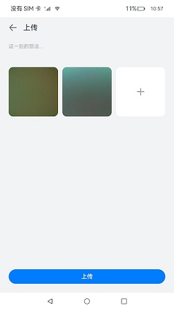

# 上传和下载

### 介绍
本示例使用[@ohos.request](https://gitee.com/openharmony/docs/blob/master/zh-cn/application-dev/reference/apis/js-apis-request.md)接口创建上传和下载任务，实现上传、下载功能，hfs作为服务器，实现了文件的上传和下载和任务的查询功能。

### 效果预览

|               主页               |             上传             |                 下载                 |
| :---------------------------------------: | :---------------------------------------: | :--------------------------------------: |
|        |  |  |

使用说明

1.本示例功能需要先配置服务器环境后使用，具体配置见[上传下载服务配置](./environment)。

2.首页展示上传和下载两个入口组件，点击进入对应的页面，如果要使用后台下载任务，请开启后台任务开关。

3.上传页面：

​    点击**+**，**从相册选择**拉起图库选择照片，图片选择页面支持拍照，选择照片后点击发表进行上传。

​    在首页中打开后台任务开关后，上传页面开启的是后台上传任务，后台任务在应用退出到后台时可以在通知栏看到任务状态。

4.下载页面：

​    点击文件列表选择要下载的文件后，点击**下载**选择指定路径后开始下载。

​    点击**查看下载文件**进入下载文件页面，点击文件夹查看文件夹内的文件。

​    在首页中打开后台任务开关后，下载页面开启的是后台下载任务，后台任务在应用退出到后台时可以在通知栏看到任务状态。

​    前台下载时只支持单文件下载，后台下载时支持选择多个文件下载。

### 工程目录

```
UploadAndDownload
├── AppScope                                    
│   └── app.json5                               //APP信息配置文件
├── entry/src/main                              //应用首页
│   ├── ets
│   │   ├── entryability
│   │   ├── components                          //自定义组件
│   │   ├── pages
│   │   │   ├── Index.ets                       //主页入口
│   │   │   ├── Download.ets                    //下载页面                     
│   │   │   ├── DownloadFiles.ets               //查看下载文件页面
│   │   │   ├── Upload.ets                      //上传页面 
│   └── module.json5
│
├── features/uploadanddownload/src/main         //上传和下载
│   ├── ets
│   │   ├── Index.ets                           //对外提供的接口列表      
│   │   ├── components
│   │   │    └── FileBrowse.ets                 //查看下载文件组件  
│   │   ├── download                            //下载任务相关
│   │   ├── upload                              //上传任务相关
│   │   ├── utils                               //相关工具类
│   └── module.json5
```

### 具体实现

* 该示例分为两个模块：
  * 上传模块
    * 使用[@ohos.request](https://gitee.com/openharmony/docs/blob/master/zh-cn/application-dev/reference/apis/js-apis-request.md)中API 10接口agent.create创建上传任务，调用@ohos.request中的Task相关接口实现上传任务的创建、取消、进度加载，失败的任务会调用查询接口获取失败原因并打印在日志中，支持多个文件上传。
    * 源码链接：[RequestUpload.ets](./features/uploadanddownload/src/main/ets/upload/RequestUpload.ets)，[AddPictures.ets](./entry/src/main/ets/components/AddPictures.ets)，[Upload.ets](./entry/src/main/ets/pages/Upload.ets)
    * 参考接口：[@ohos.request](https://gitee.com/openharmony/docs/blob/master/zh-cn/application-dev/reference/apis/js-apis-request.md)，[@ohos.file.picker](https://gitee.com/openharmony/docs/blob/master/zh-cn/application-dev/reference/apis/js-apis-file-picker.md)
  * 下载模块
    * 使用[@ohos.request](https://gitee.com/openharmony/docs/blob/master/zh-cn/application-dev/reference/apis/js-apis-request.md)中API 10接口agent.create创建上传任务，调用@ohos.request中的Task相关接口实现上传任务的创建、取消、进度加载，失败的任务会调用查询接口获取失败原因并打印在日志中，前台下载任务只支持单个文件下载，后台下载任务支持多文件下载。使用[@ohos.file.fs](https://gitee.com/openharmony/docs/blob/master/zh-cn/application-dev/reference/apis/js-apis-file-fs.md)完成指定路径的创建和查询已下载的文件。
    * 源码链接：[RequestDownload.ets](./features/uploadanddownload/src/main/ets/download/RequestDownload.ets)，[Download.ets](./entry/src/main/ets/pages/Download.ets)，[FileUtils.ets](./features/uploadanddownload/src/main/ets/utils/FileUtils.ets)，[FileBrowse.ets](./features/uploadanddownload/src/main/ets/components/FileBrowse.ets)
    * 参考接口：[@ohos.request](https://gitee.com/openharmony/docs/blob/master/zh-cn/application-dev/reference/apis/js-apis-request.md)，[@ohos.file.fs](https://gitee.com/openharmony/docs/blob/master/zh-cn/application-dev/reference/apis/js-apis-file-fs.md)

### 相关权限

[ohos.permission.INTERNET](https://gitee.com/openharmony/docs/blob/master/zh-cn/application-dev/security/permission-list.md)

[ohos.permission.READ_MEDIA](https://gitee.com/openharmony/docs/blob/master/zh-cn/application-dev/security/permission-list.md)

### 依赖

[上传下载服务配置](./environment)。

### 约束与限制

1.本示例仅支持标准系统上运行。

2.本示例适配API version 10版本SDK，版本号：4.0.8.5。

3.本示例需要使用DevEco Studio 3.1 Beta2 (Build Version: 3.1.0.400, built on April 7, 2023)才可编译运行。

###  下载

如需单独下载本工程，执行如下命令：

```
git init
git config core.sparsecheckout true
echo code/BasicFeature/Connectivity/UploadAndDownload/ > .git/info/sparse-checkout
git remote add origin https://gitee.com/openharmony/applications_app_samples.git
git pull origin master
```