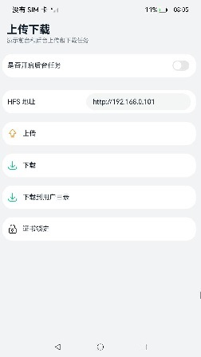

# 上传和下载

### 介绍
本示例使用[@ohos.request](https://gitee.com/openharmony/docs/blob/master/zh-cn/application-dev/reference/apis/js-apis-request.md)接口创建上传和下载任务，实现上传、下载功能，hfs作为服务器，实现了文件的上传和下载和任务的查询功能。

### 效果预览

|               主页               |             上传             |             片段上传             |                 下载                 |
| :---------------------------------------: | :---------------------------------------: | :--------------------------------------: | :--------------------------------------: |
|        |  |  |  |

使用说明

1.本示例功能需要先配置服务器环境后使用，具体配置见[上传下载服务配置](./environment)。

2.首页展示上传和下载两个入口组件，点击进入对应的页面，如果要使用后台下载任务，请开启后台任务开关。

3.上传页面：

点击 **+**，**从相册选择**拉起图库选择照片，图片选择页面支持拍照，选择照片后点击**上传**进行上传。

可选的，点击缩略图，显示文件片段上传配置选项弹窗，可以配置上传起点和终点，取值为闭区间；起点默认为0，终点默认为文件结尾。点击**上传**进行选中文件片段以及后续文件全部内容上传。

点击**返回**键或片段上传配置选项弹窗外区域，取消片段上传。

在首页中打开后台任务开关后，上传页面开启的是后台上传任务，后台任务在应用退出到后台时可以在通知栏看到任务状态。

后台上传**暂停**时，需要服务器支持上传暂停服务（HFS暂不支持此操作）。如仍然使用HFS作为服务器，此时HFS服务将中断文件写入，立即将当前传输的数据保存为文件片段。点击**继续**时则会重新生成一份文件，并在新文件中开始写入。

4.下载页面：

点击文件列表选择要下载的文件后，点击**下载**选择指定路径后开始下载。

点击**查看下载文件**进入下载文件页面，点击文件夹查看文件夹内的文件。

在首页中打开后台任务开关后，下载页面开启的是后台下载任务，后台任务在应用退出到后台时可以在通知栏看到任务状态。

前台下载时只支持单文件下载，后台下载时支持选择多个文件下载。

后台下载**暂停**时，本示例功能将自动记录断点。此时HFS服务仍会进行一定时间的传输，但是传输的数据并不会被接受。点击**继续**后将会从上次暂停的断点继续下载。
### 工程目录

```
UploadAndDownload
├── AppScope                                    
│   └── app.json5                               //APP信息配置文件
├── entry/src/main                              //应用首页
│   ├── ets
│   │   ├── entryability
│   │   ├── components                          //自定义组件
│   │   ├── pages
│   │   │   ├── Index.ets                       //主页入口
│   │   │   ├── Download.ets                    //下载页面                     
│   │   │   ├── DownloadFiles.ets               //查看下载文件页面
│   │   │   ├── Upload.ets                      //上传页面 
│   └── module.json5
│
├── features/uploadanddownload/src/main         //上传和下载
│   ├── ets
│   │   ├── Index.ets                           //对外提供的接口列表      
│   │   ├── components
│   │   │    └── FileBrowse.ets                 //查看下载文件组件  
│   │   ├── download                            //下载任务相关
│   │   ├── upload                              //上传任务相关
│   │   ├── utils                               //相关工具类
│   └── module.json5
```

### 具体实现

* 该示例分为两个模块：
  * 上传模块
    * 使用[@ohos.request](https://gitee.com/openharmony/docs/blob/master/zh-cn/application-dev/reference/apis/js-apis-request.md)中API 10接口agent.create创建上传任务，调用@ohos.request中的Task相关接口实现上传任务的创建、取消、进度加载，失败的任务会调用查询接口获取失败原因并打印在日志中，支持多个文件上传及片段上传。
    * 源码链接：[RequestUpload.ets](./features/uploadanddownload/src/main/ets/upload/RequestUpload.ets)，[AddPictures.ets](./entry/src/main/ets/components/AddPictures.ets)，[Upload.ets](./entry/src/main/ets/pages/Upload.ets)
    * 参考接口：[@ohos.request](https://gitee.com/openharmony/docs/blob/master/zh-cn/application-dev/reference/apis/js-apis-request.md)，[@ohos.file.picker](https://gitee.com/openharmony/docs/blob/master/zh-cn/application-dev/reference/apis/js-apis-file-picker.md)
  * 下载模块
    * 使用[@ohos.request](https://gitee.com/openharmony/docs/blob/master/zh-cn/application-dev/reference/apis/js-apis-request.md)中API 10接口agent.create创建上传任务，调用@ohos.request中的Task相关接口实现上传任务的创建、取消、进度加载，失败的任务会调用查询接口获取失败原因并打印在日志中，前台下载任务只支持单个文件下载，后台下载任务支持多文件下载。使用[@ohos.file.fs](https://gitee.com/openharmony/docs/blob/master/zh-cn/application-dev/reference/apis/js-apis-file-fs.md)完成指定路径的创建和查询已下载的文件。
    * 源码链接：[RequestDownload.ets](./features/uploadanddownload/src/main/ets/download/RequestDownload.ets)，[Download.ets](./entry/src/main/ets/pages/Download.ets)，[FileUtils.ets](./features/uploadanddownload/src/main/ets/utils/FileUtils.ets)，[FileBrowse.ets](./features/uploadanddownload/src/main/ets/components/FileBrowse.ets)
    * 参考接口：[@ohos.request](https://gitee.com/openharmony/docs/blob/master/zh-cn/application-dev/reference/apis/js-apis-request.md)，[@ohos.file.fs](https://gitee.com/openharmony/docs/blob/master/zh-cn/application-dev/reference/apis/js-apis-file-fs.md)

### 相关权限

[ohos.permission.INTERNET](https://gitee.com/openharmony/docs/blob/master/zh-cn/application-dev/security/permission-list.md)

[ohos.permission.READ_MEDIA](https://gitee.com/openharmony/docs/blob/master/zh-cn/application-dev/security/permission-list.md)

### 依赖

[上传下载服务配置](./environment)。

### 约束与限制

1.本示例仅支持标准系统上运行，支持设备：RK3568。

2.本示例为Stage模型，支持API10版本SDK，SDK版本号(API Version 10 Release),镜像版本号(4.0 Release)

3.本示例需要使用DevEco Studio 版本号(4.0 Release)及以上版本才可编译运行。

4.运行本示例需全程联网。

###  下载

如需单独下载本工程，执行如下命令：

```bash
git init
git config core.sparsecheckout true
echo code/BasicFeature/Connectivity/UploadAndDownload/ > .git/info/sparse-checkout
git remote add origin https://gitee.com/openharmony/applications_app_samples.git
git pull origin master
```