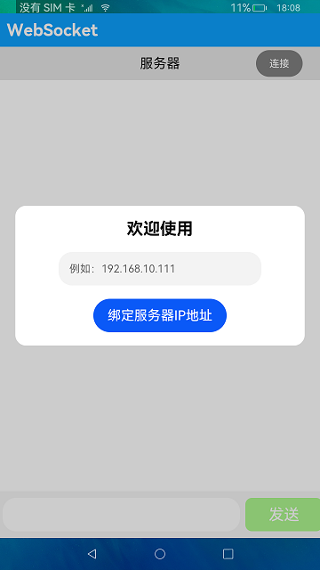
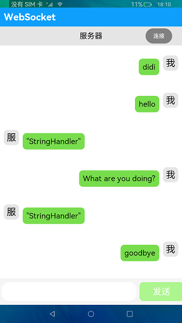
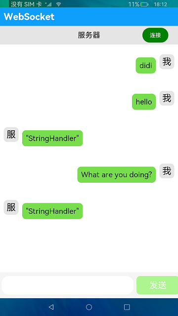

# WebSocket

### 介绍

本示例展示了WebSocket的使用，包括客户端与服务端的连接和断开以及客户端数据的接收和发送。

WebSocket连接：使用WebSocket建立服务器与客户端的双向连接，需要先通过createWebSocket方法创建WebSocket对象，然后通过connect方法连接到服务器。
当连接成功后，客户端会收到open事件的回调，之后客户端就可以通过send方法与服务器进行通信。 当服务器发信息给客户端时，客户端会收到message事件的回调。
当客户端不要此连接时，可以通过调用close方法主动断开连接，之后客户端会收到close事件的回调。

### 效果预览

| 主页                                      | 未连接                                    | 连接                                  |
|-----------------------------------------|----------------------------------------|-------------------------------------|
|  |  |  |

使用方法：

1.输入服务器IP地址，点击**绑定服务器IP地址**按钮，即可绑定该IP并退出弹框，如果要解绑IP，重启应用即可。

2.点击顶部栏的**连接**按钮，按钮颜色从灰色变为绿色，即可与服务器建立WebSocket连接，并开始监听服务器发来的消息。

3.在底部消息输入框输入消息，点击**发送**按钮，即可收到来自服务端的消息回馈。

4.再次点击顶部栏的**连接**按钮，按钮颜色从绿色重新变成灰色，即可与服务器断开连接，接收不到服务器发来的消息。

5.重新连接需要退出应用重新绑定ip，再次点击连接才可以发送接收消息。

### 工程目录
```
entry/src/main/ets/
|---Application
|   |---AbilityStage.ts
|---common
|   |---BindServiceIp.ets                    // 绑定服务器IP地址
|   |---ChatsPage.ets                        // 聊天框
|   |---SendMessage.ets                      // 发送信息
|   |---TopBar.ets                           // 顶部栏
|---MainAbility
|   |---MainAbility.ts
|---model
|   |---ChatData.ets                          // 数据类型
|   |---DataSource.ets                        // 源数据
|   |---Logger.ts                             // 日志工具
|---pages
|   |---Chats.ets                             // 首页
```

### 具体实现

* 本示例分为两大模块
  * 客户端与服务端的连接和断开模块
    * BindServiceIP方法输入服务器IP地址，socket.connect方法绑定服务器，进入消息框页面，socket.on方法连接服务器，socket.off方法断开连接
    * 源码链接：[BindServiceIp.ets](entry/src/main/ets/common/BindServiceIp.ets)，[ChatsPage.ets](entry/src/main/ets/common/ChatsPage.ets)
    * 接口参考：[@ohos.prompt](https://gitee.com/openharmony/docs/blob/master/zh-cn/application-dev/reference/apis/js-apis-promptAction.md)，[@ohos.net.webSocket](https://gitee.com/openharmony/docs/blob/master/zh-cn/application-dev/reference/apis/js-apis-webSocket.md)

  * 客户端数据的接收和发送模块
    * TopBar组件搭建通讯页面，socket.send方法发送信息数据。
    * 源码链接：[TopBar.ets](entry/src/main/ets/common/TopBar.ets)，[SendMessage.ets](entry/src/main/ets/common/SendMessage.ets)，[ChatData.ets](entry/src/main/ets/model/ChatData.ets)，[DataSource.ets](entry/src/main/ets/model/DataSource.ets)
    * 接口参考：[@ohos.prompt](https://gitee.com/openharmony/docs/blob/master/zh-cn/application-dev/reference/apis/js-apis-promptAction.md)，[@ohos.net.webSocket](https://gitee.com/openharmony/docs/blob/master/zh-cn/application-dev/reference/apis/js-apis-webSocket.md)

### 相关权限

[ohos.permission.INTERNET](https://gitee.com/openharmony/docs/blob/master/zh-cn/application-dev/security/permission-list.md#ohospermissioninternet)

### 依赖

依赖于[WebSocketServer](https://gitee.com/adslk/application_server/tree/master/WebSocketServer)服务器才能实现相关功能。

### 约束与限制

1.本示例仅支持在标准系统上运行。

2.本项目仅包含客户端，不包含服务端，当前服务端回复客服端为固定消息。

3.本示例仅支持API9版本SDK，版本号：3.2.11.9 及以上。

4.本示例需要使用DevEco Studio 3.1 Beta2 (Build Version: 3.1.0.400 构建 2023年4月7日)及以上才可编译运行。

### 下载

如需单独下载本工程，执行如下命令：
```
git init
git config core.sparsecheckout true
echo code\BasicFeature\Connectivity\WebSocket > .git/info/sparse-checkout
git remote add origin https://gitee.com/openharmony/applications_app_samples.git
git pull origin master
```
