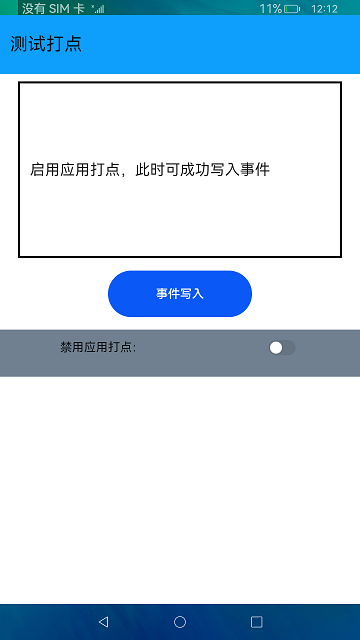

# hiTraceMeter 

### Introduction

Logging consists of two parts: hiAppEvent for application event logging and hiTraceMeter for performance tracing.

You can call `hiAppEvent` APIs to log various events that occur during application running.

This sample illustrates how to obtain application fault information in eTS. The display effect is as follows:

### Concepts

hiAppEvent: A module that provides the application event logging functions, such as writing application events to the event file and managing the event logging configuration.

### Required Permissions

N/A

### Usage

1. Touch **Write Event**. A message is displayed, indicating that event writing is successful.

2. If you turn on the **Disable hiAppEvent** switch and touch **Write Event** again, a message is displayed, indicating that the event writing has failed.

3. If you turn off the **Disable hiAppEvent** switch and touch **Write Event** again, a message is displayed, indicating that event writing is successful.

### Constraints

1. This sample can only be run on standard-system devices.

2. Performance tracing results can be verified only based on the logs obtained by running commands.

3. DevEco Studio 3.0 Beta3 (Build version: 3.0.0.901, built on May 30, 2022) must be used.
