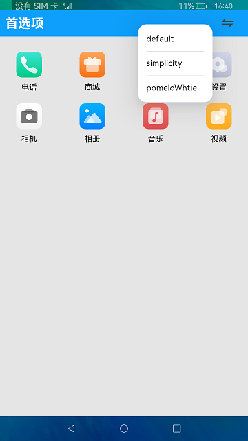
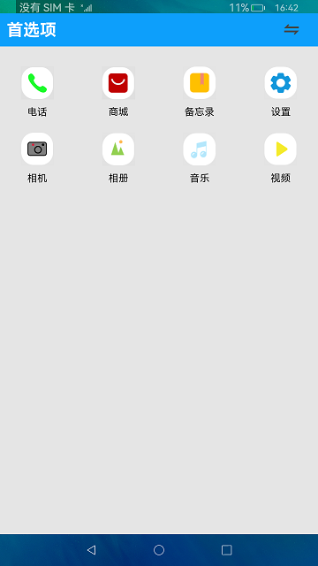
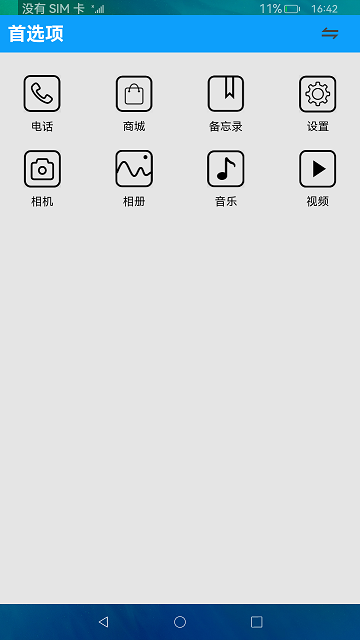

#  首选项

### 简介

本示例使用[@ohos.data.preferences](https://gitee.com/openharmony/docs/blob/master/zh-cn/application-dev/reference/apis/js-apis-data-preferences.md)
接口，展示了使用首选项持久化存储数据的功能。

### 效果预览 

|default主题|pomelo主题|simplicity主题|
|---|---|---|
||||

使用说明

1.点击顶部titleBar的右侧**切换**按钮，弹出主题菜单，选择任意主题则切换相应的主题界面；

2.退出应用再重新进入，显示上一次退出前的主题界面。

### 工程目录
```
entry/src/main/ets/
|---Application
|---common
|   |---ThemeDesktop.ets      // 首页主体内容
|---MainAbility
|---filemanager
|   |---data
|---model                     // 日志文件
|---pages
|   |---Index.ets             // 首页，所有的接口和数据都封装在这里
|---util
|   |---DataSource.ets        // 数据懒加载
```

### 具体实现

* 切换主题：在首页预先设置好几套主体数据，使用preferences.getPreferences获取使用Preferences对象，调用Preferences.get()
读取缓存中的参数，得到当前应该展示哪一套主体。每次点击切换按钮都会调用Preferences.put()来重新修改参数，然后使用
Preferences.flush()保存并刷新文件内容。
源码参考:[Index.ets](https://gitee.com/openharmony/applications_app_samples/blob/master/code/BasicFeature/DataManagement/Preferences/entry/src/main/ets/pages/Index.ets) 。

### 相关权限

不涉及。

### 依赖

不涉及。

### 约束与限制

1. 本示例仅支持在标准系统上运行。

2. 本示例为Stage模型，从API version 10开始支持。

3. 本示例已适配API10版本SDK，版本号：4.0.5.1。

4. 本示例需要使用DevEco Studio 3.1 Canary1 (Build Version: 3.1.0.100)及以上版本才可编译运行。

### 下载

如需单独下载本工程，执行如下命令：

```
git init
git config core.sparsecheckout true
echo code/BasicFeature/DataManagement/Preferences/ > .git/info/sparse-checkout
git remote add origin https://gitee.com/openharmony/applications_app_samples.git
git pull origin master
```

