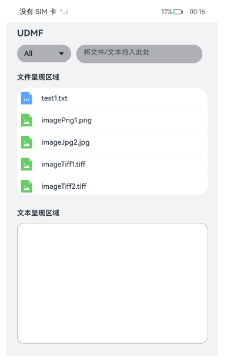
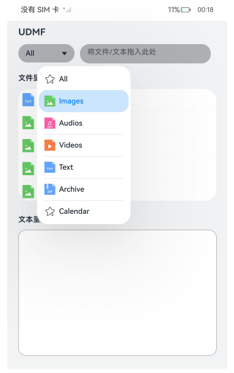
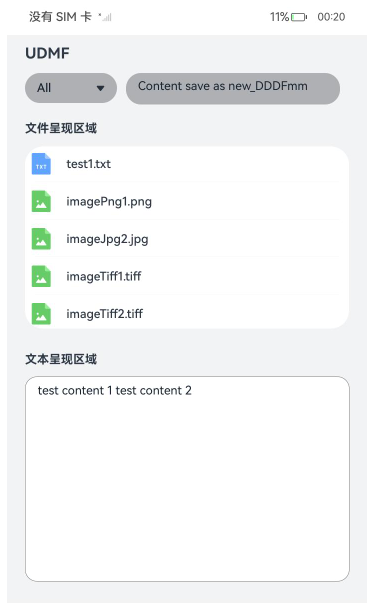

#  UDMF Demo 

### 介绍

本示例主要使用[@ohos.data.uniformTypeDescriptor](https://gitee.com/openharmony/docs/blob/master/zh-cn/application-dev/reference/apis-arkdata/js-apis-data-uniformTypeDescriptor.md) 
[@ohos.data.unifiedDataChannel](https://gitee.com/openharmony/interface_sdk-js/blob/master/api/@ohos.data.unifiedDataChannel.d.ts)展示了标准化数据定义与描述的功能，在新增预置文件后，对文件的utd标准类型获取、utd类型归属类型查询、获取文件对应的utd类型的默认图标等功能。 实现过程中还使用到[@ohos.file.fs](https://gitee.com/openharmony/docs/blob/master/zh-cn/application-dev/reference/apis-core-file-kit/js-apis-file-fs.md) 等接口。
另外，展示了ArkTS控件[拖拽事件](https://gitee.com/openharmony/docs/blob/master/zh-cn/application-dev/reference/apis-arkui/arkui-ts/ts-universal-events-drag-drop.md)中使用UDMF数据结构相关实现。


### 效果预览

|首页|文件过滤| 文本拖拽结果                         |
|--------------------------------|--------------------------------|--------------------------------|
|||  |


使用说明
1. 在主界面，类型过滤下拉框中，选择某一文件类型后，文件呈现区域展示对应类型的所有文件；
2. 在主界面，点击txt后缀的文件，文本呈现区域可展示文件内容；
3. 在主界面，对于txt后缀的文件，长按拖拽到右上角的文本控件区域，被拖拽的文件会被另存为新的文件；
4. 在主界面，在“文本呈现区域”右边长按拖拽到右上角的文本控件区域，被拖拽的文本会被另存为新的文件；

### 工程目录

```
entry/src/main/ets/
|---entryAbility
|---fileFs
|   |---fileFs.ets
|---util
|   |---Common.ets 
|   |---Logger.ets 
|---pages|   
|   |---Index.ets      // 首页
```

### 具体实现

#### 场景一：下拉列表选择不同数据类型可以进行过滤文件
* 预置条件：应用中设置不同类型的文件数据到沙箱内
* 输入：指定文件类型
* 输出：筛选出指定文件类型，过滤后的文件图标排列到文件呈现区域。


#### 场景二：实现选择出来的文件/文本信息能够被拖拽到另一个设备的应用内落为文件
* 输入：选定文件/文本

* 输出：
1.拖拽文件/数据到落入框后, 落入文件/数据另存为文件;

### 相关权限
无
### 依赖

不涉及

### 约束与限制

1. 本示例仅支持标准系统上运行，支持设备：RK3568。
2. 本示例为Stage模型，仅支持API12版本SDK，SDK版本号(API Version 12 Release),镜像版本号(OpenHarmony 5.0.0.25及更高版本)。
3. 本示例需要使用DevEco Studio 版本号(4.1Release)及以上版本才可编译运行。

### 下载

如需单独下载本工程，执行如下命令：

    git init
    git config core.sparsecheckout true
    echo code/BasicFeature/DataManagement/UDMF/UDMFDemo/ > .git/info/sparse-checkout
    git remote add origin https://gitee.com/openharmony/applications_app_samples.git
    git pull origin master
