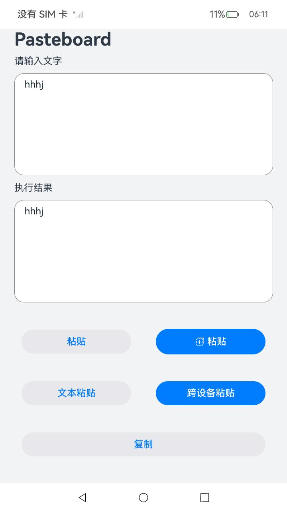

#  剪贴板Sample 

### 介绍

 本示例主要使用[@ohos.pasteboard](https://gitee.com/openharmony/docs/blob/master/zh-cn/application-dev/reference/apis-basic-services-kit/js-apis-pasteboard.md) 展示了剪贴板的能力，包括基础功能、支持查询剪贴板数据类型、支持查询剪贴板数据是否来自跨设备、使用系统安全控件读取剪贴板、通过ctrl v访问剪贴板数据。 


### 效果预览

|               首页               |
|:------------------------------: |
|  |


使用说明
1. 在主界面，应用第一次安装时，弹出剪切板授权请求，点击“仅本次允许”进行用户授权；
2. 在主界面，文本框中输入文本，点击“复制”按钮，文本内容即可由文本框拷贝到剪切板；
3. 在主界面，点击“粘贴”按钮，文本内容即可由剪切板到文本框；
4. 在主界面，点击“文本粘贴”按钮，文本类型的内容即可由剪切板到文本框；
5. 在主界面，点击粘贴控件，文本类型的内容即可由剪切板到文本框；
6. 在主界面，点击"跨设备粘贴"按钮，可将跨设备剪切板中的内容到文本框；
7. 设备外接键盘，焦点放在文本框中，点击ctrl+v，文本内容即可由剪切板到文本框；

### 工程目录

```
entry/src/main/ets/
|---entryAbility
|---pages|   
|   |---Index.ets      // 首页
```

### 具体实现

#### 场景一：基础功能场景

##### 数据复制

* 输入：复制
* 处理：将数据写入剪贴板
* 输出：复制成功

#### 数据粘贴
* 输入：粘贴
* 处理：读取剪贴板数据
* 输出：粘贴成功

    
#### 场景二：查询剪贴板数据类型

* 输入：仅文本粘贴
* 处理：查询剪贴板是否有文本类型数据 hasDataType
* 输出：有数据则粘贴成功


#### 场景三：查询剪贴板数据是否来自跨设备
* 输入：仅跨设备粘贴
* 处理：查询剪贴板数据是否来自跨设备
* 输出：有则粘贴成功


#### 场景四：通过安全控件的粘贴按钮访问剪贴板数据
* 输入：安全控件粘贴
* 处理：集成安全控件的粘贴控件，通过粘贴控件访问剪贴板数据
* 输出：粘贴成功


#### 场景五：通过ctrl v访问剪贴板数据
* 输入：外接键盘，按ctrl + v
* 处理：默认实现
* 输出：粘贴成功
    

### 相关权限

[ohos.permission.READ_PASTEBOARD](https://gitee.com/openharmony/docs/blob/master/zh-cn/application-dev/security/AccessToken/permissions-for-system-apps.md#ohospermissionread_pasteboard) 允许应用访问剪贴板

### 依赖

不涉及

### 约束与限制

1. 本示例仅支持标准系统上运行，支持设备：RK3568。
2. 本示例为Stage模型，仅支持API12版本SDK，SDK版本号(API Version 12 Release),镜像版本号(OpenHarmony 5.0.0.25及更高版本)。
3. 本示例需要使用DevEco Studio 版本号(4.1Release)及以上版本才可编译运行。
4. 本示例涉及调用系统权限的接口，需要配置允许权限列表，可以参考[特殊权限配置方法](https://docs.openharmony.cn/pages/v3.2/zh-cn/application-dev/security/hapsigntool-overview.md/) ，在配置文件中的“allowed-acls”字段中增加"ohos.permission.READ_PASTEBOARD"权限，ohos.permission.REQUIRE_FORM为system_basic级别。

### 下载

如需单独下载本工程，执行如下命令：

    git init
    git config core.sparsecheckout true
    echo code/BasicFeature/DataManagement/pasteboard/ > .git/info/sparse-checkout
    git remote add origin https://gitee.com/openharmony/applications_app_samples.git
    git pull origin master
