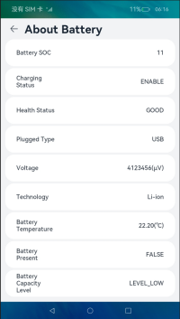

# 电量信息

### 介绍
本示例主要展示了电量信息相关的功能，使用[@ohos.batteryInfo.d.ts](https://gitee.com/openharmony/docs/blob/master/zh-cn/application-dev/reference/apis/js-apis-battery-info.md)接口获取电池和充放电状态信息。

### 效果预览

|主页|列表
|--------------------------------|--------------------------------|
|||

使用说明

1. 点击进入hap查看电池当前信息状态。

### 工程目录
```
entry/src/main/ets/
|---entryability
|   |---BatteryAbility.ts       // 主窗口
|---battery
|   |---data
|       |---BatteryModel.ets    // 电池接口调用模块
|       |---ListModel.ets       // 页面列表信息模块
|---pages
|   |---BatteryPage.ets         // 电池信息展示页面
```

### 具体实现
- 电池状态和充放电状态的查询接口功能封装在[BatteryModel.ets](./entry/src/main/ets/battery/data/BatteryModel.ets)中。
  - 使用[@ohos.batteryInfo.d.ts](https://gitee.com/openharmony/docs/blob/master/zh-cn/application-dev/reference/apis/js-apis-battery-info.md)接口来获取电池的相关属性，此示例只涉及普通接口，具体接口请参考API文档。
- 页面列表信息模块主要为页面展示提供需要展示的数据。
- 电池信息展示页面主要是展示具体的电池信息。

### 相关权限
无权限。

### 依赖
无依赖。

### 约束与限制
1. 本示例仅支持标准系统上运行，支持设备：RK3568。
2. 本示例仅支持API version 9版本SDK，版本号：3.2.11.9。
3. 本示例需要使用DevEco Studio 3.1 Beta1 (Build Version: 3.1.0.200)才可编译运行。

### 下载
如需单独下载本工程，执行如下命令：
```
git init
git config core.sparsecheckout true
echo code/BasicFeature/DeviceManagement/BatteryInfo/ > .git/info/sparse-checkout
git remote add origin https://gitee.com/openharmony/applications_app_samples.git
git pull origin master
```
