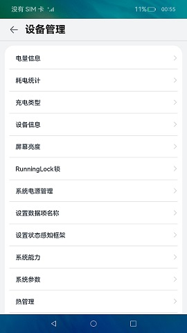
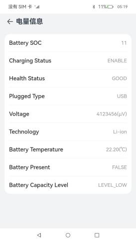
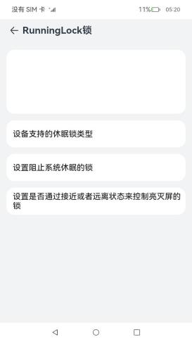
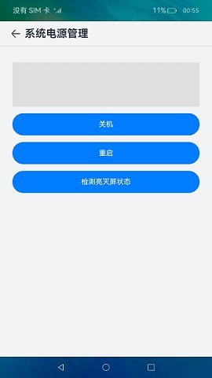
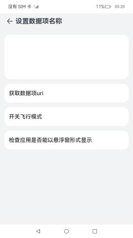
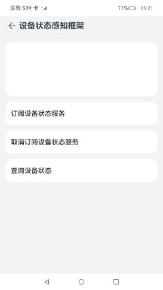
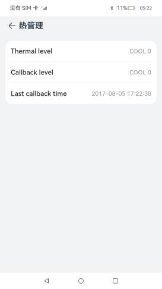

# 设备管理合集（非系统特性）

### 介绍

本示例集合设备管理相关（非系统特性）不需要复杂功能展示的模块，展示了各个模块的基础功能，包含：

- [@ohos.batteryInfo (电量信息)](https://docs.openharmony.cn/pages/v3.2/zh-cn/application-dev/reference/apis/js-apis-battery-info.md/)
- [@ohos.charger (充电类型)](https://gitee.com/openharmony/docs/blob/master/zh-cn/application-dev/reference/apis/js-apis-charger.md)
- [@ohos.deviceInfo (设备信息)](https://gitee.com/openharmony/docs/blob/master/zh-cn/application-dev/reference/apis/js-apis-device-info.md)
- [@ohos.power (系统电源管理)](https://docs.openharmony.cn/pages/v3.2/zh-cn/application-dev/reference/apis/js-apis-power.md/)
- [@ohos.runningLock (Runninglock锁)](https://docs.openharmony.cn/pages/v3.2/zh-cn/application-dev/reference/apis/js-apis-runninglock.md/)
- [@ohos.settings (设置数据项名称)](https://docs.openharmony.cn/pages/v3.2/zh-cn/application-dev/reference/apis/js-apis-settings.md/)
- [@ohos.stationary (设备状态感知框架)](https://docs.openharmony.cn/pages/v3.2/zh-cn/application-dev/reference/apis/js-apis-stationary.md/)
- [@ohos.thermal (热管理)](https://docs.openharmony.cn/pages/v3.2/zh-cn/application-dev/reference/apis/js-apis-thermal.md/)
- [@ohos.usbManager (USB管理)](https://docs.openharmony.cn/pages/v3.2/zh-cn/application-dev/reference/apis/js-apis-usbManager.md/)
- [@ohos.multimodalInput.inputConsumer (组合按键)](https://gitee.com/openharmony/docs/blob/master/zh-cn/application-dev/reference/apis/js-apis-inputconsumer.md)
- [@ohos.multimodalInput.inputDevice (输入设备)](https://gitee.com/openharmony/docs/blob/master/zh-cn/application-dev/reference/apis/js-apis-inputdevice.md)
- [@ohos.multimodalInput.inputEvent (输入事件)](https://gitee.com/openharmony/docs/blob/master/zh-cn/application-dev/reference/apis/js-apis-inputevent.md)
- [@ohos.multimodalInput.inputEventClient (按键注入)](https://gitee.com/openharmony/docs/blob/master/zh-cn/application-dev/reference/apis/js-apis-inputeventclient.md)
- [@ohos.multimodalInput.inputMonitor (输入监听)](https://gitee.com/openharmony/docs/blob/master/zh-cn/application-dev/reference/apis/js-apis-inputmonitor.md)
- [@ohos.multimodalInput.keyCode (键值)](https://gitee.com/openharmony/docs/blob/master/zh-cn/application-dev/reference/apis/js-apis-keycode.md)
- [@ohos.multimodalInput.keyEvent (按键输入事件)](https://gitee.com/openharmony/docs/blob/master/zh-cn/application-dev/reference/apis/js-apis-keyevent.md)
- [@ohos.multimodalInput.mouseEvent (鼠标输入事件)](https://gitee.com/openharmony/docs/blob/master/zh-cn/application-dev/reference/apis/js-apis-mouseevent.md)
- [@ohos.multimodalInput.pointer (鼠标指针)](https://gitee.com/openharmony/docs/blob/master/zh-cn/application-dev/reference/apis/js-apis-pointer.md)
- [@ohos.multimodalInput.touchEvent (触摸输入事件)](https://gitee.com/openharmony/docs/blob/master/zh-cn/application-dev/reference/apis/js-apis-touchevent.md)

### 效果预览

|                   **主页**                   |                  **电量信息**                  |              **RunningLock锁**               |               **系统电源管理**               |
|:------------------------------------------:|:------------------------------------------:|:-------------------------------------------:|:--------------------------------------:|
|       |   |  |  |
|                **设置数据项名称**                 |                **设备状态感知框架**                |                   **热管理**                   |               **USB管理**                |
|  |  |     |   |

使用说明

1.首页展示语言基础类库各个子模块菜单，点击进入对应的模块页面。

2.各个子模块界面中点击功能按钮完成各个功能。

3.电量信息：进入电量信息页面，展示设备电量相关信息。

4.RunningLock锁：点击按钮分别实现设备支持的休眠锁类型、设置屏幕休眠时间功能、设置是否通过接近或者远离状态来控制亮灭屏的锁功能。

5.系统电源管理：点击按钮分别实现获取亮灭屏状态、获取电源模式功能。

6.设置数据项名称：点击按钮分别实现获取数据项uri、开关飞行模式、检查应用是否能以悬浮形式显示功能。

7.设备状态感知框架：点击按钮分别实现订阅设备状态服务、取消订阅设备状态服务、查询设备状态并显示功能。

8.热管理：进入热管理页面，展示当前设备热档位信息、设备过热时提示用户。

9.USB管理：打开监听开关后插入USB设备，会有提示并刷新设备列表，关闭监听后插入USB设备不会提示和自动刷新，下拉设备列表可以手动刷新设备列表。

### 工程目录

```
DeviceManagementCollection
├── AppScope                                    
│   └── app.json5                               //APP信息配置文件
├── entry/src/main                              //语言基础类库应用首页
│   ├── ets
│   │   ├── entryability
│   │   ├── pages
│   │   │   ├── Index.ets                       //主页入口
│   │   │   ├── components                       
│   │   │   │   └── Capabilities.ets            //根据点击的菜单，展示对应的子界面
│   └── module.json5
│ 
├── common/src/main                             //公共组件及工具类
│   ├── ets
│   │   ├── components
│   │   │   └── CustomDataSource.ets            //自定义DataSource，LazyForEach时使用
│   │   ├── util
│   │   │   ├── Logger.ets                      //日志工具类
│   │   │   └── ResourceUtil.ets                //资源管理工具类
│   └── module.json5
│
├── menuitems/src/main                          //菜单
│   ├── ets
│   │   ├── Index.ets                           //对外提供的接口列表
│   │   ├── menulist                            //菜单组件
│   │   │   └── MenuList.ets                  
│   │   ├── components                          //菜单相关自定义组件
│   └── module.json5
│
├── capabilities/src/main                       //功能集
│   ├── ets
│   │   ├── capabilities                        //各个子模块功能组件
│   │   │   ├── BatteryInfo.ets                 //电量信息
│   │   │   ├── PowerManager.ets                //系统电源管理
│   │   │   ├── RunningLockManager.ets          //RunningLock锁
│   │   │   ├── SettingsManager.ets             //设置数据项名称
│   │   │   ├── StationaryManager.ets           //设置状态感知框架
│   │   │   ├── Thermal.ets                     //热管理
│   │   │   └── UsbManager.ets                  //USB管理
│   │   ├── components                          //子模块相关组件
│   │   │   ├── usbmanager                      //usbmanager相关组件
│   │   │   ├── ColumnOperation.ets             //展示一列功能按钮的组件
│   │   │   └── RadiusColumn.ets                //白色圆角的自定义Columm组件
│   │   ├── model                               //相关数据模型
│   │   └── utils                               //相关工具类
│   └── module.json5
```

### 具体实现

1.首页菜单展示：使用一个module，menuitems完成菜单组件的实现，传入要展示的菜单的strarray类型的资源和菜单点击对应的组件即可。使用Navigation和NavRouter组件实现菜单点击进入功能界面，使用LocalStorage实现应用内Ability内数据共享，点击菜单时标记selectedLabel，在entry中的Capabilities组件中，通过selectedLabel显示对应的功能组件。

2.电量信息：使用[@ohos.batteryInfo.d.ts](https://docs.openharmony.cn/pages/v3.2/zh-cn/application-dev/reference/apis/js-apis-battery-info.md/)
接口获取电池和充放电状态信息。

3.RunningLock锁：使用[@ohos.runningLock.d.ts](https://docs.openharmony.cn/pages/v3.2/zh-cn/application-dev/reference/apis/js-apis-runninglock.md/)
实现对Runninglock锁的创建、查询、持锁、释放等操作。

4.系统电源管理：使用[@ohos.power.d.ts](https://docs.openharmony.cn/pages/v3.2/zh-cn/application-dev/reference/apis/js-apis-power.md/)
实现获取亮灭屏状态、查询电源模式功能。

5.设置数据项名称：使用[@ohos.settings.d.ts](https://docs.openharmony.cn/pages/v3.2/zh-cn/application-dev/reference/apis/js-apis-settings.md/)
实现获取获取数据项uri、开关飞行模式、检查应用是否能以悬浮窗形式显示功能。

6.设备状态感知框架：使用[@ohos.stationary.d.ts](https://docs.openharmony.cn/pages/v3.2/zh-cn/application-dev/reference/apis/js-apis-stationary.md/)
接口提供设备状态感知能力。

7.热管理：使用[@ohos.thermal.d.ts](https://docs.openharmony.cn/pages/v3.2/zh-cn/application-dev/reference/apis/js-apis-thermal.md/)
提供热管理相关的接口，查询热档位以及注册温控等级回调。

8.USB管理：使用[@ohos.usbManager.d.ts](https://docs.openharmony.cn/pages/v3.2/zh-cn/application-dev/reference/apis/js-apis-usbManager.md/)
实现usb设备列表的获取，使用[@ohos.commonEventManager.d.ts](https://docs.openharmony.cn/pages/v3.2/zh-cn/application-dev/reference/apis/js-apis-commonEventManager.md/)
订阅USB设备插入和拔出监听。

### 相关权限

1.允许应用获取运行锁权限：[ohos.permission.RUNNING_LOCK](https://gitee.com/openharmony/docs/blob/OpenHarmony-3.2-Release/zh-cn/application-dev/security/permission-list.md#ohospermissionrunning_lock)

### 依赖

不涉及。

### 约束与限制

1.本示例仅支持标准系统上运行，支持设备：RK3568。

2.本示例为Stage模型，支持API10版本SDK，SDK版本号(API Version 10 Release),镜像版本号(4.0 Release)

3.本示例需要使用DevEco Studio 版本号(4.0 Release)及以上版本才可编译运行。

### 下载

如需单独下载本工程，执行如下命令：

```text
git init
git config core.sparsecheckout true
echo code/BasicFeature/DeviceManagement/DeviceManagementCollection/ > .git/info/sparse-checkout
git remote add origin https://gitee.com/openharmony/applications_app_samples.git
git pull origin master
```