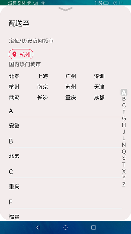

# Geolocation

### Introduction

This sample shows how to use **geolocation** APIs to implement location services.

In this example, we'll use [Geolocation](https://gitee.com/openharmony/docs/blob/master/en/application-dev/reference/apis/js-apis-geolocation.md) APIs to obtain the longitude and latitude of the current location, and use [HTTP](https://gitee.com/openharmony/docs/blob/master/en/application-dev/reference/apis/js-apis-http.md) APIs to obtain the city where the longitude and latitude are located. With the [AlphabetIndexer](https://gitee.com/openharmony/docs/blob/master/en/application-dev/reference/arkui-ts/ts-container-alphabet-indexer.md) APIs, we can also quickly locate the container display area based on the logical structure.

How to Use

1. Go to the home page and touch a popular city in the popular city list. The delivery address will be updated to the selected city. Alternatively, touch the alphabetic index bar on the right to quickly locate the desired city. If the city is divided into districts, you can click the desired district to update the delivery address to that district.

2. If your test device supports the GPS function, you can touch the location icon above the popular city list to locate the city where you settle. The city next to the location icon will be updated accordingly. Current city data is analog data.

### Preview

### Required Permissions

Using network sockets: [ohos.permission.INTERNET](https://gitee.com/openharmony/docs/blob/master/en/application-dev/security/permission-list.md)

Obtaining location information while running in the foreground: [ohos.permission.LOCATION](https://gitee.com/openharmony/docs/blob/master/en/application-dev/security/permission-list.md)

Obtaining location information while running in the background: [ohos.permission.LOCATION_IN_BACKGROUND](https://gitee.com/openharmony/docs/blob/master/en/application-dev/security/permission-list.md)

### Dependency

N/A

### Constraints

1. This sample can only be run on standard-system devices. To use GPS positioning, the test device must support the GPS function.

2. This sample demonstrates the stage model, which supports only the SDK of API version 9 (SDK version: 3.2.11.9). 

3. DevEco Studio 3.1 Canary1 (Build Version: 3.1.0.100) must be used.
