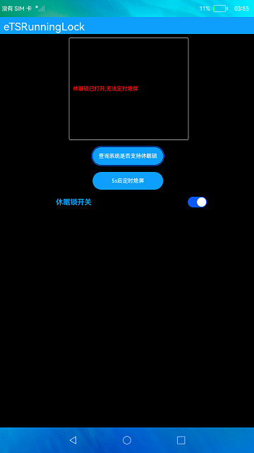

# 运行锁

### 介绍

本示例使用[@ohos.runningLock](https://gitee.com/openharmony/docs/blob/master/zh-cn/application-dev/reference/apis/js-apis-runninglock.md)接口展示了阻止系统休眠的运行锁功能，通过黑白色壁纸模拟息屏、亮屏状态，来展示系统的休眠状态，从而对运行锁的功能进行测试，使得该运行锁在打开后可以阻止系统休眠。

### 效果预览
|首页|熄屏效果|
|------|--------|
|||

使用说明：

1. 先点击**查询系统是否支持休眠锁**按钮，反馈系统支持的结果;
2. 点击**5s后定时息屏**按钮，系统在5秒后可定时灭屏（黑色背景模拟）;
3. 打开锁开关，系统被阻止进入休眠状态，点击**5s后定时息屏**按钮，5秒后将会一直亮屏（白色背景模拟）;
4. 关闭锁开关，系统被禁止休眠状态解除，点击**5s后定时息屏**按钮，5秒后将会到点灭屏（黑色背景模拟）;
5. 待灭屏后，点击屏幕任意一处即可亮屏（白色背景模拟）。

### 目录结构
```
entry/src/main/ets/
|---pages
|   |---Index.ets                           // 首页
log/src/main/ets/
|---common
|   |---LockSwitch.ets                      // 休眠锁开关
|---util
|   |---Logger.ts                           // 日志
```

### 具体实现
+ 休眠锁创建在LockSwitch中，代码参考[LockSwitch.ets](entry/src/main/ets/common/LockSwitch.ets):
    + 创建运行锁：创建前通过runningLock.isSupported接口查询系统是否支持RunningLock，代码参考[Index.ets](entry/src/main/ets/pages/Index.ets)，然后使用runningLock.create创建运行锁，可在创建之后查询锁的状态;
    + 获取当前运行锁状态：使用isHolding查询RunningLock状态，根据获取到的状态确认锁当前的开关状态;
    + 运行锁状态切换：hold锁定RunningLock，unhold释放RunningLock。

### 相关权限

[ohos.permission.RUNNING_LOCK](https://gitee.com/openharmony/docs/blob/master/zh-cn/application-dev/reference/apis/js-apis-runninglock.md)

### 依赖

不涉及。

### 约束与限制

1.本示例仅支持在标准系统上运行;
2.本示例已适配支持API10版本SDK，版本号：4.0.5.1;
3.本示例需要使用DevEco Studio 3.1 Canary1 (Build Version: 3.1.0.100)及以上版本才可编译运行。

### 下载
如需单独下载本工程，执行如下命令：

```
git init
git config core.sparsecheckout true
echo code/BasicFeature/DeviceManagement/RunningLock/ > .git/info/sparse-checkout
git remote add origin https://gitee.com/openharmony/applications_app_samples.git
git pull origin master
```

