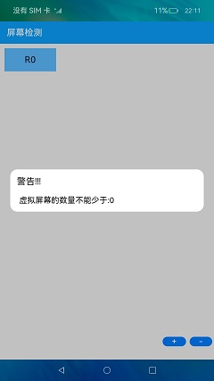

# 屏幕探测

### 介绍

本示例实时监测连接的屏幕数量状态，支持创建至多5个虚拟屏幕，点击对应的屏幕矩形能显示该屏幕的相关属性。

### 效果预览

| 主页                                   | 添加虚拟屏幕                                     | 添加警告                                       | 删除警告                                          | 屏幕属性                                 |
|--------------------------------------|--------------------------------------------|--------------------------------------------|-----------------------------------------------|--------------------------------------|
|  |  |  |  |  |

使用说明：

1.第一步：进入开始界面

2.第二步：点击右下方的“+”按钮，添加虚拟屏幕，连续点击后，至多创建5个虚拟屏幕。

3.第三步：点击右下方的“-”按钮，移除虚拟屏幕，连续点击删除全部的虚拟屏幕后，再次点击会提示告警信息。

4.第四步：点击屏幕矩形，展示相关屏幕的属性（首字母为R的为真实屏幕，首字母为V的为虚拟屏幕）

### 工程目录
```
entry/src/main/ets/
|---application
|   |---MyAbilityStage.ts
|---commmon
|   |---Detector.ets                    // 主页
|   |---Logger.ts                       // 打印日志
|   |---ShowInfo.ets                    // 屏幕属性
|   |---Warn.ets                        // 警告
|---mainAbility
|   |---MainAbility.ts
|---pages
|   |---Index.ets                       // 首页
|   |---ScreenInfo.ets                  // 属性页面
```
### 具体实现

* 真实屏幕模块
  * 首字母显示为R，且不能进行删除，点击跳转屏幕属性页面展示真实屏幕属性
  * 源码链接：[Detector.ets](entry/src/main/ets/common/Detector.ets)，[ShowInfo.ets](entry/src/main/ets/common/ShowInfo.ets)
  * 接口参考：[@ohos.display](https://gitee.com/openharmony/docs/blob/master/zh-cn/application-dev/reference/apis/js-apis-display.md)，[@ohos.router](https://gitee.com/openharmony/docs/blob/master/zh-cn/application-dev/reference/apis/js-apis-system-router.md)

* 新增和删除虚拟屏幕模块
  * getAllDisplay获取当前所有的display对象，getDefaultDisplay获取当前默认的display对象,push方法新增虚拟屏幕，增加超过5个虚拟屏幕时，给出警告，pop方法删除虚拟屏幕，全部删除虚拟屏幕后，点击给出警告，点击虚拟屏幕展示虚拟屏幕属性
  * 源码链接：[Detector.ets](entry/src/main/ets/common/Detector.ets)，[ShowInfo.ets](entry/src/main/ets/common/ShowInfo.ets)，[Warn.ets](entry/src/main/ets/common/Warn.ets)
  * 接口参考：[@ohos.display](https://gitee.com/openharmony/docs/blob/master/zh-cn/application-dev/reference/apis/js-apis-display.md)，[@ohos.router](https://gitee.com/openharmony/docs/blob/master/zh-cn/application-dev/reference/apis/js-apis-system-router.md)

### 相关权限

不涉及

### 依赖

不涉及

### 约束与限制

1. 本示例仅支持标准系统上运行，支持设备：RK3568;
2. 本示例已适配API version 9版本SDK，版本号：3.2.11.9；
3. 本示例需要使用DevEco Studio 3.1 Beta2 (Build Version: 3.1.0.400 构建 2023年4月7日)及以上版本才可编译运行；

### 下载
如需单独下载本工程，执行如下命令：

```
git init
git config core.sparsecheckout true
echo code/BasicFeature/DeviceManagement/ScreenDetector/ > .git/info/sparse-checkout
git remote add origin https://gitee.com/openharmony/applications_app_samples.git
git pull origin master
```
