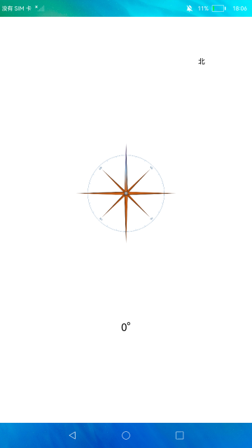

# **传感器**

## **介绍**

本示例系统将按照用户指定的上报频率向用户报告传感器数据的基本功能，实现了指南针的效果。

## **效果预览**



## **目录结构**

```
entry/src/main/ets/
|---pages                                  
|   |---Index.ets                             // 首页
```

## **具体实现**

订阅接口订阅了SensorType为SENSOR_TYPE_ID_ORIENTATION的传感器,根据手机的转动情况,界面显示的角度值及指南针的指向也会发生相应的改变。

## **相关权限**

不涉及。

## **依赖**

不涉及。

## **约束与限制**

1.打开应用后需要对传感器进行画8校准。

2.本示例仅支持在标准系统上运行。

3.本示例为Stage模型, 仅适配API9版本SDK, SDK版本号(API Version 9 Release),镜像版本号(4.0 Release)。

4.本示例需要使用DevEco Studio 版本号(4.0 Release)及以上版本才可编译运行。

5.本示例需要特殊模块与特定传感器，目前该功能仅支持部分机型。

## **下载**

如需单独下载本工程，执行如下命令：
```
git init
git config core.sparsecheckout true
echo code/BasicFeature/DeviceManagement/Vibrator/CustomHaptic/ > .git/info/sparse-checkout
git remote add origin https://gitee.com/openharmony/applications_app_samples.git
git pull origin master
```