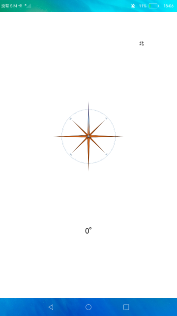

# 传感器

### 介绍

本示例使用[@ohos.sensor](https://gitee.com/openharmony/docs/blob/master/zh-cn/application-dev/reference/apis/js-apis-sensor.md) 中的方向传感器相关接口，实现指南针的功能。

### 效果预览

|主页|
|---|
||

使用说明

转动设备，指针跟随转动，转动的角度为偏离正北方的角度，并在界面下方显示。

### 工程目录
```
entry/src/main/ets/
|---entryAbility                           // 入口文件
|---pages
|   |---index.ets                          // 首页
|---util                                   // 日志工具
```

### 具体实现

* 指南针：在主页直接引入sensor对象，使用sensor.on()监听传感器变化，当传感器发生变化时会返回数据data，其中包含alpha属性，使用
Math.round(alpha)得出让他的整数角度，配合Image组件的旋转属性rotate来展示到界面中。源码参考[Index.ets](https://gitee.com/openharmony/applications_app_samples/blob/master/code/BasicFeature/DeviceManagement/Sensor/entry/src/main/ets/pages/Index.ets) 。

### 相关权限

[ohos.permission.VIBRATE](https://gitee.com/openharmony/docs/blob/master/zh-cn/application-dev/security/permission-list.md)

### 依赖

不涉及。

### 约束与限制

1.打开应用后需要对传感器进行画8校准。

2.本示例仅支持在标准系统上运行。

3.本示例需要使用DevEco Studio 3.1 Canary1 (Build Version: 3.1.0.100)及以上版本才可编译运行。

4.本示例需要特殊模块与特定传感器，目前该功能仅支持部分机型。

5.本示例已适配API10版本SDK，版本号：4.0.5.1。

### 下载

如需单独下载本工程，执行如下命令：

```
git init
git config core.sparsecheckout true
echo code/BasicFeature/DeviceManagement/Sensor/ > .git/info/sparse-checkout
git remote add origin https://gitee.com/openharmony/applications_app_samples.git
git pull origin master
```

