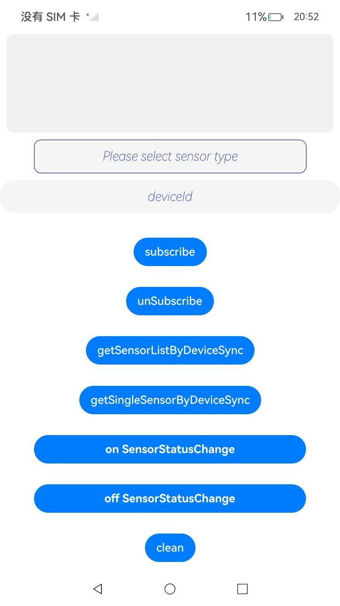

# sensor js接口hap

### 介绍

本样例展示了sensor模块js接口的使用样例，包含订阅和去订阅传感器、订阅和去订阅外设热插拔事件、获取设备及扩展设备的上传感器信息等接口功能


本示例用到了权限获取相关的的操作[@ohos.abilityAccessCtrl](https://gitee.com/openharmony/docs/blob/master/zh-cn/application-dev/reference/apis-ability-kit/js-apis-abilityAccessCtrl.md#abilityaccessctrlcreateatmanager)
错误信息相关[@ohos.base](https://gitee.com/openharmony/docs/blob/master/zh-cn/application-dev/reference/apis-basic-services-kit/js-apis-base.md)

传感器相关接口操作[@kit.SensorServiceKit](https://gitee.com/openharmony/docs/blob/master/zh-cn/application-dev/reference/apis-sensor-service-kit/js-apis-sensor.md)


### 效果预览
| 主页                                           |
|----------------------------------------------|
|  |

依次介绍sample具有什么功能，怎样使用这些功能，以及使用后会达到什么效果；示例如下：

1. 在主界面，可以点击Please select sensor type文本框选择此设备上的传感器；
2. 在主界面，可以点击deviceId选择想要使用的设备，目前手机上暂时不支持设置；
3. 在主界面，点击subscribe按钮可以订阅Please select sensor type文本框中选择的传感器后，界面下方会显示回调数据；
4. 在主界面，点击unsubscribe按钮可以去订阅选中的传感器，去订阅后不会再收到回调数据；
5. 在主界面，点击getSensorListByDeviceSync按钮获取本设备及扩展设备上的传感器列表，并在下方显示（手机上只能获取本机上的传感器信息）；
6. 在主界面，点击getSingleSensorByDeviceSync按钮可以获取对应设备上对应的传感器信息，（手机只能获取本机上的传感器信息）；
7. 在主界面，点击on SensorStatusChange按钮订阅本设备上扩展设备的热插拔事件，（目前手机上暂时不支持此功能）；
8. 在主界面，点击off SensorStatusChange按钮去订阅本设备上扩展设备的热插拔事件，（目前手机上暂时不支持此功能）；
9. 在主界面，点击subscribeUseSensorInfoParam按钮可以订阅Please select sensor type文本框中选择的传感器后，界面下方会显示回调数据；
10. 在主界面，点击onceSubscribe按钮可以订阅Please select sensor type文本框中选择的传感器，界面下方会显示回调数据一次；
11. 在主界面，点击unSubscribeUseSensorInfoParam按钮去订阅选中的传感器，去订阅后不会再收到回调数据；
12. 在主界面，点击getGeomagneticInfo按钮可以获取某时刻地球上特定位置的地磁场信息；
13. 在主界面，点击getDeviceAltitude按钮可以根据气压值获取海拔高度；
14. 在主界面，点击getInclination按钮可以根据倾斜矩阵计算地磁倾角；
15. 在主界面，点击getAngleVariation按钮可以计算两个旋转矩阵之间的角度变化；
16. 在主界面，点击getRotationMatrix按钮可以根据旋转矢量获取旋转矩阵；
17. 在主界面，点击transformRotationMatrix按钮可以根据指定坐标系映射旋转矩阵；
18. 在主界面，点击getQuaternion按钮可以根据旋转向量计算归一化四元数；
19. 在主界面，点击getOrientation按钮可以根据旋转矩阵计算设备方向；
20. 在主界面，点击getRotationMatrixTwoParam按钮可以根据重力矢量和地磁矢量计算旋转矩阵；
21. 在主界面，点击getSingleSensor按钮可以获取指定传感器类型的属性信息。

   

工程目录

```
entry
|   |--- src/main/
|        |--- module.json5              // sensor模块配置hap类型："type": "feature"
|             |---ets/pages      
|                    |---index.ets      // sensor组件接口实现页面
```


### 具体实现

本样例展示了sensor模块js接口的使用样例，包含订阅和去订阅传感器、订阅和去订阅外设热插拔事件、获取设备及扩展设备的上传感器信息等接口的功能，该功能全部接口已封装在index，源码参考：[index.ets](./entry/src/main/ets/pages/index.ets)

* Please select sensor type文本框：使用sensor.getSensorList接口获取本设备上的所有传感器信息列表；
* subscribe订阅传感器：先使用窗口框选择想要订阅的传感器，接着使用sensor.on接口对已经选择的传感器进行订阅；
* unsubscribe去订阅传感器：先使用窗口框选择想要去订阅的传感器，接着使用sensor.off接口对已经选择的传感器进行去订阅，未订阅的传感器会去订阅失败；
* getSensorListByDeviceSync获取本设备及扩展设备上传感器列表，使用sensor.getSensorListByDeviceSync接口即可获取本设备及扩展设备上传感器列表。手机暂时只能获取本机传感器信息列表；
* getSingleSensorByDeviceSync获取指定设备上传感器信息，使用sensor.getSingleSensorByDeviceSync接口获取指定设备上指定传感器信息，目前手机上只能获取本机上传感器信息；
* 订阅去订阅外设热插拔事件，通过sensor.on和sensor.off来实现对扩设备热插拔事件订阅，目前手机不支持此功能。
* subscribe订阅传感器一次：先使用窗口框选择想要订阅的传感器，接着使用sensor.once接口对已经选择的传感器进行订阅；
* 获取某时刻地球上特定位置的地磁场信息：通过sensor.getGeomagneticInfo接口来实现获取某时刻地球上特定位置的地磁场信息；
* 根据气压值获取海拔高度：通过sensor.getDeviceAltitude接口来实现根据气压值获取海拔高度；
* 根据倾斜矩阵计算地磁倾角：通过sensor.getInclination接口来实现根据倾斜矩阵计算地磁倾角；
* 计算两个旋转矩阵之间的角度变化：通过sensor.getAngleVariation接口来实现计算两个旋转矩阵之间的角度变化；
* 根据旋转矢量获取旋转矩阵：通过sensor.getRotationMatrix接口来实现根据旋转矢量获取旋转矩阵；
* 根据指定坐标系映射旋转矩阵：通过sensor.transformRotationMatrix接口来实现根据指定坐标系映射旋转矩阵；
* 根据旋转向量计算归一化四元数：通过sensor.getQuaternion接口来实现根据旋转向量计算归一化四元数；
* 根据旋转矩阵计算设备方向：通过sensor.getOrientation接口来实现根据旋转矩阵计算设备方向；
* 根据重力矢量和地磁矢量计算旋转矩阵：通过sensor.getRotationMatrix接口来实现根据重力矢量和地磁矢量计算旋转矩阵；
* 获取指定传感器类型的属性信息：通过sensor.getSingleSensor接口来实现获取指定传感器类型的属性信息；

### 相关权限

附上使用到的权限和链接，示例如下：

[ohos.permission.ACCELEROMETER](https://gitee.com/openharmony/docs/blob/master/zh-cn/application-dev/security/AccessToken/permissions-for-all.md#ohospermissionaccelerometer)

### 依赖

不涉及。

### 约束与限制

1.本示例仅支持标准系统上运行，支持设备：RK3568;

2.本示例为Stage模型，仅支持API20版本SDK，SDK版本号(API Version 20 Beta),镜像版本号(6.0Beta);

3.本示例需要使用DevEco Studio 5.0.4 Release (Build Version: 5.0.11.100, built on March 28, 2025)及以上版本才可编译运行。

### 下载

如需单独下载本工程，执行如下命令：
```

git init  
git config core.sparsecheckout true  
echo code/BasicFeature/DeviceManagement/Sensor/SensorJsSamples/ > .git/info/sparse-checkout  
git remote add origin https://gitcode.com/openharmony/applications_app_samples.git  
git pull origin master

```