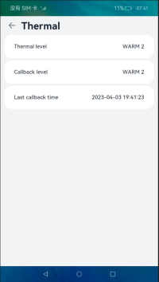
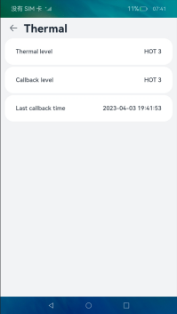

# 热管理

### 介绍

本示例主要展示了温控相关的功能，使用[@ohos.thermal.d.ts](https://gitee.com/openharmony/docs/blob/master/zh-cn/application-dev/reference/apis/js-apis-thermal.md)提供热管理相关的接口，查询热档位以及注册温控等级回调。

### 效果预览

|主页|列表
|--------------------------------|--------------------------------|
|||

使用说明

1. 点击进入hap查看温控当前信息状态。

### 工程目录
```
entry/src/main/ets/
|---entryability
|   |---ThermalAbility.ts       // 主窗口
|---thermal
|   |---data
|       |---ThermalModel.ets    // 温控接口调用模块
|       |---ListModel.ets       // 页面列表信息模块
|---pages
|   |---ThermalPage.ets         // 温控信息展示页面
```

### 具体实现
- 温控热档位查询及注册回调的接口功能封装在[ThermalModel.ets](./entry/src/main/ets/thermal/data/ThermalModel.ets)中。
  - 使用[@ohos.thermal.d.ts](https://gitee.com/openharmony/docs/blob/master/zh-cn/application-dev/reference/apis/js-apis-thermal.md)提供的热管理相关接口注册温控回调以及热档位查询，具体接口请参考API文档。
- 页面列表信息模块主要为页面展示提供需要展示的数据。
- 温控信息展示页面主要是展示具体的温控信息。

### 相关权限
无权限。

### 依赖
无依赖。

### 约束与限制
1. 本示例仅支持标准系统上运行，支持设备：RK3568。
2. 本示例仅支持API9版本SDK，版本号：3.2.10.6。
3. 本示例需要使用DevEco Studio 3.1 Beta1 (Build Version: 3.1.0.200)才可编译运行。

### 下载
如需单独下载本工程，执行如下命令：
```
git init
git config core.sparsecheckout true
echo code/BasicFeature/DeviceManagement/Thermal/ > .git/info/sparse-checkout
git remote add origin https://gitee.com/openharmony/applications_app_samples.git
git pull origin master
```
