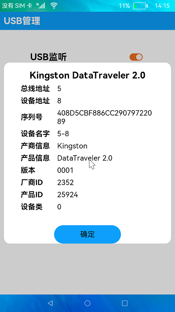

# USB管理

### 介绍

本示例使用[@ohos.usbV9](https://gitee.com/openharmony/docs/blob/master/zh-cn/application-dev/reference/apis/js-apis-usb.md)、[@ohos.commonEventManager](https://gitee.com/openharmony/docs/blob/master/zh-cn/application-dev/reference/apis/js-apis-commonEventManager.md)接口展示了USB设备管理的使用，包括USB设备插拔状态监听和USB设备信息显示。

### 效果预览

|设备列表|设备详情|
|---------|----------|
|||

使用说明：

1. 打开**USB监听**开关，界面弹出"开始监听..."的提示（USB监听开关仅监听设备是否插入并弹窗进行提示）;
2. 插入设备，界面会有“USB已插入”的提示,设备列表会显示已插入设备的名称。如果列表没有及时更新，则可以下拉列表手动刷新;
3. 点击设备，弹框会显示该USB设备的具体信息，点击**确定**按钮返回主页面;
4. 将USB设备拔出，界面会有“已移除设备”的提示，设备列表会移除该名称的设备，如果列表没有及时更新，则可以下拉列表手动刷新。

### 工程目录

```
entry/src/main/ets/
|---common
|   |---DeviceCustomDialog.ets                    // 设备详情弹窗
|   |---DeviceList.ets                            // 设备列表
|---model
|   |---DeviceAttribute.ts                        // 设备详情数据结构
|   |---Logger.ts                                 // 日志工具
|---pages
|   |---Index.ets                                 // 首页
|---utils
|   |---CheckEmptyUtils.ts                        // 工具，判断设备列表是否为空 
```

### 具体实现
+ USB监听功能和设备信息获取功能在Index中实现，源码参考[Index.ets](entry/src/main/ets/pages/Index.ets):
    + 监听USB设备挂载和卸载：使用commonEventManager.createSubscriber创建订阅者，用来监听USB挂载和卸载事件，commonEventManager.unsubscribe取消订阅者；
    + 订阅者信息枚举值：[support类型](https://gitee.com/openharmony/docs/blob/master/zh-cn/application-dev/reference/apis/commonEventManager-definitions.md#common_event_usb_device_detached)，COMMON_EVENT_USB_DEVICE_DETACHED：卸载USB公共事件的动作，COMMON_EVENT_USB_DEVICE_ATTACHED：挂载USB公共事件的动作；
    + 获取USB设备列表：使用usbV9.getDevices接口获取接入主设备的USB设备列表。

### 相关权限

不涉及。

### 依赖

不涉及。

### 约束与限制

1. 本示例仅支持在标准系统上运行;

2. 本示例已适配API10版本SDK，版本号:4.0.5.1;

3. 本示例需要使用DevEco Studio 3.1 Canary1 (Build Version: 3.1.0.100)及以上版本才可编译运行。

### 下载

如需单独下载本工程，执行如下命令：
```
git init
git config core.sparsecheckout true
echo code/BasicFeature/DeviceManagement/USBManager/ > .git/info/sparse-checkout
git remote add origin https://gitee.com/openharmony/applications_app_samples.git
git pull origin master
```

