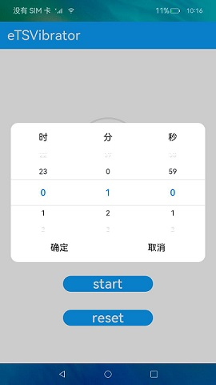
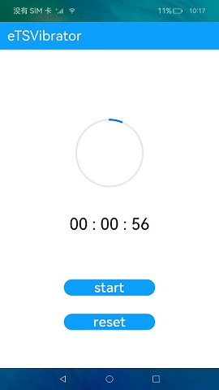

# 振动

### 介绍

本示例模拟倒计时场景，通过[@ohos.vibrator](https://gitee.com/openharmony/docs/blob/master/zh-cn/application-dev/reference/apis/js-apis-vibrator.md) 等接口来实现振动。

### 效果预览

|设置倒计时间|振动倒计时|
|--------------------------------|--------------------------------|
||

使用说明

1.点击倒计时文本，弹出时间选择框，选择任意时间，点击**确认**，倒计时文本显示选择的时间。

2.点击**start**，开始倒计时，圆形进度条和文本开始变化；倒计时结束，开始振动，进度条恢复初始状态并且弹出振动提示框，按照描述进行选择。

3.点击**reset**，可以结束倒计时并使文本和进度条恢复初始状态。

### 工程目录
```
entry/src/main/ets/
|---MainAbility
|   |---common
|   |   |---TextDialog.ts                   // 弹窗组件
|   |   |---TextTimeComponent.ts            // 内容模块
|   |   |---TimerPicker.ts                  // TimerPicker模块
|   |   |---TitleBar.ts                     // 标题组件
|   |---mode
|   |   |---Logger.ts                       // 日志工具
|   |   |---TimerData.ts                    // 时间数据
|   |---page
|   |   |---Index.ets                       // 首页

```
### 具体实现

* 本示例实现振动的方法主要封装在TextTimerComponent中，源码参考: [TextTimerComponent](entry/src/main/ets/MainAbility/common/TextTimerComponent.ets) 。
    * 设置倒计时间：Timepicker文件中通过TextPicker组件来设置倒计的时间，并将设定的时间数据双向绑定到TextTimerComponent组件当中。
    * 启动倒计时：点击start按钮通过setInterval执行倒计时，每隔一段时间Process组件的进度值会被此代码this.progressValue += TOTAL / this.duration进行处理同步刷新。
    * 触发振动：当时间为0的时候，则执行vibrator.vibrate()方法去触发振动效果。
    * 初始化时间：点击reset按钮会将Process组件的value以及时间进行初始化，并清除定时器。
  
### 相关权限

[ohos.permission.VIBRATE](https://gitee.com/openharmony/docs/blob/master/zh-cn/application-dev/security/permission-list.md#ohospermissionvibrate)

### 依赖

不涉及。

### 约束与限制

1.本示例仅支持标准系统上运行。

2.本示例需要使用有振动器的设备测试。

3.本示例已适配API version 9版本SDK，版本号：3.2.11.9。

4.本示例需要使用DevEco Studio 3.1 Beta2 (Build Version: 3.1.0.400 构建 2023年4月7日)及以上版本才可编译运行。

### 下载

如需单独下载本工程，执行如下命令：
```
git init
git config core.sparsecheckout true
echo code/BasicFeature/DeviceManagement/Vibrator/ > .git/info/sparse-checkout
git remote add origin https://gitee.com/openharmony/applications_app_samples.git
git pull origin master

```

