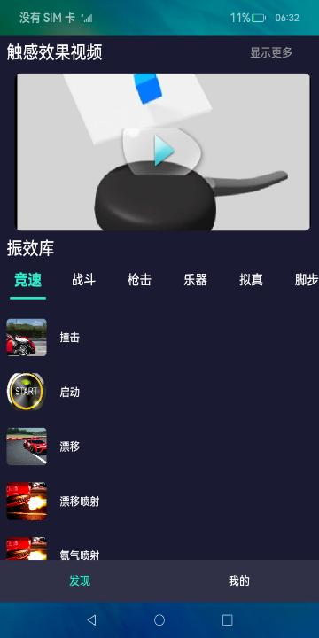
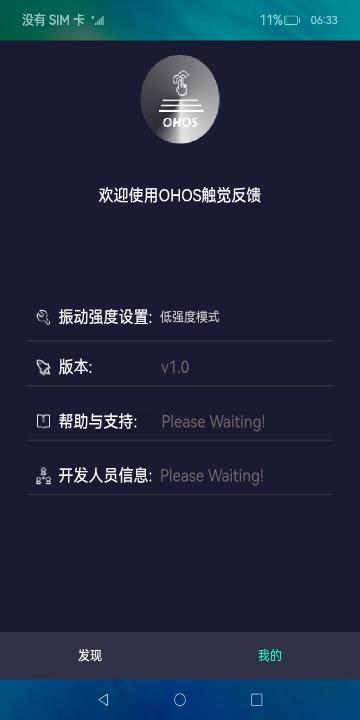
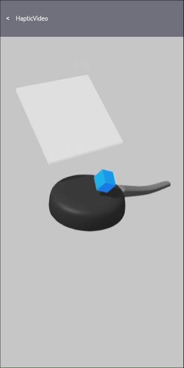

# 自定义振动

### 介绍

本示例使用[Vibrator模块](https://gitee.com/openharmony/docs/blob/master/zh-cn/application-dev/reference/apis/js-apis-vibrator.md)展示了振感定制化的基本功能，包括振感与音效、视频协同振动等。

### 效果预览
| 首页                                     | 我的                                    | 视频                                       |
|----------------------------------------|---------------------------------------|------------------------------------------|
|  |  |  |

使用说明：
1. 在"我的"界面中包含开发信息及基本设置，点击振动强度设置，可选择振动强度等级，本步骤可选，默认为低强度模式；
2. 在"发现"界面，振效库中罗列了不同体验场景，可点击各条目享受音效与振动的协同感受；
3. 在"发现"界面，触感效果视频可体验视频与振动的协同，点击视频预览图片进入全屏播放界面；
4. "显示更多"中罗列了当前的振感视频列表。

### 目录结构
```
entry/src/main/ets/
|---component
|   |---Common.ets                            // 振效库场景公共组件
|   |---Battle.ets                            // 振效库"战斗"场景
|   |---Environment.ets                       // 振效库"环境"场景
|   |---Exercise.ets                          // 振效库"运动"场景
|   |---Footstep.ets                          // 振效库"脚步"场景
|   |---Instrument.ets                        // 振效库"乐器"场景
|   |---Interaction.ets                       // 振效库"互动"场景
|   |---Racing.ets                            // 振效库"竞速"场景
|   |---Realistic.ets                         // 振效库"拟真"场景
|   |---Shooting.ets                          // 振效库"射击"场景
|   |---VideoPreview.ets                      // 视频频预览界面
|---module
|   |---AudioPlayer.ets                       // 音频播放模块
|   |---DisplayModule.ets                     // "发现"界面，主界面
|   |---ImageData.ets                         // 资源数据结构
|   |---Logger.ets                            // 封装的日志
|   |---MyInfoModule.ets                      // "我的"界面
|   |---TabBar.ets                            // 振效库场景类别滑动栏
|   |---Util.ets                              // 工具函数
|   |---VideoListModule.ets                   // 视频列表模块
|   |---VideoPlayModule.ets                   // 视频播放模块
|---pages                                  
|   |---Index.ets                             // 首页
```
### 具体实现
+ 振动强度设置：可以选择振动的强度等级，源码参考[MyInfoMoModule.ets](entry/src/main/ets/module/MyInfoModule.ets)；
+ 振效库：点击振效库中各项，会调用媒体库AVPlayer播放音效，并同时调用vibrator模块startVibration接口启动振动，源码参考[DisplayModule.ets](entry/src/main/ets/module/DisplayModule.ets)以及component目录下振效库场景，比如[Battle.ets](entry/src/main/ets/component/Battle.ets)等;
+ 振感视频：使用Video控件全屏播放视频，在开始播放同时调用vibrator模块startVibration接口启动振动，源码参考[VideoPlayModule.ets](entry/src/main/ets//module/VideoPlayModule.ets)；
+ 自定义振动：使用[Vibrator模块](https://gitee.com/openharmony/docs/blob/master/zh-cn/application-dev/reference/apis/js-apis-vibrator.md)的startVibration方法播放应用内置的振动资源文件，代码参考[Util.ets](entry/src/main/ets/module/Util.ets);

### 相关权限

[ohos.permission.VIBRATE](https://gitee.com/openharmony/docs/blob/master/zh-cn/application-dev/security/permission-list.md#ohospermissionvibrate)

### 依赖
不涉及

### 约束与限制

1.本示例仅可在支持自定义振动的标准系统上运行。

2.本示例为Stage模型，仅适配API10版本SDK，SDK版本号(API Version 10 Release),镜像版本号(4.0 Release)

3.本示例需要使用DevEco Studio 版本号(4.0 Release)及以上版本才可编译运行。

### 下载
如需单独下载本工程，执行如下命令：
```
git init
git config core.sparsecheckout true
echo code/BasicFeature/DeviceManagement/Vibrator/CustomHaptic/ > .git/info/sparse-checkout
git remote add origin https://gitee.com/openharmony/applications_app_samples.git
git pull origin master
```
