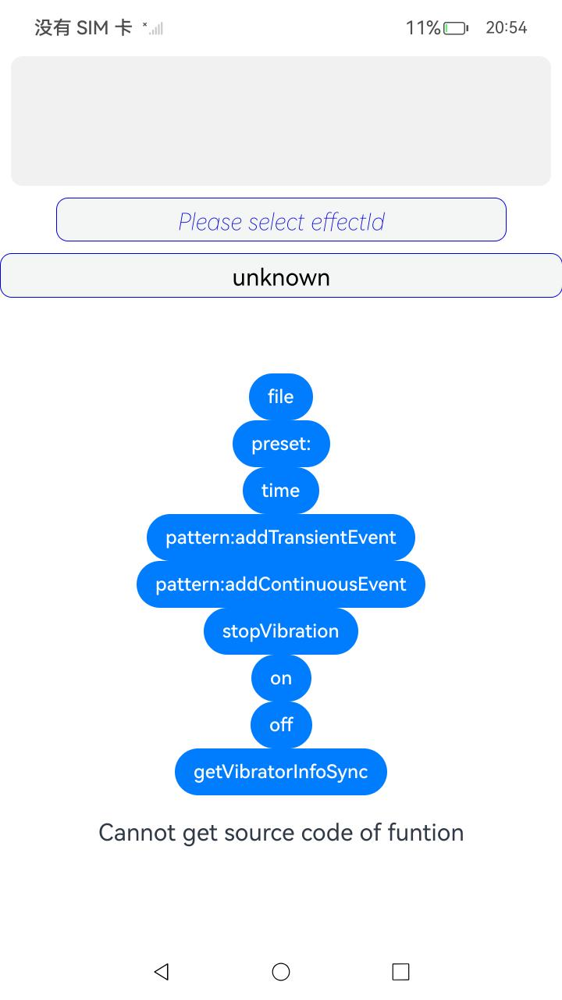

# vibrator js接口hap

### 介绍

本样例展示了vibrator模块js接口的使用样例，包含time、preset、file、pattern四种形式的振动,订阅去订阅外设热插拔事件、获取设备上马达信息等接口功能


本示例用到了打开读取文件的操作[@kit.LocalizationKit](https://gitee.com/openharmony/docs/blob/master/zh-cn/application-dev/reference/apis-localization-kit/js-apis-resource-manager.md)
错误信息[@kit.BasicServicesKit](https://gitee.com/openharmony/docs/blob/master/zh-cn/application-dev/reference/apis-basic-services-kit/js-apis-base.md)

振动相关功能[@kit.SensorServiceKit](https://gitee.com/openharmony/docs/blob/master/zh-cn/application-dev/reference/apis-sensor-service-kit/js-apis-vibrator.md)


### 效果预览
| 主页                                             |
|------------------------------------------------|
|  |

依次介绍sample具有什么功能，怎样使用这些功能，以及使用后会达到什么效果；示例如下：

1. 在主界面，可以点击Please select effectId文本框选择使用的effectId，effectId作为preset形式振动的固定形式参数；
2. 在主界面，可以点击Please select usage文本框选择使用的usage信息，不选择会有默认值；
3. 可以选设置deviceid，手机上多设备功能底层暂时不支持，只能选择本机的deviceid：-1
4. 在主界面，点击file按钮可以下发工程中附带json文件的振动效果；
5. 在主界面，点击preset按钮可以下发预选effectId的振动效果；
6. 在主界面，点击time按钮可以下发默认的时长的振动效果；
7. 在主界面，点击pattern:addContinuousEvent按钮可以下发自定义振动事件长事件振动效果；
8. 在主界面，点击pattern:addTransientEvent按钮可以下发自定义振动事件短事件振动效果；
9. 在主界面，点击stopVibration按钮可以实现停止振动的效果；
10. 在主界面，点击on按钮和off按钮可以下发对设备热插拔事件的订阅和去订阅，此功能在手机上暂未实现；
11. 在主界面，点击getVibratorInfoSync按钮可以实现对设备上马达器件列表信息的获取，并在下方显示；

工程目录

```
entry
|   |--- src/main/
|        |--- module.json5              // vibrator模块配置hap类型："type": "feature"
|             |---ets/pages      
|                    |---index.ets      // vibrato组件接口实现页面
```


### 具体实现

time、preset、file、pattern四种形式的振动，订阅去订阅外设热插拔事件、获取设备上马达信息等的功能接口封装在index，源码参考：[index.ets](./entry/src/main/ets/pages/index.ets)

* file文件形式振动：使用Vibrator.startVibration接口的file形式来实现文件形式振动的下发；
* preset文件形式振动：先使用窗口框选择Vibrator模块提供的effectId，然后使用Vibrator.startVibration接口使用preset形式来实现预置效果串形式振动的下发；
* time文件形式振动：使用Vibrator.startVibration接口的time形式来下发指定时间形式的振动；
* pattern文件形式振动：使用Vibrator.startVibration接口的pattern形式来实现ContinuousEvent和TransientEvent事件形式振动的下发；
* 停止振动：使用Vibrator.stopVibration来停止振动；
* 订阅去订阅外设热插拔事件，通过Vibrator.on和Vibrator.off来实现对扩设备热插拔事件订阅；
* 获取设备上马达信息列表：通过Vibrator.getVibratorInfoSync接口来实现对本设备及扩展设备上马达列表的获取；

### 相关权限

附上使用到的权限和链接，示例如下：

[ohos.permission.VIBRATE](https://gitee.com/openharmony/docs/blob/master/zh-cn/application-dev/security/AccessToken/permissions-for-all.md#ohospermissionvibrate)

### 依赖

不涉及。

### 约束与限制

1.本示例仅支持标准系统上运行，支持设备：RK3568;

2.本示例为Stage模型，仅支持API20版本SDK，SDK版本号(API Version 20 Beta)，镜像版本号(6.0Beta);

3.本示例需要使用DevEco Studio 5.0.4 Release (Build Version: 5.0.11.100, built on March 28, 2025)及以上版本才可编译运行。

### 下载

如需单独下载本工程，执行如下命令：
```

git init  
git config core.sparsecheckout true  
echo code/BasicFeature/DeviceManagement/Vibrator/VibratorJsSamples/ > .git/info/sparse-checkout  
git remote add origin https://gitee.com/openharmony/applications_app_samples.git  
git pull origin master

```