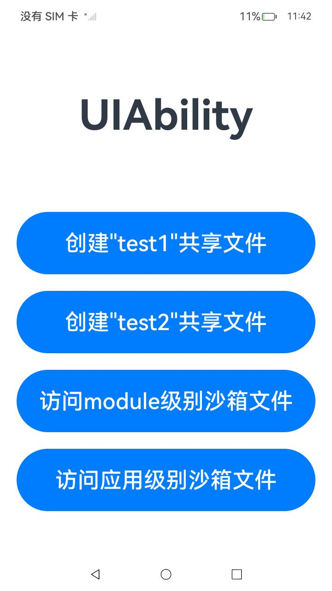
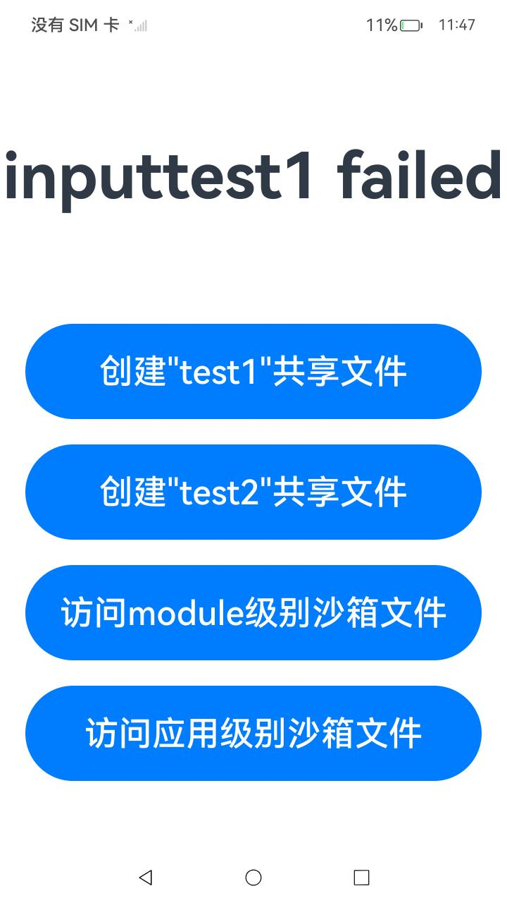
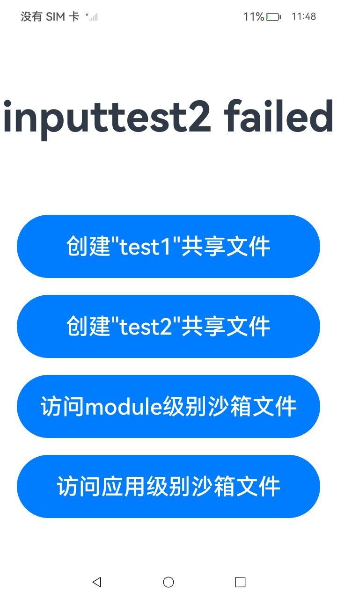

# extension示例

## 介绍

本示例实现了一个inputMethod独立extension，并验证独立extension与UIExtension之间的文件共享，实现了以下几点功能：

1.实现一个inputMethod独立extension：[InputMethodService.ts](./entry/src/main/ets/inputmethodextability1/InputMethodService.ts)。

2.UIExtension与inputMethod独立extension实现文件共享。

## 效果预览

| 首页                                   | 访问模块级别独立沙箱文件                           | 访问应用级别独立沙箱文件                          |
|--------------------------------------|----------------------------------------|---------------------------------------|
|  |  |  |

## 使用说明

1. 启动一个主应用 "hdc shell aa start -a EntryAbility -b
   com.example.contexttest"。点击前两个按钮，uiAbility分别以dataGroupId为"
   test1"、"test2"产生的共享目录下创建共享文件,创建成功后会有创建成功弹框提示，创建失败会有创建失败弹框提示；

2. 启动一个inputMethod独立extension应用： "hdc shell aa start -a
   inputMethod -b com.example.contexttest"，inputMethod可在dataGroupId为"test1"
   产生的共享目录下修改共享文件，修改成功查看打印相关日志：1:the content of file:1:inputMethod Try to write str.，修改失败查看相关打印日志：1：fs.openSync err: {"code":13900002};在dataGroupId为"
   test2"产生的共享目录下修改共享文件,修改成功查看打印相关日志：2:the content of file:2:inputMethod Try to write str.，修改失败查看相关打印日志：2：fs.openSync err: {"code":13900002}； 

3. 点击第三个按钮，UIAbility访问inputMethod module级别的独立extension的沙箱文件，访问成功会有访问成功弹框提示;访问失败会有访问失败弹框提示且页面的message更新为moduleFailed；预期结果访问失败，证明inputMethod是独立沙箱；

4. 点击第四个按钮，UIAbility访问inputMethod应用级别的独立extension的沙箱文件，访问成功会有访问成功弹框提示;访问失败会有访问失败弹框提示且页面的message更新为appFailed；预期结果访问失败，证明inputMethod是独立沙箱；

## 工程目录

```
entry/src/main/ets/
|---entryability
|---inputMethodextability
    |---pages
        |---inputMethodService.ts            //input独立extension
|---pages
|   |---Index.ets                            // 首页
entry/src/ohosTest/ets/
|---test
|   |---Ability.test.ets                     // xts用例    

```

## 具体实现

* 示例分为两个方面

* inputMethod独立extension与UIExtension实现共享目录下文件共享：
    * 使用getGroupDir接口，创建共享目录下的共享文件，dataGroupId相同的共享目录下的共享文件可以实现文件共享，反之不能实现共享。
    * 源码参考：[Index.ets](./entry/src/main/ets/pages/Index.ets)，[InputMethodService.ts](./entry/src/main/ets/inputmethodextability1/InputMethodService.ts)
    * 接口参考：[context.d](https://docs.openharmony.cn/pages/v4.1/zh-cn/application-dev/reference/apis-ability-kit/js-apis-inner-application-context.md)

* inputMethod独立extension访问其独立沙箱文件且能正常操作文件，另外的应用不能访问其沙箱文件：
    * 使用openSync、writeSync、closeSync等接口实现对沙箱文件的创建、读、写等操作。
    * 源码参考：[Index.ets](./entry/src/main/ets/pages/Index.ets)，[InputMethodService.ts](./entry/src/main/ets/inputmethodextability1/InputMethodService.ts)
    * 接口参考：[@ohos.file.fs.d](https://docs.openharmony.cn/pages/v4.1/zh-cn/application-dev/reference/apis-core-file-kit/js-apis-fileio.md)

## 相关权限

不涉及。

## 依赖

不涉及。

## 约束与限制

1.本示例仅支持标准系统上运行，支持设备：RK3568。

2.本示例为Stage模型，支持API12版本SDK，SDK版本号(API Version 12 Release),镜像版本号(5.0.0.20)。

3.本示例需要使用DevEco Studio 版本号(4.1.0.400)及以上版本才可编译运行。

4.本示例需要使用Full SDK编译。使用Full SDK时需要手动从镜像站点获取，并在DevEco
Studio中替换，具体操作可参考[替换指南](https://docs.openharmony.cn/pages/v4.1/zh-cn/application-dev/faqs/full-sdk-switch-guide.md)。

5.本实例需要用到相同dataGroupId实现共享文件，所以需要在签名证书UnsgnedReleasedProfileTemplate.json中添加配置如"
data-group-ids":["test1","test2","test3"]，同时需要在module.json5中的extensionAbilities中添加配置如："
dataGroupIds": ["test1"]
，只有当前extension和应用配置相同dataGroupId，才可以和应用共享这一个dataGroupId生成的目录。具体操作指南可参考[HarmonyAppProvision配置文件说明](https://gitee.com/openharmony/docs/blob/master/zh-cn/application-dev/security/app-provision-structure.md#bundle-info%E5%AF%B9%E8%B1%A1%E5%86%85%E9%83%A8%E7%BB%93%E6%9E%84)。

## 下载

如需单独下载本工程，执行如下命令：

```
git init
git config core.sparsecheckout true
echo code/BasicFeature/Extension/Contexttest/ > .git/info/sparse-checkout
git remote add origin https://gitee.com/openharmony/applications_app_samples.git
git pull origin master
```
