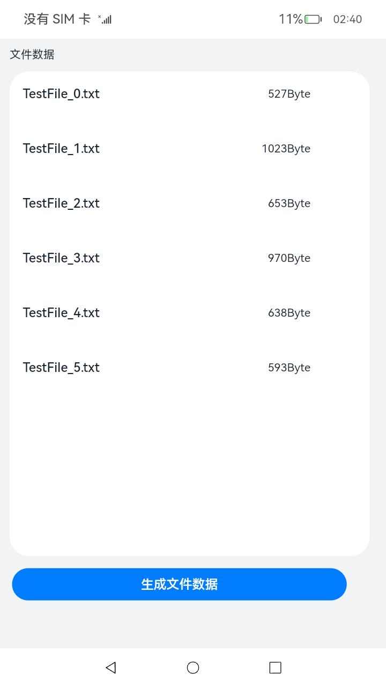

# 应用接入数据备份恢复

### 介绍

应用接入数据备份恢复需要通过BackupExtensionAbility实现。

BackupExtensionAbility，是[Stage模型](https://gitee.com/openharmony/docs/blob/master/zh-cn/application-dev/application-models/stage-model-development-overview.md)中扩展组件[ExtensionAbility](https://gitee.com/openharmony/docs/blob/master/zh-cn/application-dev/application-models/extensionability-overview.md)的派生类。开发者可以通过修改配置文件定制备份恢复框架的行为，包括是否允许备份恢复，备份哪些文件等。

本sample主要给备份流程提供应用，用于生成数据和显示数据。

### 效果预览

|初始界面|生成文件界面|恢复备份后显示|
|--------------------------------|--------------------------------|--------------------------------|
||||

使用说明：

1. 点击按钮“生成文件数据”，应用会随机生成2个到10个txt文件，大小在1Byte到1024Byte之间，用于校验备份和恢复的数据为同一数据。
2. 本应用仅适用于生成和显示数据，具体的备份和恢复的操作目前需要使用hdc shell命令操作。
3. 具体操作方面，进入应用点击按钮生成文件数据后，进入hdc shell，使用backup_tool backup --isLocal=true --bundle com.sample.backupextension  --pathCapFile /data/backup/tmp命令进行备份。然后可以把应用删掉，重新安装应用后进入hdc shell，使用backup_tool restore --bundle com.sample.backupextension --pathCapFile /data/backup/tmp，提示成功后，重新打开应用可以看到备份的文件显示在列表里。

### 工程目录
```
entry/src/main/ets/
|---Application
|---Common
|   |---Logger.ts                      // 日志工具
|---MainAbility
|   |---EntryAbility.ts                // Ability类
|---fileFs
|   |---createFile.ts                  // 创建文件
|---pages
|   |---Index.ets                      // 首页
```
### 具体实现

1. 在应用配置文件`module.json5`中注册`extensionAbilities`相关配置

新增`"extensionAbilities"`字段，其中注册类型`"type"`设置为`"backup"`，元数据信息["metadata"](https://gitee.com/openharmony/docs/blob/master/zh-cn/application-dev/reference/apis/js-apis-bundleManager-metadata.md)新增一个`"name"`为`"ohos.extension.backup"`的条目。

BackupExtensionAbility配置文件示例：

```
{
    "extensionAbilities": [
        {
            "description": "$string:ServiceExtAbility",
            "icon": "$media:icon",
            "name": "BackupExtensionAbility",
            "type": "backup",
            "visible": true,
            "metadata": [
                {
                    "name": "ohos.extension.backup",
                    "resource": "$profile:backup_config"
                }
            ],
            "srcEntrance": "",
        }      
    ]
}
```

2. 新增元数据资源配置文件

在元数据资源配置文件中，定义备份恢复时需要传输的文件。元数据资源配置文件名称需要与`module.json5`中 `"metadata.resource"`名称保持一致，其保存位置在Profile文件夹下。

元数据资源配置文件示例：

```
{
  "allowToBackupRestore": true,
    "includes": [
      "data/storage/el2/database/",
      "data/storage/el2/base/files/",
      "data/storage/el2/base/preferences/",
      "data/storage/el2/base/haps/*/database/",
      "data/storage/el2/base/haps/*/base/files/",
      "data/storage/el2/base/haps/*/files/",
      "data/storage/el2/base/haps/entry/files/TextDir/",
      "data/storage/el2/base/haps/*/base/preferences/",
      "/data/storage/el2/base/files/users/*/*.json"
    ],
    "excludes": [
      "/data/storage/el2/base/files/users/*/hidden.json"
    ]
}
```

其中includes里面的文件夹是用户需要备份数据的路径，excludes为用户不想备份数据的路径。

3. 使用应用生成数据：

点击界面的“生成文件数据”按钮，会使用以下代码生成文件，并在onPageShow中获取文件名列表和文件大小列表，然后显示在界面上。

```
async  createTestFiles() {
    try {
      // let fileAccessHelper = fileAccess.createFileAccessHelper(globalThis.context);
      let num = Math.floor(Math.random() * 10) + 1;
      if (!fs.accessSync(this.baseDir)) {
        fs.mkdirSync(this.baseDir);
      }
      let dpath = this.baseDir;
      Logger.info(this.TAG, 'globalThis.filesDir = ' + dpath);
      Logger.info(this.TAG, 'num is  = ' + num);
      for (let i = 0; i < num; i++) {
        let myFile = dpath + `/TestFile_${i}.txt`;
        Logger.info(this.TAG, 'readyFile myFile = ' + myFile);
        let file = fs.openSync(myFile, fs.OpenMode.CREATE | fs.OpenMode.READ_WRITE);
        fs.writeSync(file.fd, new ArrayBuffer(1024 * Math.random()));
        fs.closeSync(file);
      }
    } catch (e) {
      Logger.error(this.TAG, 'Failed to prepare media files, error:' + e.message + e.code);
    }
  }
```

4. 备份与恢复操作：

由于目前备份与恢复尚未提供具体的应用接口，所以备份与功能仅提供命令行方式进行检验：

```
应用备份
backup_tool backup --isLocal=true --bundle com.sample.backupextension  --pathCapFile /data/backup/tmp
备份成功提示：
BundleStarted errCode = 0, BundleName = com.example.backupextension
FileReady owner = com.example.backupextension, fileName = manage.json, sn = 0, fd = 9
FileReady owner = com.example.backupextension, fileName = 1.tar, sn = 0, fd = 9
BundleFinished errCode = 0, BundleName = com.example.backupextension
backup successful

应用恢复
backup_tool restore --bundle com.sample.backupextension --pathCapFile /data/backup/tmp
恢复成功提示：
BundleStarted errCode = 0, BundleName = com.example.backupextension
FileReady owner = com.example.backupextension, fileName = 1.tar, sn = 0, fd = 8
FileReady owner = com.example.backupextension, fileName = manage.json, sn = 0, fd = 8
BundleFinished errCode = 0, BundleName = com.example.backupextension
Restore successful
```

backup详细说明可以使用backup -help查看。


### 相关权限

[ohos.permission.GET_BUNDLE_INFO_PRIVILEGED](https://gitee.com/openharmony/docs/blob/master/zh-cn/application-dev/security/permission-list.md#ohospermissionget_bundle_info_privileged)


### 依赖

不涉及。

### 约束与限制

1.本示例仅支持标准系统上运行。

2.本示例已适配API version 10版本SDK，需要手动替换Full SDK才能编译通过，具体操作可参考[替换指南](https://docs.openharmony.cn/pages/v3.2/zh-cn/application-dev/quick-start/full-sdk-switch-guide.md/) 。

3.本示例需要使用DevEco Studio 3.1.1 Release (Build Version: 3.1.0.501, built on June 20, 2023)及以上版本才可编译运行。

4.本示例所配置的权限ohos.permission.GET_BUNDLE_INFO_PRIVILEGED为system_basic级别(相关权限级别可通过[权限定义列表](https://gitee.com/openharmony/docs/blob/master/zh-cn/application-dev/security/permission-list.md) 查看)，需要手动配置对应级别的权限签名(具体操作可查看[自动化签名方案](https://docs.openharmony.cn/pages/v3.2/zh-cn/application-dev/security/hapsigntool-overview.md/)) 。


### 下载

如需单独下载本工程，执行如下命令：
```
git init
git config core.sparsecheckout true
echo code/BasicFeature/FileManagement/FileBackupExtension > .git/info/sparse-checkout
git remote add origin https://gitee.com/openharmony/applications_app_samples.git
git pull origin master

```
