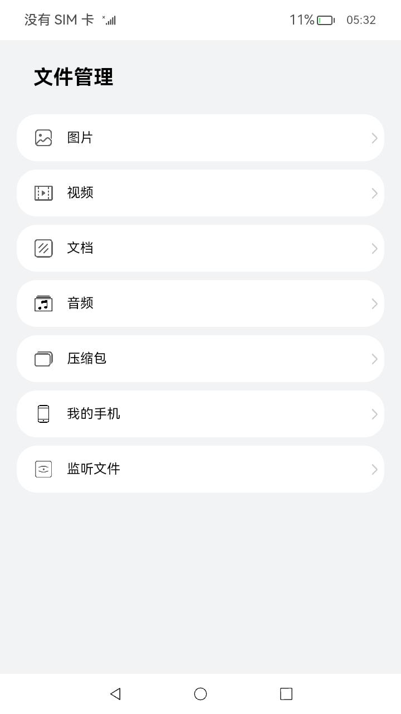
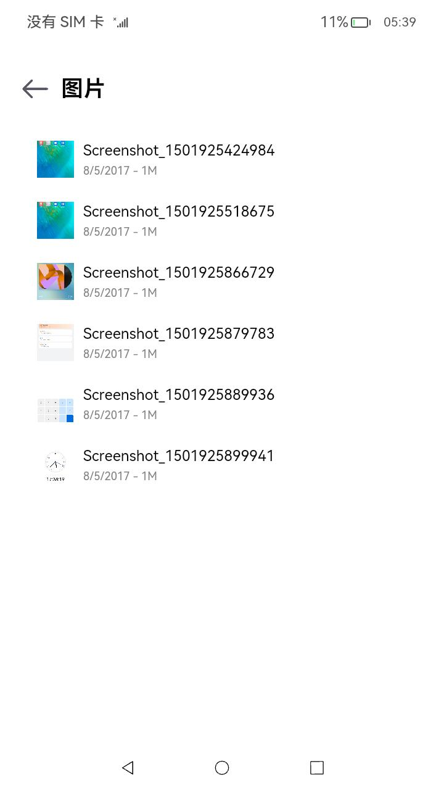
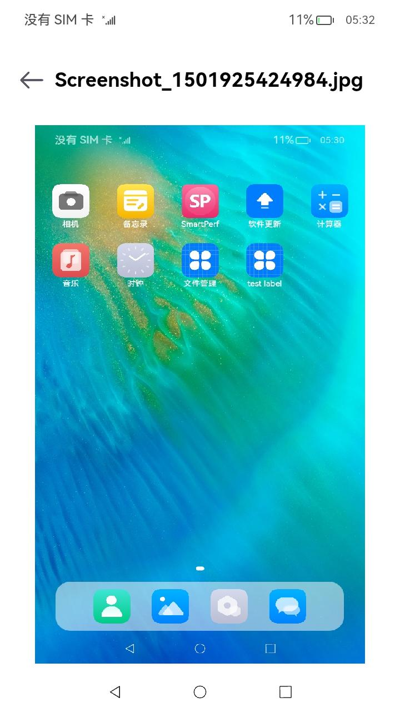
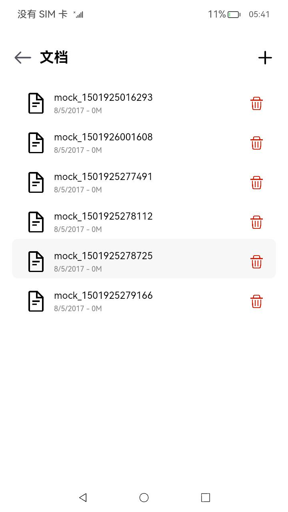
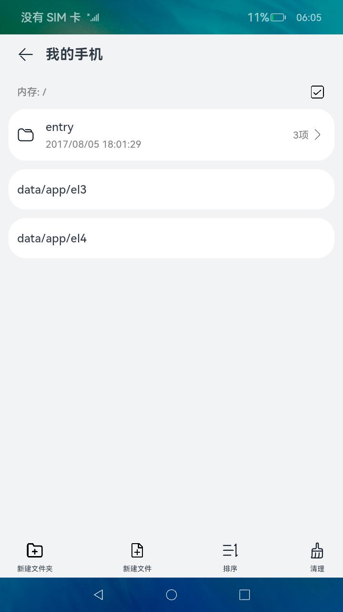

# 文件管理

### 介绍

本示例主要展示了文件管理相关的功能，使用[@ohos.multimedia.medialibrary](https://gitee.com/openharmony/docs/blob/master/zh-cn/application-dev/reference/apis/js-apis-medialibrary.md) 、[@ohos.filemanagement.userFileManager](https://gitee.com/openharmony/docs/blob/master/zh-cn/application-dev/reference/apis/js-apis-userFileManager.md) 、[@ohos.fileio](https://gitee.com/openharmony/docs/blob/master/zh-cn/application-dev/reference/apis/js-apis-fileio.md) 、[@ohos.file.fs](https://gitee.com/openharmony/docs/blob/master/zh-cn/application-dev/reference/apis/js-apis-file-fs.md)、[@ohos.app.ability.contextConstant](https://gitee.com/openharmony/docs/blob/master/zh-cn/application-dev/application-models/application-context-stage.md)

等接口，实现了增添文件、删除文件、查找指定类型文件文件、复制并移动文件、切换加密分区和预览图片、监听文件的功能;

### 效果预览

|首页|图片列表|图片预览|文档删除|加密分区|
|--------------------------------|--------------------------------|--------------------------------|--------------------------------|--------------------------------|
||||||

使用说明
1. 在主界面，可以点击图片、视频、文档、音频等按钮进入对应目录的文件列表浏览界面；
2. 在文档列表浏览界面，点击“+”按钮，可以添加文件；
3. 在文档列表浏览界面，长按列表项会出现删除图片，点击删除图标可以删除文件；
4. 在图片文件列表界面，点击图片可以进入图片预览界面。
5. 进入“我的手机”页面前应先安装[MyPhoneFilePage](./lib/MyPhoneFilePage-1.0.0.hap)，在主页点击“我的手机”，进入应用沙箱目录下。
   1. 列表的上方是默认的EL2加密分区的应用根目录下文件列表，点击下方两个按钮“data/app/el3”和“data/app/el4”分别进入EL3和EL4加密分区应用根目录，进入后对文件或文件夹操作与EL2加密分区相同。
   
   2. 点击左下角“新建文件夹”按钮，在弹窗中输入文件夹名称，点击弹窗中的“确定”按钮，完成创建。

   3. 点击新建的文件夹，进入目录，在新目录中点击左下角的“新建文件”，在弹窗的窗口中填写文件名称，然后点击确定，完成创建。

   4. 点击右上角多选按钮，选择需要重命名的文件（仅选中一个文件时可用），点击重命名，在弹窗中修改文件名称，点击“确定”，完成修改。

   5. 点击右上角多选按钮，选择需要复制和移动的文件（可多选，并且不可移动到本身的子目录下），选中后点击左下角“复制和移动”按钮，在页面中点击目标目录会进入该目录，在目标目录下点击“移动到这”按钮，完成文件复制和移动。

   6. 点击右上角多选按钮，选择需要删除的文件，选中后点击右下角“更多”按钮，弹出的菜单中选择“删除”，在弹窗中点击“删除”，即可删除文件。
   
   7. 点击右上角多选按钮，选择一项需要修改时间的文件，选中后点击右下角“更多”按钮，弹出的菜单中选择“修改文件(夹)时间”，在弹窗的文本框中输入要修改的时间，点击“确定”，即可修改文件(夹)时间。
   
   8. 点击单个文件，可进入文件内容页面，点击右上角编辑按钮，进入编辑模式编辑、修改文件内容，然后点击右上角的保存按钮保存对文件的修改，点击左上角"X"按钮退出编辑模式，点击返回按钮返回上一页。
6. 在主页点击“监听文件”，进入文件监听页面。
   1.  点击**添加监听**按钮，选择**IN_CREATE**监听，然后点击**确定**按钮，成功添加IN_CREATE监听。
   2. 点击**添加**按钮，成功添加一个文件，触发事件后日志显示为相应日志：event：256，fileName为新增文件的路径。
   3. 点击**停止监听**按钮，选择**IN_CREATE**监听，然后点击**确定**按钮，成功停止IN_CREATE监听。
   4. 点击**添加**按钮，成功添加一个文件，触发事件后日志无变化。
   5. 点击**添加监听**按钮，选择**IN_DELETE**监听，然后点击**确定**按钮，成功添加IN_DELETE监听。
   6. 选择要删除的文件item，左滑后点击删除图标，成功删除一个文件，触发事件后日志显示为相应日志：event：512，fileName为删除文件的路径。
   7. 点击**停止监听**按钮，选择**IN_DELETE**监听，然后点击**确定**按钮，成功停止IN_CREATE监听。
   8. 选择要删除的文件item，左滑后点击删除图标，成功删除一个文件，触发事件后日志无变化。
   9. 点击**添加监听**按钮，选择**IN_MODIFY**监听，然后点击**确定**按钮，成功添加IN_MODIFY监听。
   10. 选择要编辑的文件item，左滑后点击编辑图标，进入文件编辑界面，修改文件名和文件内容，修改之后点击保存图标，页面显示的文件文件大小发生变化，然后点击返回图标后返回文件监听界面，查看触发事件后日志显示为相应日志：event：2，fileName为修改后文件的路径。IN_MODIFY监听只监听文件内容是否发生变化，若单独修改文件名，则不会更新监听日志。
   11. 点击**停止监听**按钮，选择**IN_MODIFY**监听，然后点击**确定**按钮，成功停止IN_MODIFY监听。
   12. 选择要编辑的文件item，左滑后点击编辑图标，进入文件编辑界面，修改文件名和文件内容，修改之后点击保存图标，页面显示的文件文件大小发生变化，然后点击返回图标后返回文件监听界面，查看触发事件后日志无变化。

### 工程目录

```
entry/src/main/ets/
|---Application
|---common
|   |---Common.ts             // 公用方法，如bufferToString
|   |---Logger.ts             // 监听文件日志
|---filemanager
|   |---data
|   |   |---FileDataSource.ets             // 懒加载数据格式
|   |---fileFs
|   |   |---MyWatcher.ts      // 预制10个文件进行监听，并对文件增删改进行处理，以及对添加watcher和删除watcher进行处理
|   |---pages
|   |   |---audio
|   |   |   |---AudioFileList.ets          // 音频列表页面
|   |   |---common
|   |   |   |---FileList.ets               // 同类型文件列表展示页面，接收文件类型，展示特定类型的文件列表
|   |   |---document
|   |   |   |---DocumentFileList.ets       // 文档列表页面
|   |   |---image
|   |   |   |---ImageFileList.ets          // 图片列表页面
|   |   |   |---ImagePreview.ets           // 图片预览页面
|   |   |---MyPhone
|   |   |   |---ChangeTimeDialog.ets       //修改时间的弹窗
|   |   |   |---DeleteDialog.ets           // 删除时的询问弹窗
|   |   |   |---InputNameDialog.ets        // 新增文件时的输入框
|   |   |   |---MyPhone.ets                // MyPhone主页
|   |   |   |---OpenFile.ets               // 文件内容查看编辑页面
|   |   |---video
|   |   |   |---VideoFileList.ets          // 视频列表页面
|   |   |---FileManagerHome.ets            // 首页主体内容
|---MainAbility
|---pages
|   |---WatcherFile.ets       // 监听文件页面，可对当前目录添加监听和停止监听，同时可以添加文件和删除文件并显示触发事件后日志
|   |---Index.ets             // 首页
|   |---EditFile.ets          // 文件编辑界面，可对文件名和文件内容进行修改，并可对文件的修改进行撤销
Library/src/main/ets/
|---filemanager
|   |---components
|   |   |---ThumbnailImage.ets             // 缩略图组件
|   |---fileio
|   |   |---FileIoManager.ts               // 文件管理模块，封装了fileio的接口，实现MyPhone部分的功能
|   |---medialibrary
|   |   |---MediaLibraryManager.ts         // 主要封装了mediaLibrary库相关的接口，实现相关功能，如：对文件的增、删、查和图片预览功能
|   |---userfilemanager
|   |   |---UserFileManager.ts             // 封装userFileManager库相关的接口
|   |---FileManager.ts                     // 文件管理接口，统一封装了各模块对外提供的功能接口
|---mock                                   // 本地数据
|---utils                                  // 日志工具
```

### 具体实现：

* 增添文件、删除文件、查找指定类型文件文件和预览图片的功能接口封装在MediaLibraryManager，源码参考：[MediaLibraryManager.ts](Library/src/main/ets/filemanager/medialibrary/MediaLibraryManager.ts)
    * 使用mediaLibrary.getMediaLibrary来获取MediaLibrary对象;
    * 读取每个文件的数据：使用MediaLibrary.getFileAssets读取满足条件的文件集合FetchFileResult，然后调用FetchFileResult.getFirstObject();
    * 创建模拟文件：使用MediaLibrary.getPublicDirectory()获取系统预定的目录，然后使用MediaLibrary.createAsset();
    * 删除指定路径的文件：使用MediaLibrary.deleteAsset();
    * 获取预览图：使用image.createImageSource()创建指定的文件资源ImageSource，然后调用ImageSource.createPixelMap()，接口参考：[@ohos.multimedia.image](https://gitee.com/openharmony/docs/blob/master/zh-cn/application-dev/reference/apis/js-apis-image.md) 。
    
* MyPhone模块中的文件增删、复制移动、查找功能封装在FileSystem，源码参考：[FileIoManager.ets](Library/src/main/ets/filemanager/fileio/FileIoManager.ets) 。
  * 读取文件列表：使用fileio.opendirSync()打开指定目录dir，然后使用dir.readSync()读取文件内容dirent，在调用dirent中相关api获取想要的文件参数;
  * 创建目录：使用fileio.mkdirSync()创建文件夹；
  * 创建文件：使用fileio.openSync()创建文件；
  * 删除选中内容：使用fileio.rmdirSync()删除文件夹，使用fileio.unlinkSync()删除文件；
  * 复制文件：使用fileio.copyFileSync()复制目标文件；
  * 移动文件：使用fileio.mkdirSync()创建指定目录，再递归选中目录中的文件，将内部的文件创建到指定的位置。
  * 修改加密分区：修改应用上下文Context的area，实现当前加密分区的修改。

* 在Library模块中通过封装FileManager向外提供功能接口，如MediaLibraryManager.getPixelMapByFileAsset()，源码参考：[FileManager.ts](Library/src/main/ets/filemanager/FileManager.ts)
    * 如效果预览中的**图片列表**，读取指定类型的文件：在[FileList.ets](entry/src/main/ets/filemanager/pages/common/FileList.ets)
      中调用FileManager.getFileAssets()；
    * 创建模拟文件：在[FileList.ets](entry/src/main/ets/filemanager/pages/common/FileList.ets)
      中调用FileManager.createTxtFileAsset()；
    * 删除指定路径的文件：在[FileList.ets](entry/src/main/ets/filemanager/pages/common/FileList.ets)
      中调用FileManager.deleteFileAsset()；
    * 获取缩略图：在[ThumbnailImage.ets](Library/src/main/ets/filemanager/components/ThumbnailImage.ets) 中调用FileManager.getThumbnail()；
    * 如效果预览中的**图片预览**，获取预览图：在[ImagePreview.ets](entry/src/main/ets/filemanager/pages/image/ImagePreview.ets) 中调用FileManager.getPixelMapByFileAsset()。
    
* 监听文件模块中的文件增删、查找、修改、监听功能封装在MyWatcher，源码参考：[MyWatcher.ts](ets/src/main/ets/filemanager/fileFs/MyWatcher.ts)

    * 增加文件、删除文件、监听文件、停止监听文件：在[WatcherFile.ets](entry/src/main/ets/pages/WatcherFile.ets)
      中调用MyWathcer.addFileToWatcher()、MyWathcer.deleteFileToWatcher()、MyWathcer.startWatcher(watcherName)、MyWathcer.stopWatcher()；

    * 修改文件：在[EditFile.ets](entry/src/main/ets/pages/EditFile.ets)

      中调用MyWatcher.modifyFileToWatcher()。

### 相关权限

[ohos.permission.READ_MEDIA](https://gitee.com/openharmony/docs/blob/master/zh-cn/application-dev/security/permission-list.md#ohospermissionread_media)

[ohos.permission.WRITE_MEDIA](https://gitee.com/openharmony/docs/blob/master/zh-cn/application-dev/security/permission-list.md#ohospermissionwrite_media)

[ohos.permission.FILE_ACCESS_MANAGER](https://gitee.com/openharmony/docs/blob/master/zh-cn/application-dev/security/permission-list.md#ohospermissionfile_access_manager)

[ohos.permission.STORAGE_MANAGER](https://gitee.com/openharmony/docs/blob/master/zh-cn/application-dev/security/permission-list.md#ohospermissionstorage_manager)

### 依赖

不涉及

### 约束与限制

1. 本示例仅支持标准系统上运行，支持设备：RK3568;
2. 本示例为Stage模型，仅支持API11版本SDK，SDK版本号(API Version 11 Beta),镜像版本号(4.1Beta)。
3. 本示例需要使用DevEco Studio 版本号(4.0Release)及以上版本才可编译运行。
4. 本示例涉及调用系统权限的接口，需要配置允许权限列表，可以参考[特殊权限配置方法](https://docs.openharmony.cn/pages/v3.2/zh-cn/application-dev/security/hapsigntool-overview.md/) ，在配置文件中的“allowed-acls”字段中增加"ohos.permission.READ_MEDIA", "ohos.permission.WRITE_MEDIA", "ohos.permission.FILE_ACCESS_MANAGER", "ohos.permission.STORAGE_MANAGER"四个权限。

### 下载

如需单独下载本工程，执行如下命令：

    git init
    git config core.sparsecheckout true
    echo code/BasicFeature/FileManager/FileManager/ > .git/info/sparse-checkout
    git remote add origin https://gitee.com/openharmony/applications_app_samples.git
    git pull origin master
