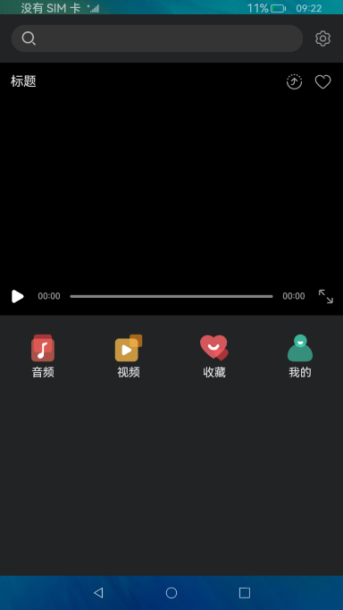

# 媒体管理合集

###  介绍

#### 具体功能

1. 网络流播放能力
2. 音视频播控能力
3. 音量调节能力

### 效果预览

|主页|音频| 视频                                 | 重命名                                 |
|--------------------------------|--------------------------------|------------------------------------|-------------------------------------|
| ||  |  |

使用说明

1. 启动应用，点击音频或视频可以查看本地音视频资源。若本地没有音视频资源，可以push视频到本地媒体库路径，视频路径(storage/media/100/local/files/Videos)  音频路径(storage/media/100/local/files/Audios)，需要先hdc进入storage/media/100/local/files路径下查看是否有Videos/Audios文件夹，没有则需要mkdir Videos/Audios创建文件夹后push音视频资源。
2. 进入首页，可以通过输入网络地址或点击音频，视频进行播放音视频。
3. 音视频播放后，对于播控按键显示，点击播放、暂停可以播放、暂停音视频。
4. 音视频列表左滑可以开启重命名、删除图标，点击对应图标可以进行音视频的重命名和删除。

### 工程目录
```
entry/src/main/ets/
|---Application
|   |---MyAbilityStage.ts
|---common
|   |---constants
|   |   |---AVplayerConstants.ets               // AVplayer常量
|   |   |---DrmConstants.ets                    // Drm常量
|   |---BroadcastControl.ets                    // 窗口
|   |---DeleteDialog.ets                        // 删除弹窗
|   |---IsInformationDialog.ets                 // 信息弹窗
|   |---mainDialog.ets                          // 弹窗组件
|   |---MediaItem.ets                           // 音频每一项
|   |---RenameDialog.ets                        // 重命名
|   |---StreamingMedia.ets                      // 视频播放
|   |---TitleBar.ets                            // 首页标题组件
|   |---Toolkit.ets                             // 工具栏
|   |---ToolkitItem.ets                         // 工具栏每一项
|---MainAbility
|   |---MainAbility.ts
|---model
|   |---AVPleyer.ets                            // AVPlayer控制器
|   |---DrmController.ets                       // Drm控制器
|   |---GridData.ts                             // 数据
|   |---HttpUtil.ets                            // 网络请求方法
|   |---JsonListData.ets                        // 播放列表JSON类型
|   |---KVManagerUtil.ets                       // 持久化工具
|   |---Logger.ts                               // 日志工具
|   |---MediaUtils.ts                           // 音频方法
|   |---myMedia.ts                              // 我的
|   |---Prompt.ts                               // 弹窗
|   |---TimeTools.ts                            // 时间工具
|   |---TypeConversion.ets                      // 类型转换工具
|---pages
|   |---online
|   |   |---OnlineList.ets                      // Drm播放列表页
|   |   |---OnlinePlayer.ets                    // Drm播放页
|   |---HomePage.ets                            // 切换页
|   |---index.ets                               // 首页
|   |---phoneMain.ets                           // 主页面
|---phoneView
|   |---online
|   |   |---OnlineListItemView.ets              // Drm播放列表项
|   |   |---OnlineListView.ets                  // Drm播放列表
|   |   |---OnlinePlayerView.ets                // Drm播放窗口
|   |---BroadcastControl.ets                    // 窗口
|   |---GridDataItem.ets                        // 每项数据
|   |---LoadingDialog.ets                       // 加载
|   |---TitleBar.ets                            // 标题
|   |---Toolkit.ets                             // 工具
```

### 具体实现

* 获取音频模块
  * 使用媒体库接口进行音视频的扫描，获取音视频详细信息，重命名和删除操作，使用PixelMap方法读取或写入图像数据以及获取图像信息。
  * 源码链接：[myMedia.ts](entry/src/main/ets/model/myMedia.ts)，[IsInformationDialog.ets](entry/src/main/ets/common/IsInformationDialog.ets)，[DeleteDialog.ets](entry/src/main/ets/common/DeleteDialog.ets)，[RenameDialog.ets](entry/src/main/ets/common/RenameDialog.ets)
  * 接口参考：[@ohos.multimedia.mediaLibrary](https://gitee.com/openharmony/docs/blob/master/zh-cn/application-dev/reference/apis-media-library-kit/js-apis-medialibrary.md)，[@ohos.multimedia.image](https://gitee.com/openharmony/docs/blob/master/zh-cn/application-dev/reference/apis-image-kit/js-apis-image.md)，[@ohos.prompt](https://gitee.com/openharmony/docs/blob/master/zh-cn/application-dev/reference/apis-as/js-apis-promptAction.md)

* 音频，视频操作模块
  * 使用媒体服务进行音视频播放，暂停，seek等操作，其中AudioPlayer方法播放音频，VideoPlayer方法播放视频。
  * 源码链接：[MediaUtils.ts](entry/src/main/ets/model/MediaUtils.ts)，[StreamingMedia.ets](entry/src/main/ets/common/StreamingMedia.ets)
  * 接口参考：[@ohos.multimedia.media](https://gitee.com/openharmony/docs/blob/master/zh-cn/application-dev/reference/apis-media-kit/js-apis-media.md)，[@ohos.multimedia.audio](https://gitee.com/openharmony/docs/blob/master/zh-cn/application-dev/reference/apis-audio-kit/js-apis-audio.md)

* 设备适配模块
  * 使用屏幕管理接口获取设备宽度进行适配。
  * 源码链接：[MainAbility.ts](entry/src/main/ets/MainAbility/MainAbility.ts)，[RenameDialog.ets](entry/src/main/ets/common/RenameDialog.ets)
  * 接口参考：[@ohos.display](https://gitee.com/openharmony/docs/blob/master/zh-cn/application-dev/reference/apis-as/js-apis-display.md)

### 相关权限

1.读取公共媒体文件权限：[ohos.permission.READ_MEDIA](https://gitee.com/openharmony/docs/blob/master/zh-cn/application-dev/security/AccessToken/permissions-for-all.md#ohospermissionread_media)

2.读写公共媒体文件权限：[ohos.permission.WRITE_MEDIA](https://gitee.com/openharmony/docs/blob/master/zh-cn/application-dev/security/AccessToken/permissions-for-all.md#ohospermissionwrite_media)

### 依赖

不涉及

### 约束与限制

1.本示例仅支持标准系统上运行，支持设备：RK3568。

2.本示例已适配API version 10版本SDK，本示例涉及使用系统接口：getXComponentSurfaceId()，需要手动替换Full SDK才能编译通过，具体操作可参考[替换指南](https://docs.openharmony.cn/pages/v3.2/zh-cn/application-dev/quick-start/full-sdk-switch-guide.md/)。

3.本示例需要使用DevEco Studio 3.1 Beta2 (Build Version: 3.1.0.400 构建 2023年4月7日)及以上版本才可编译运行。

### 下载
如需单独下载本工程，执行如下命令：

```
git init
git config core.sparsecheckout true
echo code/BasicFeature/FileManagement/MediaCollections/ > .git/info/sparse-checkout
git remote add origin https://gitee.com/openharmony/applications_app_samples.git
git pull origin master
```