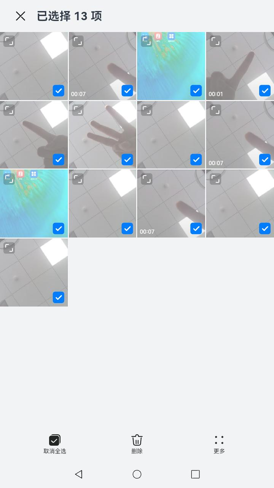

# 相册

### 介绍

本示例主要展示了相册相关的功能，使用[@ohos.filemanagement.userFileManager](https://gitee.com/openharmony/docs/blob/master/zh-cn/application-dev/reference/apis/js-apis-userFileManager.md)
接口，实现了查看系统相册、创建用户相册、查看相册照片、用户相册文件添加和删除、以及预览图片、最近删除、收藏夹操作等功能;

### 效果预览

|主页|图片列表|大图|图片选择|
|--------------------------------|--------------------------------|--------------------------------|--------------------------------|
|||||

使用说明

1、主界面：查询显示全部照片（虚拟）、系统相册（相机/视频/截屏录屏/我的收藏/最近删除）、用户相册
2、主界面点击“+”，创建用户相册
3、创建时添加图片到用户相册（复制/仅关联）
4、长按相册，删除相册
5、长按相册，重命名相册（不可重名）
6、长按相册，相册多选,批量删除
7、点击相册，查看相册中的图片列表
8、点击图片，查看单个图片大图
9、点击心形图标，收藏图片
10、点击心形图标，取消收藏
11、图片详情界面，重命名文件（可重名）
12、图片详情界面，删除文件（最近删除）
13、从最近删除恢复照片
14、从最近删除永久删除照片
15、点击视频，查看视频并播放
16、点击图片页面右上角叹号，查看图片详情
17、长按图片批量操作：多选/全选、删除、恢复
18、相册内图片列表界面点击“+”，从已有相册添加照片（复制/仅关联)(不能从系统相册添加）
19、长按图片列表图片，更多菜单，从图片选择添加到已有相册（复制/仅关联）（不能添加到系统相册）

### 工程目录

```
├── base //@ohos.filemanagement.userFileManager接口封装
│   ├── FavorUserFileDataItem.ts
│   ├── InnerUserFileDataItem.ts
│   ├── TrashUserFileDataItemCache.ts
│   ├── TrashUserFileDataItem.ts
│   ├── UserFileDataChangeCallback.ts
│   ├── UserFileDataHelper.ts
│   ├── UserFileDataItemCache.ts
│   ├── UserFileDataItem.ts
│   ├── UserFileModel.ts
│   ├── UserFileObserverCallback.ts
│   └── UserFileObserver.ts
├── common //业务逻辑
│   ├── ActionBarProp.ts
│   ├── AlbumDataImpl.ts
│   ├── AlbumDataItem.ts
│   ├── AlbumsDataSource.ts
│   ├── BroadcastManager.ts
│   ├── Broadcast.ts
│   ├── CommonObserverCallback.ts
│   ├── EventPipeline.ts
│   ├── GlobalContext.ts
│   ├── GroupDataImpl.ts
│   ├── GroupItemDataSource.ts
│   ├── ItemDataSource.ts
│   ├── MultimodalInputManager.ts
│   ├── ScreenManager.ts
│   ├── SelectManager.ts
│   └── SimpleAlbumDataItem.ts
├── components //UI组件
│   ├── ActionBarButton.ets
│   ├── ActionBar.ets
│   ├── AddNotesDialog.ets
│   ├── AlbumGridItemNewStyle.ets
│   ├── AlbumListCard.ets
│   ├── AlbumScrollBar.ets
│   ├── AlbumSelectGridItemNewStyle.ets
│   ├── AlbumSetPage.ets
│   ├── CancelOperationDialog.ets
│   ├── CopyOrMoveDialog.ets
│   ├── CustomDialogView.ets
│   ├── DeleteDialog.ets
│   ├── DeleteProgressDialog.ets
│   ├── DetailMenuPanel.ets
│   ├── DetailsDialog.ets
│   ├── DetailTitle.ets
│   ├── DownloadCancelOperationDialog.ets
│   ├── EditExitDialog.ets
│   ├── EmptyAlbumComponent.ets
│   ├── FindSameNameDialog.ets
│   ├── GridScrollBar.ets
│   ├── ImageGridItemComponent.ets
│   ├── LoadingPanel.ets
│   ├── MediaOperationActionBar.ets
│   ├── MultiSelectDialog.ets
│   ├── NewAlbumDialog.ets
│   ├── NoPhotoComponent.ets
│   ├── NoPhotoIndexComponent.ets
│   ├── PhotoBrowserActionBar.ets
│   ├── PhotoBrowserBg.ets
│   ├── PhotoItem.ets
│   ├── PhotoSwiper.ets
│   ├── ProgressDialog.ets
│   ├── RenameDialog.ets
│   ├── SaveDialog.ets
│   ├── SaveImageDialog.ets
│   ├── SelectionTitle.ets
│   ├── SingleTitle.ets
│   ├── ThirdDeleteDialog.ets
│   ├── ThirdSelectPhotoBrowserActionBar.ets
│   ├── ToolBarButton.ets
│   ├── ToolBar.ets
│   └── VideoIcon.ets
├── constants //常量
│   ├── AnimationConstants.ts
│   ├── BroadcastConstants.ts
│   ├── BrowserConstants.ts
│   ├── Constants.ts
│   ├── MediaConstants.ts
│   ├── QueryConstants.ts
│   └── RouterConstants.ts
├── entryability //APP入口
│   └── EntryAbility.ts
├── menus //菜单操作
│   ├── AlbumSetDeleteMenuOperation.ts
│   ├── AlbumSetNewMenuOperation.ts
│   ├── AlbumSetRenameMenuOperation.ts
│   ├── AsyncCallback.ts
│   ├── BatchDeleteMenuOperation.ts
│   ├── BatchRecoverMenuOperation.ts
│   ├── ClearRecycleMenuOperation.ts
│   ├── CopyMenuOperation.ts
│   ├── GotoPhotosMenuOperation.ts
│   ├── MenuContext.ts
│   ├── MenuOperationCallback.ts
│   ├── MenuOperation.ts
│   ├── MoveMenuOperation.ets
│   ├── ProcessMenuOperation.ts
│   ├── RenameMenuOperation.ts
│   └── ShareMenuOperation.ts
├── models //类型定义
│   ├── ActionBarMode.ts
│   ├── Action.ts
│   ├── AlbumBarModel.ts
│   ├── AlbumSelectBarModel.ts
│   ├── JumpSourceToMain.ts
│   ├── MediaOperationType.ts
│   ├── NewAlbumBarModel.ts
│   ├── PhotoGridBarModel.ts
│   ├── ThumbnailModel.ts
│   └── ViewType.ts
├── pages //页面
│   ├── AlbumSelect.ets
│   ├── Index.ets
│   ├── MediaOperationPage.ets
│   ├── NewAlbumPage.ets
│   ├── PhotoBrowser.ets
│   ├── PhotoGridPage.ets
│   ├── SelectPhotoBrowser.ets
│   └── VideoBrowser.ets
└── utils //工具类
    ├── AbilityUtils.ts
    ├── AlbumUtil.ts
    ├── DateUtil.ts
    ├── DialogUtil.ts
    ├── hisysEventUtil.ts
    ├── ImageUtil.ts
    ├── Log.ts
    ├── MathUtils.ts
    ├── ResourceUtils.ts
    ├── SingleInstanceUtils.ts
    ├── TraceControllerUtils.ts
    └── UiUtil.ts
```

### 具体实现
* 在base模块中通过封装userFileManager向外提供功能接口，如Album查询操作，源码参考：[FileManager.ts](code/BasicFeature/FileManagement/Photos/entry/src/main/ets/common/AlbumDataImpl.ts)
    * 如效果预览中的**相册列表**：在[AlbumSetPage.ets](code/BasicFeature/FileManagement/Photos/entry/src/main/ets/components/AlbumSetPage.ets)
      中调用AlbumDataImpl.reloadAlbumItemData()；

* 在base模块中通过封装userFileManager向外提供功能接口，如MediaLibraryManager.getPixelMapByFileAsset()，源码参考：[FileManager.ts](code/BasicFeature/FileManagement/Photos/entry/src/main/ets/base/UserFileModel.ts)
    * 如**新建相册**：在[CopyMenuOperation.ets](code/BasicFeature/FileManagement/Photos/entry/src/main/ets/menus/CopyMenuOperation.ets)
      中调用userFileModel.createOne()；
    * 如**删除图片**：在[BatchDeleteMenuOperation.ets](code/BasicFeature/FileManagement/Photos/entry/src/main/ets/menus/BatchDeleteMenuOperation.ets)
      中调用userFileModel.deleteOne()；
    * 如**恢复图片**：在[TrashUserFileDataItem.ets](code/BasicFeature/FileManagement/Photos/entry/src/main/ets/base/TrashUserFileDataItem.ets)
      中调用userFileModel.recover()；
    * 如**永久删除图片**：在[TrashUserFileDataItem.ets](code/BasicFeature/FileManagement/Photos/entry/src/main/ets/menus/TrashUserFileDataItem.ets)
      中调用userFileModel.permanentDelete()；
    * 如**删除相册**：在[AlbumDataItem.ets](code/BasicFeature/FileManagement/Photos/entry/src/main/ets/common/AlbumDataItem.ets)
      中调用userFileModel.deleteAlbum()；
### 相关权限

[ohos.permission.READ_MEDIA](https://gitee.com/openharmony/docs/blob/master/zh-cn/application-dev/security/permission-list.md)

[ohos.permission.WRITE_MEDIA](https://gitee.com/openharmony/docs/blob/master/zh-cn/application-dev/security/permission-list.md)

[ohos.permission.WRITE_IMAGEVIDEO](https://gitee.com/openharmony/docs/blob/master/zh-cn/application-dev/security/permission-list.md)

[ohos.permission.READ_IMAGEVIDEO](https://gitee.com/openharmony/docs/blob/master/zh-cn/application-dev/security/permission-list.md)

[ohos.permission.MEDIA_LOCATION](https://gitee.com/openharmony/docs/blob/master/zh-cn/application-dev/security/permission-list.md)

### 约束与限制

1. 本示例仅支持标准系统上运行，支持设备：RK3568;
2. 本示例仅支持API10版本SDK，版本号：4.0.8.3，镜像版本号：OpenHarmony 4.0.8.3。本示例涉及使用系统接口：@ohos.filemanagement.userFileManager中的createAlbum接口，需要手动替换Full SDK才能编译通过，具体操作可参考[替换指南](https://docs.openharmony.cn/pages/v3.2/zh-cn/application-dev/quick-start/full-sdk-switch-guide.md/) ；
3. 本示例需要使用DevEco Studio 3.1 Release (Build Version: 3.1.0.500)才可编译运行；
4. 本示例涉及系统接口，需要配置系统应用签名，可以参考[特殊权限配置方法](https://docs.openharmony.cn/pages/v3.2Beta/zh-cn/application-dev/security/hapsigntool-overview.md/) ，把配置文件中的“app-feature”字段信息改为“ohos_system_app”。

### 下载

如需单独下载本工程，执行如下命令：

```
git init
git config core.sparsecheckout true
echo FileManagement/Photos/ > .git/info/sparse-checkout
git remote add origin https://gitee.com/openharmony/applications_app_samples.git
git pull origin master
```