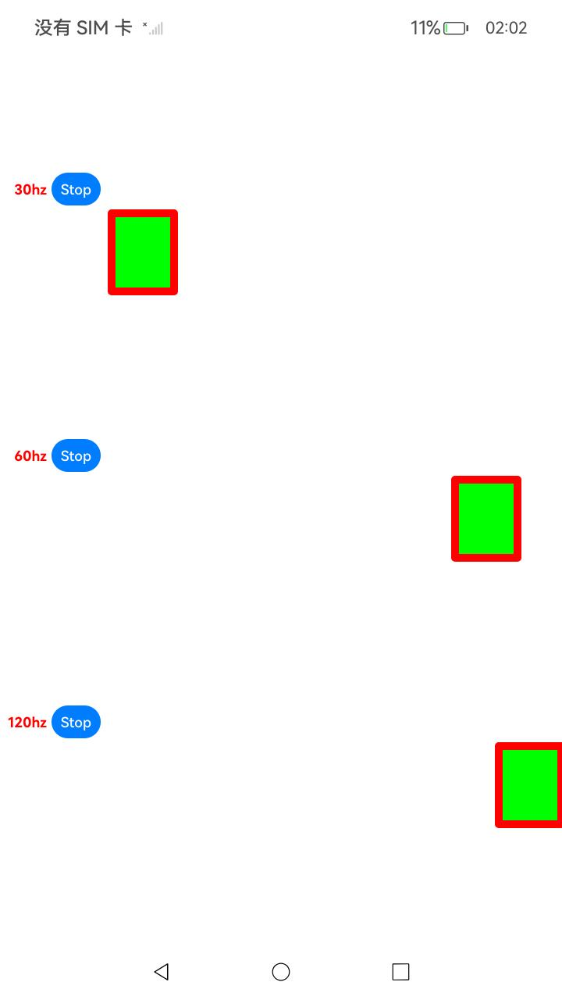

# DisplaySoloist分级管控

### 介绍

本示例通过DisplaySoloist分级管控功能，使用UI以外的线程对XComponent的绘制内容设置开发者所期望的帧率。
### 效果预览

| XComponent                                                    |
|---------------------------------------------------------------|
|  |

使用说明

1.进入XComponent页面，依次点击“**Start**”，三个方块分别按照30Hz、60Hz、120Hz移动；点击“**Stop**”动画停止；

### 工程目录
```
├──entry/src/main
│  ├──cpp                                       // C++代码区
│  │  ├──CMakeLists.txt                         // CMake配置文件
│  │  ├──hello.cpp                              // Napi模块注册
│  │  ├──common
│  │  │  └──log_common.h                        // 日志封装定义文件
│  │  ├──plugin                                 // 生命周期管理模块
│  │  │  ├──plugin_manager.cpp
│  │  │  └──plugin_manager.h
│  │  ├──samples                                // samples渲染模块
│  │  │  ├──sample_xcomponent.cpp
│  │  │  └──sample_xcomponent.h
│  ├──ets                                       // ets代码区
│  │  ├──entryability
│  │  │  ├──EntryAbility.ts                     // 程序入口类
|  |  |  └──EntryAbility.ets
|  |  ├──interface
│  │  │  └──XComponentContext.ts                // XComponentContext
│  │  ├──pages                                  // 页面文件
│  │  |  └──Index.ets                           // XComponent页面
│  │  ├──utils                                  // 工具类
|  ├──resources         			      // 资源文件目录
```

### 具体实现

* XComponent：通过在IDE中的Native c++ 工程，在c++代码中定义对外接口为register、unregister以及destroy，并调用NativeDisplaySoloist分级管控接口,可在页面上使用drawing根据设定的期望帧率来绘制。
    * 涉及到的相关接口([CAPI接口链接](https://gitee.com/openharmony/docs/blob/master/zh-cn/application-dev/reference/apis-arkgraphics2d/_native_display_soloist.md))：

      | 接口名 | 描述 | 
      | -------- | -------- |
      | OH_DisplaySoloist_Create| 创建一个OH_DisplaySoloist实例 |
      | OH_DisplaySoloist_Destroy  | 销毁一个OH_DisplaySoloist实例 |
      | OH_DisplaySoloist_Start  | 设置每帧回调函数，每次vsync信号到来时启动每帧回调 |
      | OH_DisplaySoloist_Stop  | 停止请求下一次vsync信号，并停止调用回调函数callback |
      | OH_DisplaySoloist_SetExpectedFrameRateRange  | 设置期望帧率范围 |


### 相关权限

不涉及

### 依赖

不涉及

### 约束与限制

1.本示例仅支持在标准系统上运行，支持设备：RK3568。

2.本示例为Stage模型，已适配API version 12版本SDK，SDK版本号(API Version 12 5.0.0.26),镜像版本号(5.0.0.26)。

3.本示例需要使用DevEco Studio 版本号(4.1.3.500)及以上版本才可编译运行。


### 下载

如需单独下载本工程，执行如下命令：
```
git init
git config core.sparsecheckout true
echo code/BasicFeature/Graphics/DisplaySoloist/ > .git/info/sparse-checkout
git remote add origin https://gitee.com/openharmony/applications_app_samples.git
git pull origin master

```
